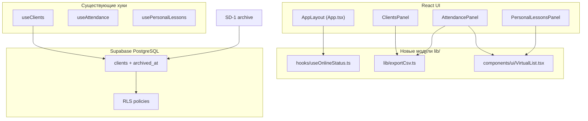
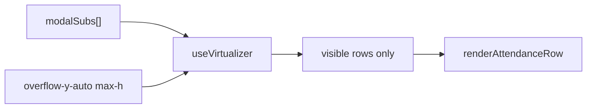

# TangoDB — ТЗ на архитектурные улучшения (Фаза 2)

> **Версия:** 1.3  
> **Дата:** 2026-06-16  
> **Ревизия 1.2:** сверка с кодом (`useClients`, `useSubsForDate`, `ErrorBoundary`, миграции); дополнены файлы SD-1; исправлены промты; добавлены раздел 9 (сверка) и раздел 10 (Фаза 3 с промтами).  
> **Ревизия 1.3:** уточнены query keys/cache-check для SD-1; NET-1 prompt дополнен handler guards; VIRT-1 prompt дополнен правилом одного scroll container.  
> **Стек:** React 19 · TypeScript 5.8 · Vite 6 · Supabase · TanStack Query · Zustand  
> **Scope:** `tangodb/src/`, `tangodb/supabase/`  
> **Связанные документы:** [CODE_REVIEW.md](./CODE_REVIEW.md), [tangodb_migration_TZ.md](./tangodb_migration_TZ.md)

---

## 0. Обзор

После закрытия P0/P1/P2/P3 из code review (по `steps` отмечены выполненными обязательные 20 пунктов) — четыре улучшения **архитектурного уровня**, которые повышают зрелость CRM без смены бизнес-модели.

| ID | Фича | Зачем | Сложность | Зависимости |
|----|------|-------|-----------|-------------|
| **EXP-1** | CSV export | Отчёты, бухгалтерия, резервная копия «на сегодня» | Низкая | Нет |
| **NET-1** | Offline banner | Понятный UX при обрыве сети в Telegram Mini App | Низкая | Нет |
| **SD-1** | Soft Delete клиентов | «Удаление» без FK-ошибки и без потери истории | Средняя | Миграция БД + разделение active/display client queries |
| **VIRT-1** | Virtual lists | Плавный UI при длинных списках абонементов/уроков | Низкая–средняя | Желательно после PERF-1 |

**Рекомендуемый порядок реализации:** EXP-1 → NET-1 → SD-1 → VIRT-1.  
**Фаза 3 (опционально):** DB-6 → SD-2 → EXP-2 → NET-2 → OBS-1 — см. раздел 10.

---

## 1. Архитектура (общая)



### Принципы реализации

1. **Минимальный diff** — не рефакторить несвязанные панели.
2. **Клиентский экспорт** — без Edge Functions; данные уже в TanStack Query cache.
3. **Soft delete** — не менять FK; архив = `UPDATE`, не `DELETE`; архивные клиенты скрываются из выбора, но остаются доступными для отображения истории.
4. **Virtual lists** — только там, где список может превысить ~20 DOM-строк (порог включения VIRT-1); не виртуализировать короткие формы.
5. **Стили** — slate/indigo, существующие классы кнопок и `panel-card-stack`.

### Новые зависимости npm

| Пакет | Фича | Версия (ориентир) |
|-------|------|-------------------|
| `@tanstack/react-virtual` | VIRT-1 | latest ^3.x |

EXP-1, NET-1, SD-1 — **без новых npm-зависимостей**.

---

## 2. План по фазам

| Фаза | Промты | Критерий готовности | Проверка |
|------|--------|---------------------|----------|
| **A** | EXP-1 | CSV скачивается из Clients и Attendance | Excel открывает кириллицу |
| **B** | NET-1 | Баннер при offline; мутации disabled | DevTools → Offline |
| **C** | SD-1 | Архивация клиента с абонементами работает | Клиент скрыт, история на месте |
| **D** | VIRT-1 | Скролл модалки посещаемости плавный при 50+ строк | Chrome Performance |

**Фаза 3 (опционально, после A–D):** DB-6 → SD-2 → EXP-2 → NET-2 → OBS-1 — см. раздел 10.

После каждой фазы: `npm run lint` + ручная проверка затронутого экрана.

---

# EXP-1 — Экспорт данных в CSV

## EXP-1.1. Проблема и цель

**Сейчас:** экспорт есть только для **импорта** из GAS (`tangodb_export.json`, `scripts/migrate.mjs`). В UI нет выгрузки.

**Цель:** кнопки «Экспорт CSV» на ключевых экранах; файл открывается в Excel с корректной кириллицей (UTF-8 BOM).

## EXP-1.2. Архитектура

```
lib/exportCsv.ts          — утилита (escape, BOM, download)
ClientsPanel.tsx          — кнопка + маппинг Client → row
AttendancePanel.tsx       — кнопка + маппинг attendance за selectedMonth
```

**Не в scope v1:** экспорт SubscriptionsPanel, PersonalLessonsPanel (можно добавить в v1.1 по тому же паттерну).

## EXP-1.3. Спецификация `lib/exportCsv.ts`

```typescript
/** Колонки: ключ → заголовок в CSV (русский) */
export function downloadCsv(
  rows: Record<string, string | number | null | undefined>[],
  filename: string,
  columnLabels?: Record<string, string>
): void;

function escapeCsvCell(value: unknown): string;
// — оборачивает в кавычки если есть ; " \n
// — удваивает внутренние кавычки: " -> ""
// — BOM: \uFEFF в начале файла
// — разделитель: ; (удобнее для RU Excel)
// — download через Blob + URL.createObjectURL + <a download>
// — revokeObjectURL после клика
```

**Порядок колонок:** если передан `columnLabels`, строить заголовок и строки по `Object.keys(columnLabels)`. Если `columnLabels` нет — брать ключи из первой строки. Это убирает риск «плавающего» порядка колонок при разных shape у `rows`.

## EXP-1.4. Формат выгрузки

### Clients (`clients_YYYY-MM-DD.csv`)

| Колонка CSV | Источник |
|-------------|----------|
| ID | `client.id` |
| Фамилия | `client.lastName` |
| Имя | `client.firstName` |
| Telegram | `client.telegram` |
| Дата создания | `client.createdAt ?? ""` |

Экспортировать **текущий отфильтрованный** список (`filteredClients`), не только видимую страницу.

### Attendance (`attendance_YYYY-MM.csv`)

| Колонка CSV | Источник |
|-------------|----------|
| Дата | `record.date` |
| Абонемент ID | `record.subscriptionId` |
| Клиент(ы) | `record.clientDisplay` |
| Статус | `present` → «Пришёл», `absent` → «Не пришёл», `freeze` → «Заморозка» |

Данные: явно вызвать `useAttendanceRecords(selectedMonth)` в `AttendancePanel`; сейчас `useSubsForDate(...)` использует эти записи внутри себя, но не отдаёт их наружу для экспорта. Фильтр по месяцу уже есть после PERF-1.

## EXP-1.5. UI

- Кнопка вторичного стиля: `border border-slate-200`, иконка `Download` из `lucide-react`.
- **ClientsPanel:** в шапке таблицы клиентов, рядом с поиском.
- **AttendancePanel:** рядом с переключателем месяца.
- При пустом списке — toast «Нечего экспортировать», не создавать пустой файл.
- После успеха — toast «Файл скачан».

## EXP-1.6. Файлы для изменения

| Файл | Действие |
|------|----------|
| `tangodb/src/lib/exportCsv.ts` | **Создать** |
| `tangodb/src/components/ClientsPanel.tsx` | Кнопка + handler |
| `tangodb/src/components/AttendancePanel.tsx` | Кнопка + handler |

## EXP-1.7. Рекомендации

- Не добавлять `xlsx` — CSV достаточно для v1.
- Имя файла: `{entity}_{yearMonth или date}.csv`, без пробелов.
- Не отправлять данные на сервер — приватность и нулевая нагрузка на Supabase.
- v1.1: экспорт абонементов (`useSubscriptions`) и персональных уроков (`usePersonalLessons(selectedMonth)`).

## EXP-1.8. Prompt для реализации (EXP-1)

```
Реализуй EXP-1 из tangodb_arch_improvements_TZ.md:

1. Создай tangodb/src/lib/exportCsv.ts с функцией downloadCsv(rows, filename, columnLabels?):
   - разделитель ;
   - UTF-8 BOM (\uFEFF);
   - escapeCsvCell для кавычек и переносов строк;
   - programmatic download через Blob и revokeObjectURL.

2. В ClientsPanel.tsx добавь кнопку «Экспорт CSV» (Download icon):
   - экспорт filteredClients;
   - колонки: ID, Фамилия, Имя, Telegram, Дата создания;
   - filename clients_YYYY-MM-DD.csv;
   - toast при пустом списке и при успехе.

3. В AttendancePanel.tsx добавь кнопку «Экспорт CSV»:
   - явно подключи useAttendanceRecords(selectedMonth) для данных экспорта;
   - колонки: Дата, ID абонемента, Клиенты, Статус (русские labels);
   - filename attendance_YYYY-MM.csv.

Не добавляй новые npm-зависимости. После изменений npm run lint.
```

---

# NET-1 — Offline banner и блокировка мутаций

## 3.1. Проблема и цель

**Сейчас:** `supabase.ts` — минимальный клиент без Realtime; нет индикации сети. При offline TanStack Query может показать ошибку или stale cache без объяснения.

**Цель:** глобальный баннер «Нет соединения»; опционально — disabled-состояние для деструктивных/записывающих действий.

## 3.2. Архитектура

```
hooks/useOnlineStatus.ts        — navigator.onLine + события online/offline
components/ui/OfflineBanner.tsx — визуальный баннер (amber/slate)
App.tsx AppLayout               — баннер сразу после sticky header
```

**Не в scope v1:** offline queue, Service Worker, Supabase Realtime reconnect (можно v2).

## 3.3. Спецификация `useOnlineStatus`

```typescript
export function useOnlineStatus(): {
  isOnline: boolean;
  /** true только что восстановилось после offline */
  justReconnected: boolean;
};
```

- Initial state: `typeof navigator !== "undefined" ? navigator.onLine : true`.
- Listeners: `window` `online` / `offline`.
- `justReconnected`: `true` на 3 сек после перехода offline → online (для toast «Соединение восстановлено»).

## 3.4. UI `OfflineBanner`

- Позиция: под `<header>` в `AppLayout`. В текущей вёрстке header уже `sticky top-0`, поэтому баннер лучше рендерить сразу после header без отдельного `top-[header-height]`, чтобы не получить неверный offset на mobile/desktop.
- Стиль: `bg-amber-50 border-b border-amber-200 text-amber-800 text-xs font-semibold`.
- Иконка: `WifiOff` из lucide-react.
- Текст: «Нет соединения с интернетом. Изменения могут не сохраниться.»
- `role="status"` + `aria-live="polite"`.
- На mobile учитывать `pb-16` tab bar — баннер не перекрывает контент.

## 3.5. Блокировка мутаций (рекомендуется в v1)

Создать контекст **не обязательно** — достаточно экспортировать хук и использовать в ключевых mutation-кнопках:

| Компонент | Что блокировать при offline |
|-----------|----------------------------|
| `AttendancePanel` | Кнопки «Пришёл / Не пришёл / Заморозка» |
| `ClientsPanel` | Добавление, редактирование, удаление |
| `SubscriptionsPanel` | Продажа абонемента, завершение абонемента |
| `PersonalLessonsPanel` | Бронирование, оплата, удаление |

Паттерн: `disabled={!isOnline || mutation.isPending}` + `title={!isOnline ? "Нет соединения" : undefined}`. В самих handlers также оставить ранний guard с toast, потому что disabled не покрывает все пути вызова.

**Минимальный v1:** баннер + guard/toast в mutation handlers. Лучше не блокировать `RefreshCw` и навигацию: чтение кэша и ручное обновление не должны ломать UX.

## 3.6. Файлы для изменения

| Файл | Действие |
|------|----------|
| `tangodb/src/hooks/useOnlineStatus.ts` | **Создать** |
| `tangodb/src/components/ui/OfflineBanner.tsx` | **Создать** |
| `tangodb/src/App.tsx` | Подключить в `AppLayout` |
| *(опционально)* панели с мутациями | `disabled` при offline |

## 3.7. Рекомендации

- `navigator.onLine` может врать (Wi‑Fi есть, Supabase недоступен). v2: ping HEAD на `VITE_SUPABASE_URL` раз в 30 с.
- Не блокировать **навигацию** и **просмотр** кэшированных данных offline.
- В Telegram WebView события `online`/`offline` обычно работают; протестировать на реальном телефоне.

## 3.8. Prompt для реализации (NET-1)

```
Реализуй NET-1 из tangodb_arch_improvements_TZ.md:

1. Создай tangodb/src/hooks/useOnlineStatus.ts:
   - isOnline из navigator.onLine;
   - подписка на window online/offline;
   - justReconnected: true на 3 сек после восстановления.

2. Создай tangodb/src/components/ui/OfflineBanner.tsx:
   - показывать только когда !isOnline;
   - amber banner, WifiOff icon, aria-live=polite.

3. В App.tsx AppLayout:
   - подключи useOnlineStatus и OfflineBanner сразу после sticky header;
   - при justReconnected вызови showToast (локальный callback в AppLayout) с текстом «Соединение восстановлено», type success.
   - В дочерних панелях toast приходит через prop или useToast() из App.tsx.

4. (Рекомендуется) В AttendancePanel, ClientsPanel, SubscriptionsPanel, PersonalLessonsPanel:
   - import useOnlineStatus;
   - disabled на mutation-кнопках при !isOnline;
   - в mutation handlers добавь ранний guard с toast «Нет соединения. Действие недоступно offline», потому что disabled не покрывает все программные/confirm-пути вызова.

Не добавлять Supabase Realtime. npm run lint после изменений.
```

---

# SD-1 — Soft Delete (архивация клиентов)

## 4.1. Проблема и цель

**Сейчас:** `useDeleteClient` делает `DELETE FROM clients`. FK на `subscriptions` и `personal_lessons` блокирует удаление → ошибка `23503` → toast «Клиент используется в абонементах или уроках».

**Цель:** «Удалить из базы» = **архивировать** (`archived_at = now()`). Клиент исчезает из списков и автокомплитов; история абонементов и уроков сохраняется.

## 4.2. Архитектура данных

```sql
ALTER TABLE clients ADD COLUMN archived_at TIMESTAMPTZ NULL;
CREATE INDEX idx_clients_active_last_name ON clients (last_name) WHERE archived_at IS NULL;
```

| Операция | SQL | UI |
|----------|-----|-----|
| Архивация | `UPDATE clients SET archived_at = now() WHERE id = ?` | Кнопка «Удалить» → «Архивировать» |
| Список активных | `WHERE archived_at IS NULL` | ClientsPanel, autocomplete |
| Восстановление (v1.1) | `UPDATE clients SET archived_at = NULL` | Вкладка «Архив» |
| Физическое удаление | `DELETE` | **Не в scope** — только через SQL админом |

## 4.3. RLS и запросы

**Вариант A (рекомендуется):** RLS оставляет доступ к строкам, а код разделяет active-only и display-only запросы.

- `useClients()` или `useActiveClients()` → `.select("*").is("archived_at", null).order("last_name")` для списков, форм и autocomplete.
- `useClientDirectory()` / `useClients({ includeArchived: true })` → `.select("*").order("last_name")` для display-only карт имён в `useActiveSubscriptions`, `useSubsForDate`, `Dashboard`.
- RPC `mark_attendance` читает клиентов по FK — архивные строки **остаются** в БД, JOIN работает.

**Вариант B:** изменить RLS `teacher_select` на `clients`:

```sql
CREATE POLICY "teacher_select" ON clients FOR SELECT
  USING (is_allowed_teacher() AND archived_at IS NULL);
```

⚠️ Вариант B **сломает** отображение имён архивных клиентов в старых абонементах, если имя подтягивается через join с `clients`. **Используйте вариант A** (RLS без фильтра archived; active-фильтр только в active hooks и autocomplete).

Для autocomplete (`ClientAutocomplete`, `AddClientModal`, booking forms) — только активные клиенты. Для отображения уже существующих абонементов/уроков — справочник с архивными клиентами, иначе активный абонемент архивного клиента начнёт показывать `client_id` вместо имени.

## 4.4. Изменения в коде

| Файл | Изменение |
|------|------------|
| `supabase/migrations/20260617000001_clients_soft_delete.sql` | **Создать** |
| `supabase/schema.sql` | `archived_at` в CREATE TABLE clients + `audit_clients` trigger |
| `src/types/index.ts` | `archivedAt?: string \| null` в `Client` |
| `src/hooks/useClients.ts` | active/display query modes; rename mutation → archive |
| `src/hooks/useSubscriptions.ts` | `useActiveSubscriptions`: display maps → `useClientDirectory()` |
| `src/hooks/useAttendance.ts` | `useSubsForDate`: display maps → `useClientDirectory()` |
| `src/components/SubscriptionsPanel.tsx` | **Display** (вкладка «Активные»): `useClientDirectory()` для `clientMap`; **продажа/autocomplete**: оставить `useClients()` (только активные) |
| `src/components/PersonalLessonsPanel.tsx` | **Display** (`resolveClientName`, журнал): `useClientDirectory()`; **бронирование/autocomplete**: `useClients()` |
| `src/pages/DashboardPage.tsx` | `clients` для `Dashboard` → `useClientDirectory()` |
| `src/components/ClientsPanel.tsx` | тексты confirm: «Архивировать»; toast |
| `src/components/ui/ClientAutocomplete.tsx` | без изменений — получает `clients` от родителя; родитель передаёт только активных |

### Миграция

```sql
-- 20260617000001_clients_soft_delete.sql
ALTER TABLE clients ADD COLUMN IF NOT EXISTS archived_at TIMESTAMPTZ NULL;

CREATE INDEX IF NOT EXISTS idx_clients_active_last_name
  ON clients (last_name)
  WHERE archived_at IS NULL;

COMMENT ON COLUMN clients.archived_at IS 'NULL = active; set = archived (soft delete)';

DROP TRIGGER IF EXISTS audit_clients ON clients;
CREATE TRIGGER audit_clients
  AFTER INSERT OR UPDATE OR DELETE ON clients
  FOR EACH ROW EXECUTE FUNCTION audit_trigger_fn();
```

`audit_trigger_fn()` уже есть после `20260616000004_audit_log.sql`; soft-delete миграция должна идти после неё. Если миграции применяются на чистую БД в другом порядке, сначала применить audit-log миграцию или обернуть создание trigger в проверку наличия функции.

### Хуки клиентов

```typescript
export const clientsQueryKey = ["clients"] as const;

export function useClients(options?: { includeArchived?: boolean }) {
  const includeArchived = options?.includeArchived ?? false;
  return useQuery({
    queryKey: [...clientsQueryKey, { includeArchived }],
    queryFn: async () => {
      let query = supabase.from("clients").select("*").order("last_name");
      if (!includeArchived) query = query.is("archived_at", null);
      const { data, error } = await query;
      if (error) throw error;
      return (data ?? []).map(mapClient);
    },
  });
}

export const useActiveClients = () => useClients();
export const useClientDirectory = () => useClients({ includeArchived: true });
```

- После `archive/update/add` инвалидировать `queryKey: clientsQueryKey`, чтобы обновились оба режима.
- `mapClient` должен маппить `archivedAt: row.archived_at as string | null`.
- Если `useClients()` меняет queryKey на `["clients", { includeArchived: false }]`, cache-check в `useAddClient` нельзя оставлять на `queryClient.getQueryData(clientsQueryKey)`: он начнёт читать пустой/старый cache. Завести явные helpers, например `clientsListQueryKey(false/true)`, и проверять дубликаты по active-key либо через `getQueriesData({ queryKey: clientsQueryKey })` с фильтром active-only.
- Если не хочется менять public API, можно оставить `useClients()` как active-only и добавить только `useClientDirectory()`.

### Хук `useArchiveClient` (замена `useDeleteClient`)

```typescript
export function useArchiveClient() {
  return useMutation({
    mutationFn: async (clientId: string) => {
      const { error } = await supabase
        .from("clients")
        .update({ archived_at: new Date().toISOString() })
        .eq("id", clientId)
        .is("archived_at", null);
      // ...
    },
  });
}
```

- Убрать обработку `23503` — архивация не конфликтует с FK.
- `useAddClient` проверка дубликата имя+фамилия: только среди **активных** (`!c.archivedAt` в cache-check). Cache-check оставить для UX, но при необходимости строгой гарантии добавить partial unique index на БД (см. DB-6 в разделе 10).

### Audit log

Так как DB-5 уже отмечен выполненным, trigger на `clients` лучше добавить сразу в SD-1, а не откладывать: архивация является UPDATE и должна попадать в `audit_log`.

## 4.5. UI-тексты

| Было | Стало |
|------|-------|
| «Удалить из базы» | «Архивировать» |
| «Клиент … удалён» | «Клиент … архивирован» |
| Confirm: «Удалить клиента?» | «Архивировать клиента? История абонементов сохранится.» |

## 4.6. Файлы для изменения

| Файл | Действие |
|------|----------|
| `tangodb/supabase/migrations/20260617000001_clients_soft_delete.sql` | **Создать** |
| `tangodb/supabase/schema.sql` | Колонка `archived_at` |
| `tangodb/src/types/index.ts` | Поле `archivedAt` |
| `tangodb/src/hooks/useClients.ts` | Active/display modes + archive mutation |
| `tangodb/src/hooks/useSubscriptions.ts` | `useActiveSubscriptions` → `useClientDirectory()` |
| `tangodb/src/hooks/useAttendance.ts` | `useSubsForDate` → `useClientDirectory()` |
| `tangodb/src/components/SubscriptionsPanel.tsx` | Display: directory; sell: active |
| `tangodb/src/components/PersonalLessonsPanel.tsx` | Display: directory; booking: active |
| `tangodb/src/pages/DashboardPage.tsx` | `useClientDirectory()` |
| `tangodb/src/components/ClientsPanel.tsx` | UI тексты |

## 4.7. Рекомендации

- Не удалять `useDeleteClient` export сразу, если хочется мягкой миграции импортов; допустимо оставить alias `useDeleteClient = useArchiveClient` только на время текущей фазы. Если ветка ещё не выпущена, лучше заменить импорты явно.
- Проверить `useActiveSubscriptions`, `SubscriptionsPanel`, `PersonalLessonsPanel`, `Dashboard` — они сейчас берут clients из `useClients()`. После active-only фильтра это станет багом отображения имён архивных клиентов (fallback на raw `client_id`). Для **display** hooks нужен `useClientDirectory()`; для **autocomplete/продажи** — `useClients()` (active).
- При архивации клиента с активным абонементом UI должен честно предупреждать: клиент исчезнет из выбора и базы активных клиентов, но активный абонемент/история останутся видимыми.
- Экспорт CSV (EXP-1): только активные клиенты — OK.

## 4.8. Prompt для реализации (SD-1)

```
Реализуй SD-1 из tangodb_arch_improvements_TZ.md:

1. Миграция tangodb/supabase/migrations/20260617000001_clients_soft_delete.sql:
   - archived_at TIMESTAMPTZ NULL на clients;
   - partial index idx_clients_active_last_name WHERE archived_at IS NULL.

2. Обнови tangodb/supabase/schema.sql — добавь archived_at в CREATE TABLE clients и audit_clients trigger.

3. types/index.ts — Client.archivedAt?: string | null.

4. useClients.ts:
   - добавь archivedAt в mapClient;
   - active режим: select с .is('archived_at', null);
   - display режим: useClientDirectory/useClients({ includeArchived: true }) без фильтра archived_at;
   - оформи явные query key helpers для active/directory режимов, чтобы cache-check и invalidation не расходились;
   - замени useDeleteClient на useArchiveClient (UPDATE archived_at, не DELETE);
   - убери обработку 23503.

5. useSubscriptions.ts (useActiveSubscriptions), useAttendance.ts (useSubsForDate),
   SubscriptionsPanel.tsx, PersonalLessonsPanel.tsx, DashboardPage.tsx:
   - display maps / clientMap → useClientDirectory();
   - autocomplete и формы продажи → useClients() (только активные).

6. useAddClient: duplicate check только среди активных (!archivedAt) и только из active clients cache/key; если cache пустой, не считать это доказательством отсутствия дубля (DB-6 даст строгую гарантию позже).

7. ClientsPanel.tsx:
   - useArchiveClient вместо useDeleteClient;
   - тексты: Архивировать, архивирован, confirm про сохранение истории.

RLS НЕ фильтровать по archived_at (вариант A). npm run lint.
```

---

# VIRT-1 — Виртуализированные списки

## 5.1. Проблема и цель

**Сейчас:** `AttendancePanel` рендерит все строки абонементов в модалке:

```tsx
{modalSubs.map((st) => renderAttendanceRow(st, ...))}
```

Каждая строка — тяжёлый блок (~50 строк JSX с 3 кнопками). При 30–50+ абонементах на слот — лаг скролла, особенно в Telegram Mini App.

**Цель:** рендерить только видимые строки через `@tanstack/react-virtual`.

## 5.2. Архитектура

```
@tanstack/react-virtual
components/ui/VirtualList.tsx     — generic wrapper
AttendancePanel.tsx               — modalSubs list (priority)
PersonalLessonsPanel.tsx          — filteredLessons journal (optional v1)
```



## 5.3. Спецификация `VirtualList`

```typescript
interface VirtualListProps<T> {
  items: T[];
  estimateSize: number;       // px, напр. 88 для attendance row
  overscan?: number;          // default 5
  className?: string;
  maxHeight: string | number; // напр. "min(60vh, 480px)"
  renderItem: (item: T, index: number) => React.ReactNode;
  getKey: (item: T, index: number) => string;
}
```

- Контейнер: `overflow-y-auto`, ref для `getScrollElement`.
- `useVirtualizer({ count, getScrollElement, estimateSize, overscan })`.
- Каждый item: `position: absolute; transform: translateY(virtualRow.start)`.
- Для строк переменной высоты добавить `measureElement`/`virtualizer.measureElement` после базовой интеграции; без этого длинные имена клиентов могут давать неточный scroll offset.

## 5.4. Интеграция в AttendancePanel

1. Обернуть блок `{modalSubs.map(...)}` в `<VirtualList>`.
2. Scroll container — область списка внутри модалки, не весь modal body, чтобы кнопка «Закрыть» оставалась доступной и не попадала в виртуализированную область.
3. `estimateSize: 96` — подобрать по DevTools; `measureElement` опционально для variable height.
4. **Порог включения:** виртуализация только если `modalSubs.length >= 20` (иначе обычный map — меньше overhead).
5. В текущей модалке `AttendancePanel` уже есть wrapper `overflow-y-auto` вокруг body; при включении `VirtualList` убрать/разнести этот overflow для ветки списка, чтобы фактический scroll element был только у `VirtualList`.

## 5.5. PersonalLessonsPanel (optional v1)

- `filteredLessons.map` (~строка 601) — второй кандидат.
- Карточки уроков выше по высоте → `estimateSize: 120`.
- Тот же порог `>= 20`.

## 5.6. Зависимости

```bash
cd tangodb && npm install @tanstack/react-virtual
```

## 5.7. Файлы для изменения

| Файл | Действие |
|------|----------|
| `tangodb/package.json` | `@tanstack/react-virtual` |
| `tangodb/src/components/ui/VirtualList.tsx` | **Создать** |
| `tangodb/src/components/AttendancePanel.tsx` | VirtualList для modalSubs |
| `tangodb/src/components/PersonalLessonsPanel.tsx` | *(optional)* journal list |

## 5.8. Рекомендации

- Не виртуализировать `ClientsPanel` table до 100+ клиентов — таблица с `<table>` сложнее; отложить.
- После PERF-1 списки на сервере короче, но **модалка одного дня** может иметь много абонементов — VIRT-1 всё равно актуален.
- Проверить: фокус клавиатуры, scroll на iOS Telegram, `AnimatePresence` modal не ломает height.
- `renderAttendanceRow` должен оставаться pure — key через `st.subId`.
- Не вкладывать два `overflow-y-auto` друг в друга: у `VirtualList` должен быть один фактический scroll element, иначе `getScrollElement` будет отслеживать не тот контейнер.

## 5.9. Prompt для реализации (VIRT-1)

```
Реализуй VIRT-1 из tangodb_arch_improvements_TZ.md:

1. npm install @tanstack/react-virtual в tangodb/

2. Создай tangodb/src/components/ui/VirtualList.tsx — generic компонент на useVirtualizer:
   - props: items, estimateSize, overscan, maxHeight, renderItem, getKey;
   - scroll container с overflow-y-auto;
   - absolute positioning для rows.

3. AttendancePanel.tsx:
   - если modalSubs.length >= 20 — VirtualList с estimateSize 96, maxHeight min(60vh, 480px);
   - иначе оставь существующий map;
   - getKey: st.subId;
   - не вкладывай VirtualList внутрь другого overflow-y-auto: для ветки modalSubs сделай единственный scroll element у VirtualList.

4. (Optional) PersonalLessonsPanel filteredLessons — тот же паттерн, estimateSize 120.

Не менять renderAttendanceRow логику. npm run lint.
```

---

## 6. Сводная таблица файлов

| Файл | EXP-1 | NET-1 | SD-1 | VIRT-1 |
|------|:-----:|:-----:|:----:|:------:|
| `src/lib/exportCsv.ts` | ✓ | | | |
| `src/hooks/useOnlineStatus.ts` | | ✓ | | |
| `src/components/ui/OfflineBanner.tsx` | | ✓ | | |
| `src/App.tsx` | | ✓ | | |
| `src/hooks/useClients.ts` | | | ✓ | |
| `src/hooks/useSubscriptions.ts` | | | ✓ | |
| `src/hooks/useAttendance.ts` | | | ✓ | |
| `src/components/SubscriptionsPanel.tsx` | | | ✓ | |
| `src/pages/DashboardPage.tsx` | | | ✓ | |
| `src/types/index.ts` | | | ✓ | |
| `src/components/ClientsPanel.tsx` | ✓ | ✓ | ✓ | |
| `src/components/AttendancePanel.tsx` | ✓ | ✓ | | ✓ |
| `src/components/PersonalLessonsPanel.tsx` | | ✓ | ✓ | ○ |
| `src/components/ui/VirtualList.tsx` | | | | ✓ |
| `supabase/migrations/…_soft_delete.sql` | | | ✓ | |
| `supabase/schema.sql` | | | ✓ | |
| `package.json` | | | | ✓ |

---

## 7. Тест-план (ручной)

### EXP-1
- [ ] Clients: экспорт 3+ клиентов → файл открывается в Excel, кириллица OK
- [ ] Clients: пустой search/filter → toast «Нечего экспортировать»
- [ ] Attendance: экспорт за текущий месяц → даты и статусы корректны

### NET-1
- [ ] Chrome DevTools → Offline → баннер виден
- [ ] Online → баннер скрыт, toast «Соединение восстановлено»
- [ ] Offline → кнопка «Пришёл» disabled (если реализовано)
- [ ] Telegram Mini App на телефоне — airplane mode

### SD-1
- [ ] Клиент **без** абонементов — архивируется, исчезает из списка
- [ ] Клиент **с** активным абонементом — архивируется без ошибки FK
- [ ] Журнал посещений / абонемент — история на месте, имя клиента отображается, а не raw `client_id`
- [ ] SubscriptionsPanel (вкладка «Активные») — имя архивного клиента в абонементе отображается корректно
- [ ] PersonalLessonsPanel (журнал) — имя архивного клиента в прошлых уроках на месте
- [ ] Autocomplete бронирования — архивный клиент не предлагается
- [ ] Повторное добавление того же имени — разрешено (архивный не мешает)

### VIRT-1
- [ ] Модалка с 25+ абонементами — плавный скролл
- [ ] Клик «Пришёл» на последней видимой строке работает
- [ ] Модалка с <20 строк — обычный map, без регрессий

---

## 8. Порядок промтов для Cursor Chat

### Фаза 2 (обязательная)

```
1. EXP-1  — CSV export (lib/exportCsv + 2 панели)
2. NET-1  — Offline banner + useOnlineStatus
3. SD-1   — Soft delete migration + useArchiveClient
4. VIRT-1 — @tanstack/react-virtual + AttendancePanel
```

**Не смешивать** SD-1 и EXP-1 в одном промте — разные слои (БД vs UI-only).

### Фаза 3 (опциональная, после A–D)

```
5. DB-6  — partial unique index (только после SD-1)
6. SD-2  — экран архива клиентов
7. EXP-2 — CSV абонементов и персональных уроков
8. NET-2 — health-check Supabase
9. OBS-1 — reportClientError + интеграция в мутации
```

После всех фаз обновить [CODE_REVIEW.md](./CODE_REVIEW.md) — отметить архитектурные пункты как реализованные.

---

## 9. Сверка с кодом (ревизия 1.2)

| Утверждение в ТЗ | Факт в коде | Действие |
|------------------|-------------|----------|
| `useDeleteClient` → DELETE + ошибка 23503 | Подтверждено в `useClients.ts` | SD-1 актуален |
| `useSubsForDate` уже вызывает `useAttendanceRecords(yearMonth)` | Подтверждено в `useAttendance.ts:146` | EXP-1: в `AttendancePanel` добавить **отдельный** вызов `useAttendanceRecords(selectedMonth)` для экспорта (хук дешёвый, тот же queryKey — дублирования запроса нет) |
| `AttendancePanel` не импортирует `useAttendanceRecords` | Подтверждено | EXP-1 prompt корректен |
| DB-5 audit: триггеры на subscriptions, personal_lessons, attendance | `20260616000004_audit_log.sql` — **без** `clients` | SD-1 миграция добавляет `audit_clients` |
| `ErrorBoundary` + `console.error` | Уже есть (`ErrorBoundary.tsx`, обёртки в `App.tsx`) | OBS-1 расширяет, не заменяет |
| Display hooks используют `useClients()` без фильтра | 6 мест: `useActiveSubscriptions`, `useSubsForDate`, `SubscriptionsPanel`, `PersonalLessonsPanel`, `DashboardPage` → `Dashboard.tsx` | SD-1: split active vs directory |
| `usePersonalLessons` JOIN клиентов в SQL | `clientDisplay` строится на сервере | EXP-2 и журнал уроков не зависят от active-only; display maps в других экранах — всё равно нужен directory |
| `ClientAutocomplete` — props `clients[]` | Не вызывает хук сам | Родители передают active-only |
| `navigator.onLine` / offline UX | Отсутствует | NET-1 актуален |
| `modalSubs.map` в модалке | `AttendancePanel.tsx:652` | VIRT-1 актуален |

---

## 10. Фаза 3 — дополнительные улучшения

> **Scope:** те же каталоги `tangodb/src/`, `tangodb/supabase/`.  
> **Зависимости:** каждый пункт ниже требует завершения указанных фаз Фазы 2.  
> **Совместимость:** все пункты проверены против текущей логики — не ломают FK, RLS, display maps и offline UX.

| ID | Фича | Зависит от | Сложность |
|----|------|------------|-----------|
| **DB-6** | Partial unique index (имя+фамилия среди активных) | SD-1 | Низкая |
| **SD-2** | Экран архива + восстановление | SD-1 | Средняя |
| **EXP-2** | CSV абонементов и персональных уроков | EXP-1; SD-1 желателен | Низкая |
| **NET-2** | Health-check Supabase | NET-1 | Низкая–средняя |
| **OBS-1** | Централизованный `reportClientError` | Нет (лучше после CODE-3) | Низкая |

**Рекомендуемый порядок:** DB-6 → SD-2 → EXP-2 → NET-2 → OBS-1.

---

# DB-6 — Partial unique index для активных клиентов

## DB-6.1. Проблема и цель

**Сейчас:** `useAddClient` проверяет дубликат только в TanStack Query cache. Race condition или stale cache могут создать двух активных клиентов с одинаковым именем.

**Цель:** БД-гарантия уникальности `(last_name, first_name)` среди строк с `archived_at IS NULL`. Архивные карточки не мешают повторному добавлению.

**Не ломает:** soft delete (SD-1), восстановление (SD-2), повторное добавление после архивации.

## DB-6.2. Миграция

```sql
-- 20260618000001_clients_active_name_unique.sql
CREATE UNIQUE INDEX IF NOT EXISTS clients_active_name_unique
  ON clients (lower(trim(last_name)), lower(trim(first_name)))
  WHERE archived_at IS NULL;
```

Перед применением на prod: проверить дубликаты среди активных:

```sql
SELECT lower(trim(last_name)), lower(trim(first_name)), count(*)
FROM clients WHERE archived_at IS NULL
GROUP BY 1, 2 HAVING count(*) > 1;
```

## DB-6.3. Изменения в коде

| Файл | Изменение |
|------|-----------|
| `useClients.ts` → `useAddClient` | При `error.code === '23505'` вернуть `{ success: false, error: 'Клиент с таким именем и фамилией уже существует' }` |
| `supabase/schema.sql` | Добавить index в секцию `clients` |

Cache-check в `useAddClient` **оставить** — быстрый UX без round-trip.

## DB-6.4. Prompt (DB-6)

```
Реализуй DB-6 из tangodb_arch_improvements_TZ.md (раздел 10):

1. Миграция tangodb/supabase/migrations/20260618000001_clients_active_name_unique.sql
   — partial unique index на lower(trim(last_name)), lower(trim(first_name)) WHERE archived_at IS NULL.

2. Обнови tangodb/supabase/schema.sql.

3. В useAddClient обработай Postgres error 23505 с тем же текстом, что и cache-check дубликата.

Требует применённой SD-1 (колонка archived_at). npm run lint.
```

---

# SD-2 — Экран архива клиентов

## SD-2.1. Проблема и цель

**Сейчас (после SD-1):** архивные клиенты скрыты без UI для просмотра и восстановления.

**Цель:** вкладка или фильтр «Архив» в `ClientsPanel`: список архивных, кнопка «Восстановить», опционально экспорт архива.

**Не ломает:** active-only списки, autocomplete, display directory.

## SD-2.2. Архитектура

```
useClients({ includeArchived: true })  — уже есть после SD-1
useRestoreClient()                     — UPDATE archived_at = NULL
ClientsPanel                           — PageTabs: «Активные» | «Архив»
```

| Операция | SQL | UI |
|----------|-----|-----|
| Просмотр архива | `.not('archived_at', 'is', null)` | Вкладка «Архив» |
| Восстановление | `UPDATE clients SET archived_at = NULL WHERE id = ?` | Кнопка «Восстановить» |
| Экспорт архива | `downloadCsv` | Кнопка на вкладке «Архив» |

## SD-2.3. UI

- Использовать существующий `PageTabs` (как в SubscriptionsPanel).
- Вкладка «Архив»: таблица с колонками Фамилия, Имя, Telegram, Дата архивации (`archivedAt`).
- Confirm: «Восстановить клиента? Он снова появится в списке активных.»
- Поиск работает и в архиве (локальный filter).
- **Не показывать** кнопку «Архивировать» на вкладке архива.

## SD-2.4. Файлы

| Файл | Действие |
|------|----------|
| `useClients.ts` | `useRestoreClient()` mutation |
| `ClientsPanel.tsx` | PageTabs active/archive |
| `types/index.ts` | *(без изменений, archivedAt уже есть)* |

## SD-2.5. Prompt (SD-2)

```
Реализуй SD-2 из tangodb_arch_improvements_TZ.md (раздел 10):

1. useClients.ts — useRestoreClient(): UPDATE archived_at = NULL, invalidate clientsQueryKey.

2. ClientsPanel.tsx — PageTabs «Активные» | «Архив»:
   - активные: текущий список (useClients);
   - архив: clients.filter(c => c.archivedAt), сортировка по archivedAt desc;
   - кнопка «Восстановить» + ConfirmDialog;
   - (optional) экспорт архива через downloadCsv из EXP-1.

Не менять RLS. npm run lint.
```

---

# EXP-2 — Расширенный CSV-экспорт

## EXP-2.1. Проблема и цель

**Сейчас (после EXP-1):** CSV только для клиентов и посещаемости.

**Цель:** экспорт активных абонементов и журнала персональных уроков за выбранный месяц.

**Не ломает:** display maps; для personal lessons использовать `lesson.clientDisplay` из БД, не `clientMap`.

## EXP-2.2. Формат

### Subscriptions (`subscriptions_YYYY-MM-DD.csv`)

| Колонка | Источник |
|---------|----------|
| ID | `sub.id` |
| Тип | `sub.type` |
| Клиент 1 | `formatClientName` через directory или fallback id |
| Клиент 2/3 | аналогично |
| Уроков осталось | `sub.lessonsLeft` |
| Статус | `active` → «Активен», `finished` → «Завершён» |
| Дата активации | `sub.activationDate` |

Данные: `useSubscriptions()`, фильтр `status === 'active'` для вкладки активных; либо все — по кнопке на SubscriptionsPanel.

### Personal lessons (`personal_lessons_YYYY-MM.csv`)

| Колонка | Источник |
|---------|----------|
| Дата | `lesson.date` |
| Время | `lesson.timeStart – lesson.timeEnd` |
| Клиент(ы) | `lesson.clientDisplay` |
| Оплачено | `paid === 'yes'` → «Да», иначе «Нет» |
| Сумма | `lesson.price` |

Данные: `usePersonalLessons(selectedMonth)` — месяц из `useUIStore` (PersonalLessonsPanel) или текущий.

## EXP-2.3. UI

- **SubscriptionsPanel** (вкладка «Активные»): кнопка «Экспорт CSV» в шапке.
- **PersonalLessonsPanel** (вкладка «Журнал»): рядом с переключателем месяца.
- Тот же стиль кнопки и toasts, что в EXP-1.

## EXP-2.4. Prompt (EXP-2)

```
Реализуй EXP-2 из tangodb_arch_improvements_TZ.md (раздел 10):

1. SubscriptionsPanel — кнопка «Экспорт CSV»:
   - downloadCsv для активных абонементов (useSubscriptions + useClientDirectory для имён);
   - filename subscriptions_YYYY-MM-DD.csv.

2. PersonalLessonsPanel — кнопка «Экспорт CSV»:
   - usePersonalLessons(viewMonth);
   - колонки: Дата, Время, Клиенты (clientDisplay), Оплачено, Сумма;
   - filename personal_lessons_YYYY-MM.csv.

Переиспользуй lib/exportCsv.ts из EXP-1. npm run lint.
```

---

# NET-2 — Health-check Supabase

## NET-2.1. Проблема и цель

**Сейчас (после NET-1):** `navigator.onLine` может быть `true`, пока Supabase недоступен.

**Цель:** различать «нет интернета» и «сервер недоступен»; не блокировать просмотр кэша.

## NET-2.2. Архитектура

Расширить `useOnlineStatus` или добавить `useSupabaseReachable`:

```typescript
export function useOnlineStatus(): {
  isOnline: boolean;           // navigator.onLine
  isServerReachable: boolean;  // последний health-check OK
  connectionState: 'online' | 'offline' | 'server-unreachable';
  justReconnected: boolean;
};
```

Health-check (каждые 30 с, только когда `isOnline`):

```typescript
fetch(`${VITE_SUPABASE_URL}/rest/v1/`, {
  method: 'HEAD',
  headers: { apikey: VITE_SUPABASE_ANON_KEY, Authorization: `Bearer ${VITE_SUPABASE_ANON_KEY}` },
  signal: AbortSignal.timeout(5000),
});
```

- 2 подряд неудачи → `isServerReachable = false`.
- Успех → `true`.
- Не запускать check когда `!isOnline`.

## NET-2.3. UI

`OfflineBanner` — два режима:

| `connectionState` | Текст |
|-------------------|-------|
| `offline` | «Нет соединения с интернетом…» (NET-1) |
| `server-unreachable` | «Сервер временно недоступен. Можно просматривать сохранённые данные.» |

Блокировка мутаций: `disabled={connectionState !== 'online' || mutation.isPending}` — stricter than NET-1.

## NET-2.4. Prompt (NET-2)

```
Реализуй NET-2 из tangodb_arch_improvements_TZ.md (раздел 10):

1. Расширь useOnlineStatus (или добавь useSupabaseReachable и объедини):
   - HEAD на VITE_SUPABASE_URL/rest/v1/ каждые 30с при isOnline;
   - connectionState: online | offline | server-unreachable;
   - timeout 5s, 2 failures подряд → server-unreachable.

2. OfflineBanner — разный текст для offline vs server-unreachable.

3. Обнови disabled на mutation-кнопках: connectionState === 'online'.

Не добавлять Realtime. npm run lint.
```

---

# OBS-1 — Клиентская диагностика ошибок

## OBS-1.1. Проблема и цель

**Сейчас:** `ErrorBoundary.componentDidCatch` и разрозненные `console.error` в мутациях.

**Цель:** единая точка `reportClientError(error, context)` для будущего Sentry/Logflare без переписывания UI.

**Не ломает:** существующий ErrorBoundary; только делегирует в `reportClientError`.

## OBS-1.2. Спецификация

```typescript
// lib/reportClientError.ts
export interface ErrorContext {
  area: string;       // 'mutation' | 'query' | 'boundary'
  action?: string;    // 'useArchiveClient', 'AttendancePanel', ...
  meta?: Record<string, unknown>;
}

export function reportClientError(error: unknown, context: ErrorContext): void {
  const normalized = error instanceof Error ? error : new Error(String(error));
  if (import.meta.env.DEV) {
    console.error('[TangoDB]', context.area, context.action, normalized, context.meta);
  }
  // v2: Sentry.captureException(normalized, { extra: context });
}
```

## OBS-1.3. Точки интеграции (v1)

| Место | `context` |
|-------|-----------|
| `ErrorBoundary.componentDidCatch` | `{ area: 'boundary', action: 'ErrorBoundary' }` |
| `useArchiveClient` / `useAddClient` onError | `{ area: 'mutation', action: 'useArchiveClient' }` |
| `useMarkAttendance` onError | `{ area: 'mutation', action: 'useMarkAttendance' }` |
| `QueryErrorState` onRetry (optional) | логировать только если retry исчерпан |

**Не логировать** ожидаемые бизнес-ошибки (`success: false` без throw).

## OBS-1.4. Prompt (OBS-1)

```
Реализуй OBS-1 из tangodb_arch_improvements_TZ.md (раздел 10):

1. Создай tangodb/src/lib/reportClientError.ts — reportClientError(error, context).

2. ErrorBoundary.componentDidCatch → вызов reportClientError.

3. В onError мутаций useArchiveClient, useAddClient, useMarkAttendance — reportClientError
   (только при throw/reject, не при { success: false }).

Не добавлять Sentry npm пакет. npm run lint.
```

---

## 11. Сводная таблица Фазы 3

| Файл | DB-6 | SD-2 | EXP-2 | NET-2 | OBS-1 |
|------|:----:|:----:|:-----:|:-----:|:-----:|
| `supabase/migrations/…_active_name_unique.sql` | ✓ | | | | |
| `supabase/schema.sql` | ✓ | | | | |
| `src/hooks/useClients.ts` | ✓ | ✓ | | | ✓ |
| `src/components/ClientsPanel.tsx` | | ✓ | | | |
| `src/components/SubscriptionsPanel.tsx` | | | ✓ | | |
| `src/components/PersonalLessonsPanel.tsx` | | | ✓ | | |
| `src/hooks/useOnlineStatus.ts` | | | | ✓ | |
| `src/components/ui/OfflineBanner.tsx` | | | | ✓ | |
| `src/lib/reportClientError.ts` | | | | | ✓ |
| `src/components/ui/ErrorBoundary.tsx` | | | | | ✓ |
| `src/hooks/useAttendance.ts` | | | | | ✓ |

---

*Конец ТЗ. Промты Фазы 2: EXP-1.8, 3.8, 4.8, 5.9. Промты Фазы 3: DB-6.4, SD-2.5, EXP-2.4, NET-2.4, OBS-1.4.*
