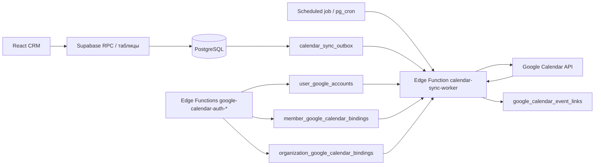

# Интеграция TangoDB с Google Calendar

Статус: архитектурная рекомендация, без реализации  
Версия: **1.6** (уточнение полей времени, deep link URL и free/busy scopes, 2026-08-06)  
Предыдущая версия: **1.5** (2026-08-06)

### История версий

| Версия | Дата | Изменения |
|--------|------|-----------|
| 1.0 | 2026-08-05 | Первоначальная архитектурная рекомендация |
| 1.1 | 2026-08-06 | Сверка с текущей схемой БД и кодом: timezone, отмены/переносы групп, `cancelled_at` персоналок, назначение преподавателя для мероприятий, разграничение с одноразовым ICS-импортом |
| 1.2 | 2026-08-06 | Исправления перед промптами: имя RPC отпуска, семантика получателя мероприятий, deep link, UNIQUE при `NULL occurrence_date`, hard DELETE персоналок, cron, pair/trio в заголовке |
| 1.3 | 2026-08-06 | Финальная проверка перед написанием промптов (`codegraph` + миграции + Google API docs): дополнен тип `quad` в правиле перечисления клиентов (§7); мелкие правки форматирования. Остальные факты документа подтверждены без изменений |
| 1.4 | 2026-08-06 | Исправлены критичные несостыковки: закрыт доступ PostgREST к OAuth credential, уточнены OIDC/scopes и отзыв общего токена, добавлена очистка старых links при смене даты/преподавателя, атомарный claim outbox, отдельный org-level binding, корректная семантика отмены Google event, `accessRole`, ETag 412 и quota |
| 1.5 | 2026-08-06 | Согласованы `disabled_at`/`cleanup_pending` со сценарием disconnect; исправлена нумерация этапов в Промпте 0; nullable `occurrence_date` в outbox; проверка `organization_members.is_active`; Google рекомендует `get`+`update` вместо `patch`; уточнены deep link kinds и зависимости Промпта 11 |
| 1.6 | 2026-08-06 | Уточнены имена полей времени (`schedule_slots.time`/`time_end` vs `time_start`/`time_end`); существующие URL-параметры `/schedule`; RPC `update_calendar_event_with_cancellations`; различие free/busy scopes; мелкие правки перекрёстных ссылок |

## 1. Краткое решение

Рекомендуемая модель:

1. **CRM — единственный источник истины для уроков.**
2. Урок создаётся, изменяется, переносится и отменяется только в TangoDB.
3. TangoDB автоматически создаёт или обновляет событие в Google Calendar назначенного преподавателя.
4. Каждый пользователь самостоятельно подключает свой Google-аккаунт по OAuth 2.0 и выбирает календарь.
5. По умолчанию создаётся или выбирается отдельный календарь вида `TangoDB / Название школы`.
6. Личные события пользователя не копируются в CRM и не читаются TangoDB.
7. Изменения событий TangoDB непосредственно в Google Calendar не считаются изменениями урока в CRM.
8. Обратный импорт Google → CRM возможен позже только как отдельный сценарий создания **черновика**, а не готового оплаченного урока.

Это безопаснее и понятнее двусторонней синхронизации: в CRM находятся клиенты, тарифы, оплаты, посещаемость, преподаватель, дисциплина и зал, которых недостаточно в обычном событии Google Calendar.

Одноразовый импорт исторических занятий из `.ics` (скрипты `ics-to-personal-lessons.mjs`, `import-calendar-lessons.mjs`; см. `tangodb/data/import/albertkoall/CALENDAR_IMPORT.md`) — отдельный миграционный сценарий Google → CRM. Он не заменяет правило «CRM — источник истины» для ongoing-синхронизации: после импорта новые изменения идут только CRM → Google.

## 2. Почему не стоит делать Google Calendar источником уроков

Если преподаватель создаёт обычное событие в Google Calendar, CRM не может надёжно определить:

- является ли событие уроком или личной записью;
- организацию, если пользователь работает в нескольких школах;
- клиента и его стабильный `client_id`;
- тип урока: групповой, персональный, мастер-класс;
- дисциплину и зал;
- тариф, стоимость, оплату и абонемент;
- правила отмены, посещаемости и начисления зарплаты;
- является ли изменение времени переносом, отменой или новым уроком.

Распознавание по названию события, цвету или префиксу ненадёжно. Ошибка такого импорта способна создать дубль, неверную оплату или урок не того клиента.

Поэтому Google Calendar следует считать внешним представлением расписания, а не бизнес-системой.

## 3. Как отделить уроки от личных записей

### Рекомендуемый вариант: отдельный календарь

После подключения Google пользователь:

- создаёт новый календарь `TangoDB / <название организации>`; или
- выбирает существующий календарь, в который TangoDB имеет право записывать события.

В одном Google-аккаунте при этом отображаются одновременно:

- личный основной календарь;
- рабочий календарь TangoDB;
- другие календари пользователя.

Пользователь может включать и выключать рабочий календарь обычным переключателем Google Calendar, назначить ему цвет и настроить уведомления.

Преимущества:

- личные записи физически не смешиваются с CRM-событиями;
- отключение интеграции не требует искать события по заголовку;
- можно удалить или скрыть только календарь TangoDB;
- в будущем можно безопасно слушать изменения только этого календаря;
- одна учётная запись может иметь отдельные календари для разных школ.

### Дополнительная техническая маркировка

Каждое созданное TangoDB событие должно содержать:

```json
{
  "extendedProperties": {
    "private": {
      "managedBy": "tangodb",
      "organizationId": "<uuid>",
      "sourceType": "group_occurrence",
      "sourceId": "<schedule_slot_id>",
      "occurrenceKey": "2026-08-05"
    }
  }
}
```

`occurrenceKey` заполняется только для `sourceType: group_occurrence` (конкретная дата повторяющегося занятия по `schedule_slots`). Для `personal_lesson` и `event_session` поле не нужно: `sourceId` уже указывает на строку с конкретной датой урока/сессии.

Эта метка скрыта от пользователя и нужна для восстановления связи и поиска дублей. Она не заменяет локальную таблицу связей с Google event ID.

### Нерекомендуемый вариант: префикс в названии

Префикс `[TangoDB]` можно использовать только как визуальную подсказку. Нельзя использовать заголовок как технический идентификатор: пользователь может его изменить, а имена клиентов и уроков могут совпадать.

## 4. Пользовательский сценарий подключения

Целевой UX: `Настройки → Интеграции → Google Calendar`. В текущем приложении раздела «Интеграции» ещё нет — пункт и маршрут `/settings/integrations` нужно добавить на этапе 1.

### Подключение преподавателем

1. Пользователь нажимает `Подключить Google Calendar`.
2. CRM открывает Google OAuth consent screen.
3. Google возвращает authorization code в серверную Edge Function.
4. Edge Function обменивает code на access token и refresh token.
5. Сервер валидирует OIDC `id_token` (issuer, audience, signature, expiry, nonce) и получает стабильный Google Account ID (`sub`) и email. Для этого базовый consent включает `openid email`; нельзя считать, что Calendar scopes сами возвращают идентичность пользователя.
6. Пользователь выбирает доступный календарь или создаёт отдельный календарь TangoDB.
7. CRM показывает:
   - подключённый Google-аккаунт;
   - выбранный календарь;
   - статус последней синхронизации;
   - кнопку проверки;
   - кнопку смены календаря;
   - кнопку отключения.
8. После сохранения CRM ставит будущие уроки пользователя в очередь синхронизации.

### Права

- Каждый участник организации подключает только собственный Google-аккаунт.
- Owner/director видит факт подключения и состояние синхронизации преподавателей.
- Owner/director не видит refresh token и не может подключить личный Google-аккаунт за другого пользователя.
- Неактивный участник (`organization_members.is_active = false`) не получает новые события: worker завершает upsert без API-вызова. Уже созданные future events при деактивации не удаляются автоматически в MVP; при необходимости — ручной disconnect/cleanup или будущий enqueue на смене `is_active`.
- При смене назначенного преподавателя событие удаляется из календаря прежнего преподавателя и создаётся у нового.
- Один `user_google_accounts` может обслуживать bindings одного пользователя в нескольких организациях. Отзыв Google consent действует на OAuth grant целиком, поэтому его нельзя выполнять при отключении только одной организации, пока существуют другие активные bindings этого аккаунта.

### Если Google Calendar не подключён

Урок в CRM всё равно создаётся. Интеграция не должна блокировать основную работу.

CRM показывает преподавателю уведомление `Google Calendar не подключён`, а owner/director — нейтральный статус синхронизации команды.

Опциональный fallback для будущей версии: отправить преподавателю email-приглашение из общего календаря организации. Это не должно быть основным механизмом, потому что организатором тогда становится организация, появляются RSVP и лишние письма.

## 5. Направление синхронизации

### Версия 1: CRM → Google, односторонняя

Поддерживаемые действия:

- создание урока → создание Google event;
- изменение времени, даты, зала, дисциплины или преподавателя → обновление/перенос event;
- отмена или удаление будущего урока → удаление event либо визуальная пометка `Отменено`;
- смена преподавателя → удаление старой копии и создание новой;
- повторная синхронизация → идемпотентное восстановление без дублей.

Личные события не читаются и не импортируются.

### Изменение события в Google

Рекомендуемая политика первой версии:

- в описании события показывать `Управляется TangoDB. Изменяйте урок в CRM`;
- правки времени и названия в Google не переносить в CRM;
- при следующем изменении урока в CRM Google event возвращается к состоянию CRM;
- удалённый пользователем event не превращать в отмену урока;
- в CRM предоставить действие `Не синхронизировать этот урок`, если такая потребность появится.

Автоматически воссоздавать удалённое пользователем событие на каждом reconciliation-цикле не следует: это выглядит как ошибка приложения. Надёжно отличить ручное удаление от внешней ошибки можно только после появления webhook/incremental sync; тогда link получает `sync_status = detached`, `detach_reason = user_deleted`. В outbound-only MVP удаление не обнаруживается до следующего явного изменения урока в CRM; получив на update `404`, worker вправе восстановить event, поскольку это следствие нового CRM-изменения.

### Версия 2: проверка занятости

Можно добавить проверку `free/busy` перед записью урока:

- CRM видит только занято/свободно;
- заголовки, участники и описание личных событий не загружаются;
- конфликт не блокирует запись жёстко, а показывает предупреждение;
- пользователь отдельно разрешает scope (`calendar.freebusy` для собственной занятости или `calendar.events.freebusy`, если выбирает несколько календарей — см. §11).

### Версия 3: Google → CRM только как inbox черновиков

Если обратный сценарий действительно понадобится:

1. TangoDB наблюдает только за отдельным календарём TangoDB.
2. Новое вручную созданное событие попадает в `Входящие записи`.
3. Пользователь в CRM выбирает клиента, дисциплину, зал, тариф и тип урока.
4. Только после подтверждения создаётся канонический урок.
5. Событие связывается с созданным уроком и становится управляемым CRM.

Нельзя автоматически создавать финансовую или клиентскую запись из одного названия Google event.

## 6. Какие сущности TangoDB синхронизировать

### Персональные уроки

Источник: `personal_lessons`.

Одна строка урока соответствует одному Google event. Назначение определяется по `teacher_member_id`.

- Строки с `cancelled_at IS NOT NULL` не синхронизируются как активные: применять политику `delete` / `mark_cancelled` (см. подраздел «Отмены» ниже), link помечать удалённым.
- Если `teacher_member_id IS NULL`, у преподавателя нет активного binding, или `organization_members.is_active = false` — задачу upsert пропускать без ошибки (урок в CRM сохраняется, в UI — статус «календарь не подключён» / «преподаватель не назначен» / «участник неактивен»).
- Время: `date` + `time_start` / `time_end` (TEXT `HH:MM`), как в `SCHEDULE_TZ.md`.

В CRM есть два разных сценария исчезновения персонального урока:

- soft-cancel: `cancelled_at` (например, конфликт с мастер-классом) — строка остаётся, outbox ловит UPDATE;
- hard DELETE: RPC `delete_personal_lesson` / `delete_personal_lesson_series_from_date` — строка удаляется. Outbox `delete` нужно ставить в той же транзакции **до** удаления строки (BEFORE DELETE trigger или явный enqueue внутри RPC). Асинхронный worker всё равно не может рассчитывать прочитать удалённую строку: delete-задача обязана содержать стабильные ключи (`organization_id`, `source_id`, `occurrence_date`), а удаление в Google выполняется по уже существующим `google_calendar_event_links`.

### Групповые уроки

Источник: `schedule_slots`, которые в TangoDB являются версионируемыми шаблонами расписания.

Рекомендуется создавать в Google отдельное событие для каждого occurrence, а не одну бесконечную RRULE-серию.

Причины:

- CRM умеет переносить и отменять отдельные occurrence;
- `schedule_slots` имеют `valid_from` / `valid_to`;
- смена преподавателя и split серии проще обрабатываются без Google recurrence exceptions;
- отдельный event легче идемпотентно связать по `(schedule_slot_id, occurrence_date)`.

Рабочее окно материализации:

- прошлое: 7 дней для восстановления недавних операций;
- будущее: 90 дней по умолчанию;
- ежедневная задача продлевает горизонт ещё на один день.

Горизонт можно сделать настройкой организации, но не следует заранее создавать события на годы вперёд.

Материализация occurrence должна повторять логику `expandSlotsToDateRange` / `expandSlotsToWeek` (`tangodb/src/lib/scheduleWeek.ts`): учитывать `valid_from` / `valid_to`, `day_of_week`, `group_name` (для заголовка события). Время occurrence: `occurrence_date` + `schedule_slots.time` / `time_end` (TEXT `HH:MM`; у слотов поле начала называется `time`, не `time_start`). Сами `expandSlots*` **не** фильтруют отмены — worker отдельно исключает даты из `schedule_occurrence_cancellations` (одиночная отмена, отпуск через RPC `cancel_teacher_group_vacation`). При `move_group_lesson_occurrence` создаётся новая версия слота (`moved_from_slot_id`, `moved_from_date`, `moved_from_time`) и запись отмены на исходную дату — worker удаляет event по старому `(slot_id, occurrence_date)` и создаёт по новому. `teacher_member_id` на слоте может быть `NULL` — тогда событие не уходит в преподавательский календарь (аналогично персоналкам).

### Мероприятия

Источник: `calendar_event_sessions` (+ родительская запись `calendar_events`).

У `calendar_event_sessions` нет `teacher_member_id`. На родителе `calendar_events`:

- `created_by` — кто создал запись в CRM (`organization_members`), часто owner/director/admin, **не** поле «преподаватель урока»;
- `guest_teacher`, `organizer` — свободный текст, не FK на участника и не Google-аккаунт.

Каждая session — отдельный Google event. Время: `session_date` + `time_start` / `time_end` (как у персоналок). **MVP (этап 4):** по умолчанию писать только в общий календарь организации через отдельный `organization_google_calendar_bindings`, а не в личный календарь `created_by`. Credential для такого binding принадлежит owner/director, который явно подключил календарь от имени организации; при его деактивации binding нужно перепривязать, а не молча использовать чужой аккаунт. Опционально: если у `created_by` включены `sync_events` и активный member binding — дублировать копию к нему как «уведомление создателю», отдельным продуктовым флагом. Не выбирать Google-аккаунт по `guest_teacher` / `organizer`. Отдельного UI/RPC hard-delete мероприятия сейчас нет: удаление session идёт через RPC `update_calendar_event_with_cancellations`, который переписывает набор `calendar_event_sessions` — enqueue должен покрывать и исчезнувшие session id. Будущее улучшение: колонка `teacher_member_id` на `calendar_events` для настоящей привязки к календарю преподавателя.

### Аренда

`rentals` не следует включать в преподавательский календарь по умолчанию. Для аренды позже нужен отдельный календарь зала/организации и отдельный переключатель.

### Отмены

Политика отображения должна быть настройкой:

- `delete` — удалить событие из Google Calendar;
- `mark_cancelled` — оставить обычное событие (`status: confirmed`) с префиксом `Отменено:` и `transparency: transparent`.

Для MVP рекомендуется `delete`, поскольку CRM хранит историю отмены, а календарь преподавателя должен показывать фактическую занятость.

Google трактует `status: cancelled` как удалённое событие, а не как видимую бизнес-пометку. Поэтому этот статус нельзя использовать для режима `mark_cancelled`.

## 7. Формат Google event

Пример персонального урока:

```text
Название: Персональный урок · Танго
Время: 5 августа 2026, 18:00–19:00
Место: Miami studio
Описание:
  Клиент: Анна П.
  Организация: TangoDB School
  Открыть в CRM: https://app.example.com/schedule?date=2026-08-05&focus=personal:<id>
  Управляется TangoDB. Изменяйте урок в CRM.
```

Deep link на конкретный урок в `/schedule` сейчас **не реализован**. В URL уже есть только фильтр преподавателя и action-параметры (`SchedulePageContainer`): `?teacher=<member_id>`, `?action=sell`, `?action=createRental`, `?renterId=<uuid>`. Неделя расписания хранится в React state (`selectedWeekStart`), а не в query string — параметр `?date=` тоже нужно добавить на этапе UI. Целевой формат deep link:

```text
?date=YYYY-MM-DD&focus=personal:<lesson_id>
?date=YYYY-MM-DD&focus=group:<slot_id>
?date=YYYY-MM-DD&focus=event:<session_id>
```

До появления deep link в описании Google event ставить ссылку на неделю/`/schedule` без фокуса. Для множественного персонального урока в названии/описании перечислять клиентов по `privacy_mode`, без телефонов и сумм.

Тип персонального урока — `solo`/`pair`/`trio`/`quad` (до 4 клиентов: `client_id1`…`client_id4`). Правило перечисления клиентов по `privacy_mode` относится к `pair`/`trio`/`quad`.

Рекомендации:

- не передавать стоимость, долг, оплату, телефон и внутренние заметки;
- имя клиента показывать по настройке приватности: полное, имя + первая буква фамилии или `Персональный урок`;
- использовать timezone организации;
- записывать IANA timezone, например `Asia/Bangkok`, а не только UTC offset;
- использовать `transparency: opaque`, чтобы урок занимал время;
- использовать `visibility: private` для персональных уроков по умолчанию (с учётом продуктовой настройки общего календаря);
- напоминания по умолчанию наследовать из выбранного календаря через `reminders.useDefault: true`;
- ссылка должна открывать конкретную дату/урок в CRM **после** реализации deep link;
- Google event ID по возможности генерировать детерминированно либо обязательно хранить возвращённый ID. Если генерировать самостоятельно (`id` в `events.insert`), учитывать формат Google: только символы `a-v` и `0-9`, длина 5–1024 — обычный UUID (дефисы, буквы `w`–`z`) не подходит без преобразования (например, hex/base32hex от исходного UUID).

## 8. Целевая архитектура



> В репозитории пока нет настроенного `pg_cron` / scheduled Edge Function для календарной очереди. На этапе 2 нужно явно выбрать механизм (Supabase Cron → Edge Function, или внешний scheduler) и зафиксировать его в deployment checklist — диаграмма выше показывает целевую схему, а не уже существующую инфраструктуру.

### Почему нужен серверный worker

Нельзя вызывать Google Calendar API непосредственно из React:

- refresh token нельзя выдавать браузеру;
- вкладка может закрыться после сохранения урока;
- Google API может временно вернуть 429 или 5xx;
- создание урока в CRM не должно откатываться из-за Google;
- нужны повторы, идемпотентность и журнал ошибок.

### Почему нужен transactional outbox

После успешной бизнес-операции CRM записывает задачу синхронизации в той же транзакции либо через DB trigger. Worker обрабатывает задачу отдельно.

Это обеспечивает:

- урок не теряется при временной недоступности Google;
- основной write path остаётся быстрым;
- повторная доставка безопасна;
- можно контролировать retry и dead-letter;
- периодическая reconciliation-задача исправляет пропуски.

Прямой webhook из браузера или fire-and-forget вызов Edge Function недостаточно надёжен.

Claim задач также должен быть атомарным: Edge Function вызывает SQL RPC наподобие `claim_calendar_sync_jobs(batch_size, worker_id)`, внутри которого один короткий transaction выполняет `FOR UPDATE SKIP LOCKED` + `UPDATE ... RETURNING`. Нельзя делать отдельный PostgREST `SELECT`, а затем `UPDATE`: между запросами lease отсутствует и два worker могут взять одну задачу.

Точки enqueue (outbox): INSERT/UPDATE/DELETE на `personal_lessons` (включая soft `cancelled_at` и hard DELETE через RPC — enqueue до удаления строки); изменения `schedule_slots` (включая закрытие версии `valid_to`); INSERT в `schedule_occurrence_cancellations`; RPC `move_group_lesson_occurrence`, `cancel_group_lesson_occurrences`, `cancel_teacher_group_vacation`; INSERT/UPDATE/DELETE на `calendar_event_sessions` и связанные изменения `calendar_events`. Предпочтительно — DB trigger или вызов из существующих RPC в той же транзакции, что и бизнес-операция.

## 9. Предлагаемая модель данных

Названия предварительные.

### `user_google_accounts`

Одна OAuth-учётная запись Google пользователя.

| Поле | Назначение |
|---|---|
| `id` | UUID |
| `user_id` | `auth.users.id` |
| `google_subject` | стабильный Google Account ID |
| `google_email` | email для отображения |
| `refresh_token_secret_id` или `encrypted_refresh_token` | ссылка на Vault secret либо ciphertext; выбрать один механизм, plaintext недопустим |
| `granted_scopes` | выданные scopes |
| `status` | `active`, `revoked`, `error` |
| `token_version` | версия схемы шифрования |
| `last_verified_at` | последняя успешная проверка |
| `created_at`, `updated_at` | аудит |

Уникальность: `(user_id, google_subject)` — один и тот же Google-аккаунт не должен создавать вторую запись для того же пользователя TangoDB. Отдельно нужно решить политику для случая, когда один и тот же `google_subject` пытается подключить другой пользователь TangoDB (например, после смены владельца почты) — это должно быть либо отдельной явной ошибкой, либо переносом привязки, а не тихим дублированием.

Критичное ограничение доступа: `authenticated` не получает `SELECT/INSERT/UPDATE/DELETE` на эту таблицу вообще. Даже зашифрованный credential нельзя возвращать через PostgREST. UI получает только безопасные поля (`id`, `google_email`, `status`, timestamps) через специально ограниченный RPC/view; запись выполняют только Edge Functions. RLS остаётся дополнительной защитой, но сама по себе не скрывает отдельную колонку от владельца строки.

### `google_oauth_states`

Короткоживущая backend-only таблица для OAuth handshake: hash случайного `state`, `user_id`, OIDC nonce, PKCE verifier (или его защищённое представление), allowlisted return URL, `expires_at`, `consumed_at`. У `authenticated` нет grants; callback атомарно помечает запись использованной. Истёкшие записи регулярно удаляются.

### `member_google_calendar_bindings`

Выбранный календарь для конкретного участника конкретной организации.

| Поле | Назначение |
|---|---|
| `id` | UUID |
| `organization_id` | tenant |
| `organization_member_id` | преподаватель/пользователь |
| `google_account_id` | связанный Google-аккаунт |
| `calendar_id` | непрозрачный Google calendar ID |
| `calendar_name` | кэш отображаемого имени |
| `timezone` | timezone календаря |
| `enabled` | синхронизация включена; новые upsert идут только при `enabled = true` |
| `sync_group`, `sync_personal`, `sync_events` | типы данных |
| `privacy_mode` | `full_name`, `initials`, `hidden` |
| `last_success_at`, `last_error_at`, `last_error_code` | состояние |
| `disabled_at` | момент отключения |
| `cleanup_pending` | `true`, пока worker ещё должен удалять future events этого binding после disconnect «с удалением»; credential/`calendar_id` остаются доступны backend |

Уникальность: один активный binding на `(organization_id, organization_member_id)` — partial UNIQUE `WHERE enabled`. Отключённый binding с `cleanup_pending = true` не мешает создать новый активный binding на другого календаря.

При смене календаря или disconnect «с удалением» старый binding нельзя физически удалять, пока `cleanup_pending` или пока есть его links. Ошибка `invalid_grant` относится к `user_google_accounts.status`, а ошибка доступа к конкретному календарю — к полям ошибки binding.

### `organization_google_calendar_bindings`

Отдельная привязка общего календаря организации для мероприятий:

| Поле | Назначение |
|---|---|
| `id`, `organization_id` | идентификатор и tenant |
| `google_account_id` | credential owner/director, который выполнил подключение |
| `configured_by_member_id` | ответственный участник |
| `calendar_id`, `calendar_name`, `timezone` | выбранный общий календарь |
| `enabled`, `disabled_at`, `cleanup_pending` | те же правила disconnect/cleanup, что у member binding |
| `last_success_at`, `last_error_*` | состояние |

Не следует кодировать общий binding как `member_google_calendar_bindings.organization_member_id = NULL`: это ломает исходную семантику таблицы, composite FK и partial UNIQUE. На организацию допускается один активный org-level binding (`WHERE enabled`).

### `google_calendar_event_links`

Связь каждого CRM occurrence с внешним событием.

| Поле | Назначение |
|---|---|
| `id` | UUID |
| `organization_id` | tenant |
| `recipient_kind` | `member` или `organization` |
| `member_binding_id` | nullable FK на календарь участника |
| `organization_binding_id` | nullable FK на общий календарь организации |
| `source_type` | `group_occurrence`, `personal_lesson`, `event_session` |
| `source_id` | ID исходной записи |
| `occurrence_date` | дата occurrence; для `group_occurrence` обязательна; для `personal_lesson` / `event_session` — дата урока/сессии (не NULL) |
| `google_event_id` | ID Google event |
| `google_etag` | защита от конкурирующих изменений |
| `desired_hash` | hash последнего отправленного payload |
| `sync_status` | `pending`, `synced`, `failed`, `detached` |
| `detach_reason` | nullable причина, например `user_deleted` |
| `last_synced_at`, `last_error` | диагностика |

`occurrence_date DATE NOT NULL` для всех `source_type`: для персоналок и session брать `personal_lessons.date` / `calendar_event_sessions.session_date`; для `group_occurrence` `source_id = schedule_slot_id`.

CHECK требует ровно один FK согласно `recipient_kind`. Нужны два partial UNIQUE-индекса:

```text
(member_binding_id, source_type, source_id, occurrence_date)
  WHERE member_binding_id IS NOT NULL
(organization_binding_id, source_type, source_id, occurrence_date)
  WHERE organization_binding_id IS NOT NULL
```

FK должны быть tenant-safe: каждый binding проверяется парой `(organization_id, *_binding_id)`, а не только глобальным UUID.

### `calendar_sync_outbox`

| Поле | Назначение |
|---|---|
| `id` | UUID/idempotency key |
| `organization_id` | tenant |
| `source_type`, `source_id`, `occurrence_date` | что пересчитать; `occurrence_date` **nullable** только для `reconcile_member` / задач без конкретной даты |
| `dedupe_key` | канонический ключ задачи (`source:type:id:date` или `reconcile_member:member_id`) |
| `operation` | `upsert`, `delete`, `reconcile_member` |
| `status` | `pending`, `processing`, `retry`, `done`, `dead` |
| `attempt_count` | число попыток |
| `available_at` | время следующей попытки |
| `locked_at`, `locked_by` | lease worker |
| `last_error_code`, `last_error_message` | диагностика |
| `created_at`, `processed_at` | аудит |

Для одного ключа можно схлопывать несколько pending-задач partial UNIQUE-индексом по `(organization_id, dedupe_key)` для статусов `pending/retry`. Отдельный `dedupe_key` устраняет неоднозначность `NULL occurrence_date` у `reconcile_member`. При изменении даты требуются две разные задачи: cleanup старого `occurrence_date` и upsert нового.

Worker всегда строит **текущее желаемое состояние** из CRM, а не проигрывает устаревшие промежуточные изменения. UPDATE, меняющий дату или преподавателя, обязан enqueue-ить OLD и NEW ключи. Дополнительно каждый upsert удаляет все links того же `source_type/source_id`, которые больше не соответствуют текущим `(recipient_kind, recipient binding, occurrence_date)`. Иначе смена даты, календаря или преподавателя оставит старое событие.

## 10. Алгоритм синхронизации

### Upsert

1. Worker атомарно получает batch через DB-функцию claim (`FOR UPDATE SKIP LOCKED` + `UPDATE ... RETURNING` в одной транзакции).
2. Загружает текущее состояние урока из CRM (для групп — с учётом `schedule_occurrence_cancellations` и переносов; для персоналок — пропуск/delete при `cancelled_at IS NOT NULL` или отсутствии строки после hard DELETE — тогда опираться на link).
3. Определяет получателя: для групп/персоналок — `teacher_member_id` + member binding; для мероприятий — org-level binding (и опционально `created_by`, см. §6). При отсутствии binding, `enabled = false` (кроме delete/cleanup), или `organization_members.is_active = false` у получателя — завершает upsert-задачу без API-вызова.
4. Строит безопасный Google payload.
5. Вычисляет `desired_hash`.
6. Находит все `google_calendar_event_links` этого `source_type/source_id`; удаляет stale links старой даты, binding или преподавателя.
7. Ищет link текущего `(recipient binding, source_type, source_id, occurrence_date)`.
8. Если link отсутствует — вызывает `events.insert`.
9. Если link есть и hash не изменился — завершает задачу без API-вызова.
10. Если link есть и hash изменился — условно обновляет event с `If-Match: <google_etag>`.
11. При `412 Precondition Failed` повторно получает event и применяет выбранную политику: CRM побеждает, если link не `detached`; число повторов ограничено.
12. Сохраняет event ID, etag, hash и время синхронизации.
13. Помечает outbox-задачу выполненной.

Google документирует, что `events.patch` расходует три quota units и рекомендует `events.get` + `events.update`. Для worker по умолчанию использовать `update` (полный ресурс из CRM-payload) с `If-Match`; `patch` не нужен. При неизменном `desired_hash` API-вызов не выполнять.

Claim-функция перед выдачей нового batch возвращает в `retry` задачи, застрявшие в `processing` дольше lease timeout. Иначе падение worker навсегда оставит задачу заблокированной.

Новая pending-задача может появиться, пока предыдущая с тем же `dedupe_key` уже processing. Claim не должен выдавать её другому worker, пока processing-задача этого ключа не завершилась: обработка одного ключа строго последовательна, иначе поздний delete может удалить только что созданный event.

### Delete/отмена

1. Worker находит все links исходного occurrence.
2. Удаляет события из календарей старых получателей, используя credential связанного binding даже если `enabled = false`, пока `cleanup_pending = true` или пока есть links этого binding.
3. Ошибку Google `404 not found` считает успешным удалением.
4. Помечает links удалёнными или удаляет их после записи аудита.
5. Когда для binding с `cleanup_pending = true` не осталось links — сбрасывает `cleanup_pending = false`.

### Смена преподавателя

Это не update одного Google event между календарями:

1. удалить event в binding прежнего преподавателя;
2. пометить или удалить link прежнего получателя — так же, как в алгоритме удаления (шаг 4 выше), иначе останется висящая запись с устаревшим `google_event_id`;
3. создать новый event в binding нового преподавателя;
4. сохранить отдельный link нового получателя.

### Retry

- token endpoint `invalid_grant`: `user_google_accounts.status → revoked`, все связанные bindings требуют переподключения;
- Google API 401: один раз обновить access token; при повторе зафиксировать ошибку аккаунта;
- 403: проверить права выбранного календаря, показать ошибку пользователю;
- 404: при update выполнить контролируемый повторный insert, если событие не было намеренно detached;
- 409 duplicate: найти событие по детерминированному ID/extended property;
- 412: перечитать event/etag и ограниченно повторить применение CRM-состояния;
- 429 и 5xx: exponential backoff с jitter;
- постоянная ошибка после лимита попыток: `dead`, видимый статус и ручной `Повторить`.

### Reconciliation

Периодическая задача:

- проверяет будущие уроки в рабочем горизонте;
- создаёт отсутствующие links;
- удаляет links для отменённых/переназначенных уроков (включая строки в `schedule_occurrence_cancellations`, переносы через `move_group_lesson_occurrence`, `personal_lessons.cancelled_at`);
- повторяет зависшие задачи;
- не сканирует личные события пользователя.

## 11. OAuth и scopes

Использовать серверный OAuth 2.0 Authorization Code Flow:

- `access_type=offline`;
- `prompt=consent` при первом подключении без сохранённого credential и при reconnect после `revoked`/ошибки, чтобы гарантированно получить `refresh_token`; при incremental consent не затирать существующий refresh token, если token response не вернул новый;
- непрозрачный случайный `state`; server-side запись с TTL связывает его с `user_id`, allowlisted return URL, nonce и PKCE verifier. Не доверять данным, сериализованным клиентом в `state`;
- PKCE S256;
- точное совпадение HTTPS redirect URI;
- refresh token хранится только на backend;
- access token не хранится долговременно и обновляется по refresh token.

Минимальные scopes следует подтвердить при реализации по актуальной документации Google. Целевая разбивка:

- идентичность аккаунта: `openid email` с обязательной валидацией `id_token`;
- рекомендуемый строгий режим «TangoDB создаёт отдельный календарь»: `calendar.app.created` + `calendar.calendarlist.readonly` (`calendars.insert` и events на календарях, созданных приложением, входят в этот scope по текущей справке Google);
- выбор уже существующего writable-календаря: дополнительный `calendar.events` (доступ к событиям всех доступных календарей — осознанно более широкий режим);
- создание/изменение свойств календаря без `calendar.app.created`: `calendar.calendars`, только по явному действию или как fallback, если `calendar.app.created` не проходит verification/consent;
- free/busy (отдельный incremental consent во второй версии): `calendar.freebusy` — только собственная занятость подключённого пользователя; `calendar.events.freebusy` — занятость любых календарей, к которым у пользователя есть доступ (нужен, если в `freebusy_calendar_ids` выбран не только основной личный календарь).

Не следует сразу запрашивать полный `https://www.googleapis.com/auth/calendar`, если сценарий покрывается более узкими scopes.

Для публичного SaaS нужен production OAuth project и Google verification. Внешний OAuth app в режиме Testing имеет ограничения на тестовых пользователей и срок жизни refresh tokens; development и production проекты следует разделить.

Service Account не подходит как основной сценарий для личных аккаунтов преподавателей. Domain-Wide Delegation применима только когда школа управляет единым Google Workspace-доменом и его администратор явно выдал полномочия.

## 12. Безопасность и приватность

Обязательные требования:

- refresh token зашифрован отдельным серверным ключом или хранится через подходящий secret/vault-механизм;
- plaintext token никогда не возвращается в PostgREST и браузер;
- service role используется только внутри Edge Functions;
- RLS не обходится клиентом;
- таблица аккаунтов отделена от tenant binding, потому что один пользователь может состоять в нескольких организациях;
- пользователь может отозвать подключение и удалить сохранённый token;
- disconnect останавливает новые записи; удаление уже созданных events — отдельный явный выбор;
- отключение одного org binding не отзывает account-level Google consent, если этот credential используется другими bindings; revoke разрешён только для явного «Отключить Google-аккаунт везде» либо после проверки отсутствия других активных bindings;
- логи не содержат refresh/access token, содержимое личных events или полные данные клиента;
- OAuth callback проверяет `state`, nonce, TTL и текущего пользователя;
- redirect URL задаётся allowlist, а не берётся произвольно из query;
- audit фиксирует connect, disconnect, смену календаря и массовую пересинхронизацию;
- данные клиента в Google минимизируются настройкой `privacy_mode`.

Желательное поведение при отключении:

1. `Отключить, события оставить`;
2. `Отключить и удалить будущие события TangoDB`;
3. `Отозвать доступ Google для TangoDB везде` — отдельное account-level действие с предупреждением обо всех затронутых организациях.

## 13. Webhook и двустороннее наблюдение

Для одностороннего MVP Google webhook не обязателен.

Если понадобится обнаруживать удаление/изменение events:

- создать `events.watch` только для выбранного рабочего календаря;
- webhook является сигналом «что-то изменилось», а не содержит полное событие;
- после сигнала выполнить incremental sync через `syncToken`;
- хранить `channel_id`, `resource_id`, `expiration`, `sync_token`;
- обновлять watch до истечения; канал сам не продлевается;
- при HTTP 410 сбросить sync token и выполнить новый полный sync рабочего календаря;
- проверять сохранённые `X-Goog-Channel-ID`, `X-Goog-Resource-ID` и непредсказуемый `X-Goog-Channel-Token` (constant-time comparison). Google не подписывает payload; token — shared secret, OAuth token в него не помещать;
- webhook должен быть публичным HTTPS endpoint;
- обработчик должен быстро вернуть 2xx, а работу положить в очередь.

Даже при webhook изменения Google не должны напрямую изменять бизнес-данные CRM без отдельного подтверждённого сценария.

## 14. Часовые пояса и даты

Текущая модель TangoDB хранит дату и локальное время школы отдельно. Для Google нужен точный datetime.

IANA timezone уже есть: `organization_settings.timezone` (по умолчанию `Europe/Moscow`), настраивается в `Настройки → Основные`. Worker обязан читать это поле, а не хардкодить offset: CRM хранит локальные `DATE` + `HH:MM`, Google получает `dateTime` + `timeZone`.

Примеры значений:

```text
Asia/Bangkok
Europe/Moscow
```

Правила:

- строить Google `start.dateTime` и `end.dateTime` из локальной даты, времени и timezone организации;
- передавать поле `timeZone`;
- не сохранять только фиксированный offset, потому что он не описывает переходы DST;
- при смене timezone организации требовать явную массовую пересинхронизацию будущих событий;
- timezone выбранного Google-календаря показывать пользователю, но источником времени урока остаётся timezone организации;
- all-day events для уроков не использовать.

Имена полей времени в CRM (worker не должен путать `time` и `time_start`):

| Сущность | Дата | Время начала / конца |
|---|---|---|
| `personal_lessons` | `date` | `time_start` / `time_end` |
| `schedule_slots` → group occurrence | `occurrence_date` (материализуется) | `time` / `time_end` |
| `calendar_event_sessions` | `session_date` | `time_start` / `time_end` |

## 15. UX и статусы

### В настройках пользователя

Показывать:

- `Подключено` / `Требуется переподключение` / `Ошибка доступа`;
- Google email;
- выбранный календарь;
- типы синхронизируемых уроков;
- режим приватности;
- последнюю успешную синхронизацию;
- краткую последнюю ошибку;
- `Проверить подключение`;
- `Синхронизировать будущие уроки`;
- `Сменить календарь`;
- `Отключить`.

### В уроке

Не нужно показывать технические детали постоянно. Достаточно компактного статуса:

- синхронизировано;
- ожидает;
- ошибка;
- у преподавателя календарь не подключён.

Ошибка календаря не должна блокировать сохранение урока.

### Для owner/director

Экран состояния команды:

- подключено ли у участника;
- последний успешный sync;
- количество pending/failed задач;
- действие `Напомнить подключить`;
- без доступа к токенам и личному содержимому календаря.

## 16. План реализации

### Этап 0. Зафиксировать продуктовые решения

- CRM является источником истины;
- outbound-only MVP;
- отдельный календарь по умолчанию;
- какие типы событий включены;
- режим приватности по умолчанию;
- delete или mark-cancelled;
- горизонт будущих групповых occurrence;
- IANA timezone организации (уже в `organization_settings.timezone`; проверить корректность перед запуском синхронизации).

### Этап 1. OAuth и подключение

- Google Cloud project для dev;
- consent screen и scopes;
- Edge Functions `google-calendar-auth-start`, `google-calendar-auth-callback`, `google-calendar-disconnect`, `google-calendar-list-calendars` (список/создание календаря и сохранение binding);
- безопасное хранение refresh token;
- таблицы account/binding;
- UI подключения и выбора календаря;
- RLS и аудит.
- безопасный RPC/view для UI без credential-колонки; у `authenticated` нет прямых grants на `user_google_accounts`.

### Этап 2. Outbox и personal lessons

- таблицы outbox/event links;
- worker с retry и идемпотентностью;
- enqueue на create/update/cancel personal lesson (включая установку `cancelled_at`, OLD+NEW при смене даты/преподавателя);
- privacy mode;
- статус синхронизации в UI;
- reconciliation.

### Этап 3. Групповые occurrence

- материализация на 90 дней (логика как `expandSlotsToDateRange` + исключение `schedule_occurrence_cancellations`);
- обработка `valid_from` / `valid_to`;
- переносы (`move_group_lesson_occurrence`, поля `moved_from_*`), split и одиночные отмены (`schedule_occurrence_cancellations`, отпуск `cancel_teacher_group_vacation`);
- смена преподавателя;
- ежедневное продление горизонта.

### Этап 4. Мероприятия и общий календарь

- `calendar_event_sessions`;
- **org-level binding как основной получатель** (не `created_by` как «преподаватель»);
- опциональная копия создателю при `sync_events`;
- правила для guest teacher (только текст в описании, не выбор аккаунта);
- отдельные настройки event types;
- deep link `?date=&focus=` в описании события (если ещё не сделан на этапе UI).

### Этап 5. Наблюдение и free/busy

- webhook renewal;
- incremental sync;
- обнаружение delete/edit;
- статус detached;
- optional free/busy без чтения деталей.

### Этап 6. Google → CRM inbox, только при подтверждённой потребности

- watch отдельного календаря;
- черновики;
- ручное сопоставление клиента/тарифа/дисциплины;
- защита от дублей.

## 17. Тестирование

Минимальный набор:

- подключение, повторное подключение и отзыв доступа;
- пользователь в двух организациях с разными календарями;
- отключение binding в одной организации не отзывает Google grant и не ломает binding второй организации;
- два преподавателя с разными Google-аккаунтами;
- повторное подключение того же Google-аккаунта тем же пользователем после `revoked` (проверить, что `refresh_token` переиздаётся благодаря `prompt=consent`);
- personal create/update/cancel/delete (в т.ч. `cancelled_at` и hard DELETE через `delete_personal_lesson`);
- групповая серия, split, перенос occurrence (`move_group_lesson_occurrence`) и отмена одной даты (`schedule_occurrence_cancellations`);
- отпуск преподавателя (`cancel_teacher_group_vacation`);
- смена преподавателя;
- мероприятие: sync в org calendar, а не в произвольный `created_by` по умолчанию;
- event уже удалён в Google;
- refresh token revoked;
- календарь стал read-only или удалён;
- 429/5xx и повтор без дубля;
- worker упал после успешного Google insert, но до записи link;
- смена даты/преподавателя удаляет старый event/link и не оставляет дубликат;
- два worker конкурентно claim-ят очередь без двойной обработки;
- `412 Precondition Failed` обрабатывается ограниченным повтором;
- смена timezone;
- privacy modes;
- отключение с сохранением и удалением будущих events;
- `cleanup_pending`: после disconnect «с удалением» worker чистит links и сбрасывает флаг; новый активный binding можно создать до завершения cleanup;
- неактивный `organization_members.is_active = false` не получает новые upsert;
- RLS: другой пользователь и другой tenant не видят credential/binding;
- owner видит статус, но не token;
- массовая первоначальная синхронизация не превышает quota.

## 18. Метрики и эксплуатация

Отслеживать:

- pending queue depth;
- возраст самой старой pending задачи;
- success/error rate;
- API latency;
- 401/403/429/5xx по кодам;
- число revoked bindings;
- количество insert/update/delete;
- количество предотвращённых дублей;
- время последней reconciliation;
- количество dead-letter задач.

Не логировать payload с клиентскими данными целиком.

## 19. Что не делать

- Не импортировать все события личного календаря.
- Не определять урок по словам в названии.
- Не хранить refresh token в React, localStorage или обычном доступном профиле.
- Не создавать Google event напрямую из компонента.
- Не откатывать созданный в CRM урок из-за ошибки Google.
- Не использовать email преподавателя как единственную связь — нужен `organization_member_id`.
- Не считать удаление event в Google отменой оплаченного урока.
- Не создавать одну вечную Google recurrence для версионируемого группового расписания.
- Не смешивать OAuth одного пользователя с общим service account.
- Не передавать в описание оплату, долг, телефон и внутренние заметки.

## 20. Итоговая рекомендация

Для TangoDB оптимальна схема:

```text
Урок создаётся в CRM
→ CRM сохраняет бизнес-данные
→ outbox ставит задачу
→ серверный worker создаёт событие
→ событие попадает в отдельный календарь назначенного преподавателя
```

Каждый преподаватель самостоятельно подключает Google-аккаунт и выбирает рабочий календарь. Личные события остаются личными. Ошибка Google Calendar не влияет на сохранение урока. Двустороннюю синхронизацию следует добавлять только как inbox черновиков после проверки реальной потребности.

## 21. Официальные материалы Google

- OAuth 2.0: https://developers.google.com/identity/protocols/oauth2
- Выбор authorization model: https://developers.google.com/identity/oauth2/web/guides/choose-authorization-model
- Production readiness: https://developers.google.com/identity/protocols/oauth2/production-readiness/overview
- Создание событий: https://developers.google.com/workspace/calendar/api/guides/create-events
- Extended properties: https://developers.google.com/workspace/calendar/api/guides/extended-properties
- Scopes: https://developers.google.com/workspace/calendar/api/auth
- ETag / conditional modification: https://developers.google.com/workspace/calendar/api/guides/version-resources
- Incremental sync: https://developers.google.com/workspace/calendar/api/guides/sync
- Push notifications: https://developers.google.com/workspace/calendar/api/guides/push
- Events watch: https://developers.google.com/workspace/calendar/api/v3/reference/events/watch

## 22. Промпты для агента (готовые к копированию)

> **Добавлено в версии 1.3, уточнено в 1.5–1.6.** Промпты реализуют план §16 (Этапы 0–6) как последовательность шагов для AI-агента. Каждый промпт рассчитан на самостоятельный запуск в новом контексте: указывает, что читать, что делать и что не трогать. Перед каждым промптом — прочитать `.cursor/docs/ai/AI_CONTEXT.md` и файлы из блока «Прочитай сначала».
>
> Дата написания промптов: 2026-08-06. Если к моменту реализации в `tangodb/supabase/migrations/` появились файлы с более поздним timestamp, чем указанный ниже как «следующий», брать актуальный следующий по порядку — жёстко зашитая дата в промптах ниже условна (по аналогии с B7 из `SCHEDULE_TZ.md`). На 2026-08-06 последняя миграция — `20260890000001_finance_cost_entry_labels.sql`.

### Порядок и зависимости

| # | Промпт | Этап (§16) | Зависит от |
|---|--------|-----------|------------|
| 0 | Decision log | 0 | — |
| 1 | OAuth-таблицы + RLS | 1 | 0 |
| 2 | Edge Functions: OAuth start/callback/disconnect | 1 | 1 |
| 3 | Edge Function: список/создание календарей + сохранение binding | 1 | 2 |
| 4 | UI: Настройки → Интеграции → Google Calendar | 1 | 3 |
| 5 | Outbox + event links + enqueue для personal lessons | 2 | 1 |
| 6 | Worker calendar-sync-worker: ядро upsert/delete | 2 | 3, 5 |
| 7 | Cron, retry/backoff, reconciliation (персональные) | 2 | 6 |
| 8 | UI статуса синхронизации (урок / настройки / команда) | 2 | 4, 7 |
| 9 | Материализация групповых occurrence + enqueue | 3 | 5 |
| 10 | Worker: групповые occurrence (перенос, отпуск, горизонт) | 3 | 6, 9 |
| 11 | Мероприятия: sync `calendar_event_sessions` | 4 | 5, 6 |
| 12 | Webhook-наблюдение + incremental sync (опционально) | 5 | 7, 10 |
| 13 | Free/busy при записи урока (опционально) | 5 | 2, 3 |
| 14 | Регрессия и чек-лист тестирования | — | 1–11 |

Этап 6 (Google → CRM inbox, §16) намеренно не разбит на промпты: документ прямо требует делать это «только при подтверждённой потребности» (§5, версия 3) — писать промпт следует отдельно, когда решение принято, а не заранее.

```
Промпт 0
   ↓
Промпт 1 → 2 → 3 → 4                (OAuth и подключение — Этап 1)
   ↓ (после 1, параллельно с 2–4)
Промпт 5 → 6 → 7 → 8                (Outbox + персональные уроки — Этап 2)
              ↓ (после 6; 9 можно параллельно с 7–8)
Промпт 9 → 10                       (Групповые occurrence — Этап 3)
              ↓ (после 5–6; можно параллельно с 9–10)
Промпт 11                           (Мероприятия — Этап 4)
              ↓
Промпт 12, 13 (опционально, параллельно) (Этап 5)
   ↓
Промпт 14 (регрессия, после всех выполненных)
```

Промпты **12** и **13** — опциональные (Этап 5 плана), запускать по продуктовому решению, а не автоматически по порядку.

---

### Промпт 0 — decision log

```
Задача: зафиксировать продуктовые решения перед реализацией интеграции TangoDB с Google Calendar.

Прочитай tangodb_google_calendar_integration.md целиком (особенно §16 Этап 0, §19 «Что не делать», §20) и добавь в .cursor/docs/ai/decision_log.md записи по каждому пункту:
- CRM — единственный источник истины; интеграция outbound-only (CRM → Google) в MVP
- отдельный календарь TangoDB по умолчанию (не основной личный)
- какие сущности синхронизируются в MVP: personal_lessons, schedule_slots (group occurrence); calendar_event_sessions и free/busy — отдельными этапами (§16 этапы 4 и 5)
- privacy_mode по умолчанию для новых binding (предложение: initials)
- политика отмены по умолчанию: delete (не mark_cancelled) — см. подраздел «Отмены» в §6
- горизонт материализации групповых occurrence: 90 дней вперёд / 7 дней назад (§6 «Групповые уроки»)
- organization_settings.timezone уже существует (default Europe/Moscow) — переиспользуем, новую настройку не создаём
- rentals не синхронизируются с преподавательским календарём в MVP (§6 «Аренда»)

Не менять код. Не создавать миграции. Только decision_log.md.
```

---

### Промпт 1 — OAuth-таблицы и RLS

```
Задача: SQL-миграция для хранения Google OAuth-аккаунтов и привязок календарей TangoDB.

Контекст: tangodb_google_calendar_integration.md §9 (OAuth accounts и оба вида bindings) и §12 (безопасность). Названия полей — из документа, финальные типы/constraints подбери по конвенциям существующих миграций (UUID PK, organization_id FK на organizations, FOREIGN KEY (organization_id, x) REFERENCES ... (organization_id, id) — паттерн из tangodb/supabase/migrations/20260620000001_v2_tenant_core_schema.sql).

Что сделать:
1. Файл tangodb/supabase/migrations/<NEXT_TIMESTAMP>_google_calendar_accounts.sql (NEXT_TIMESTAMP — следующий по порядку после последней существующей миграции в tangodb/supabase/migrations/; на 2026-08-06 последняя — 20260890000001_finance_cost_entry_labels.sql).
2. Таблица user_google_accounts: id, user_id (FK auth.users), google_subject, google_email, refresh_token_secret_id (Vault) **или** encrypted_refresh_token (ciphertext — выбрать один механизм), granted_scopes (text[] или jsonb), status (active/revoked/error), token_version, last_verified_at, created_at, updated_at.
   - UNIQUE (user_id, google_subject).
   - Отдельный UNIQUE/CHECK или explicit policy на google_subject, занятый другим user_id, — см. §9: не тихое дублирование (для MVP допустимо жёсткое UNIQUE (google_subject) с понятной ошибкой при конфликте; описать выбор в decision_log.md).
   - `authenticated` не получает прямых grants на таблицу. RLS — defense in depth, но не способ скрыть credential-колонку от владельца строки.
   - Для UI создать отдельный SECURITY DEFINER RPC или безопасный view, возвращающий только id/google_email/status/timestamps текущего пользователя; owner/director организации НЕ получают credential.
3. Backend-only таблица google_oauth_states: hash state, user_id, OIDC nonce, PKCE verifier, allowlisted return_url, expires_at, consumed_at. Без grants для authenticated; индекс для TTL cleanup.
4. Таблица member_google_calendar_bindings: id, organization_id, organization_member_id, google_account_id (FK user_google_accounts), calendar_id, calendar_name, timezone, enabled, sync_group, sync_personal, sync_events (bool, default false — включать явно на следующих этапах), privacy_mode (full_name/initials/hidden, default по решению из Промпта 0), last_success_at, last_error_at, last_error_code, disabled_at (nullable timestamptz), cleanup_pending (bool NOT NULL DEFAULT false), created_at, updated_at.
   - FOREIGN KEY (organization_id, organization_member_id) REFERENCES organization_members (organization_id, id).
   - Partial UNIQUE на (organization_id, organization_member_id) WHERE enabled — один активный binding на участника.
   - При disconnect «оставить события»: enabled=false, disabled_at=now(), cleanup_pending=false.
   - При disconnect «удалить будущие»: enabled=false, disabled_at=now(), cleanup_pending=true; worker ещё использует calendar_id/credential, пока есть links; после очистки links — cleanup_pending=false (§9, §10 Delete).
   - RLS: SELECT безопасных binding-полей — сам участник (по member_id → user_id) и owner/director своей организации; INSERT/UPDATE — только доверенные Edge Functions/service_role после проверки JWT и membership. Не разрешать клиенту подменять `google_account_id`, `organization_member_id` или `calendar_id` прямым PostgREST UPDATE.
5. Таблица organization_google_calendar_bindings: id, organization_id, google_account_id, configured_by_member_id, calendar_id/name/timezone, enabled, disabled_at, cleanup_pending, last_success_at, last_error_at/code, created_at, updated_at.
   - tenant-safe FK на configured_by_member_id; partial UNIQUE (organization_id) WHERE enabled;
   - те же правила disconnect/cleanup_pending, что у member binding;
   - на этапе 1 таблица может оставаться без UI, но схема нужна для однозначного FK из google_calendar_event_links;
   - запись только через доверенную Edge Function после проверки owner/director и принадлежности google_account_id текущему user; безопасный SELECT owner/director без credential.
6. Индексы: member binding — (organization_id, organization_member_id), (google_account_id); org binding — (organization_id), (google_account_id).
7. audit_log: не создавать новую инфраструктуру — переиспользовать существующий audit_log/триггеры, если они уже покрывают INSERT/UPDATE/DELETE generic-триггером; иначе явно зафиксировать как задачу Промпта 2 (аудит connect/disconnect делает Edge Function, а не DB trigger).

Не делать: не создавать calendar_sync_outbox / google_calendar_event_links — это Промпт 5. Не менять существующие таблицы (personal_lessons, schedule_slots и т.д.).

Прочитай сначала:
- tangodb_google_calendar_integration.md §9, §12
- tangodb/supabase/migrations/20260620000001_v2_tenant_core_schema.sql (паттерн organization_id + composite FK)
- tangodb/supabase/migrations/20260830000001_schedule_cancellations_teacher_vacation.sql (пример RLS на новой таблице с двумя политиками SELECT)
```

---

### Промпт 2 — Edge Functions: OAuth start/callback/disconnect

```
Задача: серверный OAuth 2.0 Authorization Code Flow для подключения Google-аккаунта.

Контекст: tangodb_google_calendar_integration.md §4 («Подключение преподавателем»), §11 (OAuth и scopes), §12 (безопасность). Таблицы из Промпта 1 уже существуют.

Что сделать:
1. tangodb/supabase/functions/google-calendar-auth-start/index.ts:
   - принимает текущего пользователя (JWT), генерирует криптографически случайные opaque `state`, OIDC nonce и PKCE verifier/challenge (S256); server-side запись с TTL связывает их с user_id и allowlisted return URL. Не сериализовать доверяемые user_id/return URL в клиентский state;
   - строит Google OAuth URL: `access_type=offline`, `prompt=consent` при первом подключении без сохранённого credential и при reconnect после revoked/error (см. §11), `openid email` и выбранный набор Calendar scopes из §11, redirect_uri из allowlist (env var), PKCE S256;
   - возвращает URL клиенту (не делает redirect сам — CRM открывает его в новой вкладке/popup).
2. tangodb/supabase/functions/google-calendar-auth-callback/index.ts:
   - публичный HTTPS endpoint (Google туда редиректит);
   - атомарно consume-ит state (TTL, одноразовость), извлекает server-side user_id/return URL/PKCE verifier;
   - обменивает authorization code на access+refresh token с PKCE verifier;
   - валидирует OIDC id_token (signature/JWKS, issuer, audience, expiry, nonce) и получает `sub`/email; не считать Calendar scopes источником identity;
   - сохраняет refresh_token выбранным в Промпте 1 способом (Vault secret либо encryption key из env) и делает upsert в user_google_accounts (по (user_id, google_subject)); если Google не вернул новый refresh_token при incremental consent, сохраняет прежний, а не затирает NULL;
   - если google_subject уже принадлежит другому user_id — вернуть явную ошибку (см. Промпт 1, п.2), не перезаписывать;
   - редиректит браузер обратно в CRM (на return URL из state) с результатом (success/error) в query, без токенов в URL.
3. tangodb/supabase/functions/google-calendar-disconnect/index.ts:
   - принимает JWT текущего пользователя и organization_member_id (или org binding id для org-level);
   - для «оставить события»: enabled=false, disabled_at=now(), cleanup_pending=false;
   - для «удалить будущие»: enabled=false, disabled_at=now(), cleanup_pending=true, затем enqueue удаления future links; окончательный сброс cleanup_pending делает worker после очистки (§9, §10);
   - отзыв Google grant — только отдельное account-level действие «отключить везде» после показа всех затронутых bindings. Не отзывать refresh token при отключении одной организации;
   - пишет запись в audit_log (connect/disconnect).
4. Общий модуль tangodb/supabase/functions/_shared/googleOAuth.ts: обмен кода на токены, OIDC validation, refresh access token и выбранный adapter хранения credential (используй существующий helper для секретов только если его модель действительно подходит).
5. Секреты (client_id, client_secret, encryption key, redirect URI) — через Supabase secrets, не хардкодить.

Не делать: не делать список календарей и не создавать binding здесь — это Промпт 3. Не вызывать Google Calendar events API. Не хранить plaintext refresh token нигде, кроме мгновенного использования в памяти функции.

Прочитай сначала:
- tangodb_google_calendar_integration.md §4, §11, §12
- tangodb/supabase/functions/accept-invite/index.ts (паттерн Edge Function с state/token проверкой)
- tangodb/supabase/functions/_shared/supabase.ts, _shared/http.ts (общие хелперы CORS/клиента)
- Официальные материалы: https://developers.google.com/identity/protocols/oauth2
```

---

### Промпт 3 — список/создание календарей и сохранение binding

```
Задача: выбор или создание рабочего календаря TangoDB после OAuth-подключения.

Что сделать:
1. tangodb/supabase/functions/google-calendar-list-calendars/index.ts:
   - принимает JWT пользователя и google_account_id (должен принадлежать текущему user_id — проверить перед использованием токена);
   - получает свежий access token по refresh token (общий модуль из Промпта 2);
   - запрашивает CalendarList (read-only scope);
   - возвращает пользователю список календарей (id, summary, primary, accessRole, timeZone) — без личных событий, только список;
   - разрешает выбрать для записи только календарь с `accessRole` `writer` или `owner`.
2. Тот же или отдельный Edge Function google-calendar-create-calendar/index.ts:
   - создаёт новый календарь `TangoDB / <organization name>` по явному действию пользователя;
   - возвращает его id.
3. Endpoint (можно часть google-calendar-list-calendars или отдельный google-calendar-set-binding) для сохранения выбора:
   - upsert в member_google_calendar_bindings (organization_id, organization_member_id, google_account_id, calendar_id, calendar_name, timezone, enabled = true);
   - гарантировать partial UNIQUE из Промпта 1 (один активный binding на участника — при смене календаря: старый binding → enabled=false; если пользователь выбрал «перенести/удалить старые события» — cleanup_pending=true и enqueue delete, иначе cleanup_pending=false и оставить events; не плодить два enabled=true);
   - privacy_mode и sync_* флаги — дефолты из Промпта 0, редактируемые позже в Промпте 4/8.
4. Обработка ошибок токена (401/403) — вернуть понятный код клиенту, не проглатывать молча.

Не делать: не создавать events.insert/patch — это Этап 2 (Промпт 6). Не запрашивать полный `https://www.googleapis.com/auth/calendar`. Для strict dedicated-calendar режима использовать `calendar.app.created`; `calendar.events` запрашивать только если пользователь явно выбирает уже существующий writable-календарь.

Прочитай сначала:
- tangodb_google_calendar_integration.md §4 (пункты 6–7), §9 («member_google_calendar_bindings»), §11
- tangodb/supabase/functions/_shared/supabase.ts
- Google Calendar API calendarList/calendars: https://developers.google.com/workspace/calendar/api/guides/create-events (для соседних guides по calendars)
```

---

### Промпт 4 — UI: Настройки → Интеграции → Google Calendar

```
Задача: раздел «Интеграции» в настройках TangoDB с подключением Google Calendar.

Контекст: раздела «Интеграции» в приложении сейчас нет (tangodb_google_calendar_integration.md §4). Nav настроек управляется getSettingsNav (tangodb/src/lib/i18n/navHelpers.ts) + SettingsSectionId (tangodb/src/lib/permissions.ts) + canAccessSettingsSection + SettingsLayout.tsx (SETTINGS_NAV_ICONS). Маршрут `/settings/team` — отдельный, вне SettingsLayout; integrations добавлять **внутрь** SettingsLayout по образцу general/license, не по образцу team.

Что сделать:
1. tangodb/src/lib/permissions.ts: добавить "integrations" в SettingsSectionId, в SETTINGS_SECTION_ORDER, и правило canAccessSettingsSection — доступно всем ролям с активным membership (`organization_members.is_active`), т.к. это персональное подключение, не org-wide настройка; owner/director видят дополнительно team-статус (см. Промпт 8). Неактивный участник не должен открывать connect.
2. tangodb/src/lib/i18n/navHelpers.ts + ru.ts/en.ts: пункт меню "Интеграции" → путь /settings/integrations.
3. tangodb/src/settings/SettingsLayout.tsx: добавить иконку в SETTINGS_NAV_ICONS (например, CalendarDays из lucide-react).
4. tangodb/src/settings/pages/IntegrationsSettingsPage.tsx — новая страница:
   - если Google не подключён: кнопка «Подключить Google Calendar» → вызывает google-calendar-auth-start, открывает возвращённый URL (новая вкладка/popup), после успешного колбэка (см. Промпт 2) — обновляет состояние (React Query invalidate);
   - если подключён, но календарь не выбран: экран выбора/создания календаря (использует google-calendar-list-calendars / create-calendar из Промпта 3);
   - если подключено и настроено: карточка со статусом (§15 «В настройках пользователя») — email, календарь, статус синхронизации, кнопки «Проверить подключение», «Синхронизировать будущие уроки» (заглушка до Промпта 7), «Сменить календарь», «Отключить» (с двумя вариантами из §12 — оставить/удалить будущие events; account-level «отозвать везде» — отдельно).
5. Новый хук tangodb/src/hooks/useGoogleCalendarIntegration.ts (или аналогичное имя) — обёртка над Edge Functions из Промптов 2–3 через supabase.functions.invoke, без прямых Supabase-запросов из компонента (правило core.mdc).
6. App.tsx: добавить Route path="integrations" внутри settings-роутов SettingsLayout (по аналогии с general/license), не рядом с settings/team.

Не делать: не показывать refresh token нигде в UI. Не реализовывать статус синхронизации уроков (Промпт 8) и экран команды для owner/director (тоже Промпт 8) — здесь только собственное подключение пользователя.

Обновить .cursor/docs/ai/changelog.md после реализации (новый раздел настроек).

Прочитай сначала:
- tangodb_google_calendar_integration.md §4, §15 («В настройках пользователя»)
- tangodb/src/settings/SettingsLayout.tsx
- tangodb/src/lib/permissions.ts (SettingsSectionId, canAccessSettingsSection)
- tangodb/src/lib/i18n/navHelpers.ts (getSettingsNav)
- tangodb/src/settings/pages/LicenseSettingsPage.tsx (пример простой settings-страницы с внешним состоянием подключения/статусом)
```

---

### Промпт 5 — Outbox, event links и enqueue для персональных уроков

```
Задача: таблицы очереди синхронизации и enqueue-триггеры для personal_lessons.

Что сделать:
1. Файл tangodb/supabase/migrations/<NEXT_TIMESTAMP>_google_calendar_sync_outbox.sql:
   - таблица google_calendar_event_links (§9): id, organization_id, recipient_kind ('member'|'organization'), member_binding_id nullable, organization_binding_id nullable, source_type ('group_occurrence'|'personal_lesson'|'event_session'), source_id, occurrence_date DATE NOT NULL, google_event_id, google_etag, desired_hash, sync_status ('pending'|'synced'|'failed'|'detached'), detach_reason, last_synced_at, last_error, created_at, updated_at.
     - tenant-safe composite FK для обоих binding-полей и CHECK «ровно один FK соответствует recipient_kind»;
     - два partial UNIQUE-индекса из §9: отдельно для member_binding_id и organization_binding_id.
   - таблица calendar_sync_outbox (§9): id, organization_id, source_type, source_id, occurrence_date (nullable — NULL допустим для `reconcile_member`), dedupe_key NOT NULL, operation ('upsert'|'delete'|'reconcile_member'), status ('pending'|'processing'|'retry'|'done'|'dead'), attempt_count, available_at, locked_at, locked_by, last_error_code, last_error_message, created_at, processed_at.
     - индекс на (status, available_at) для выборки worker'ом;
     - partial UNIQUE для схлопывания `pending/retry` по `(organization_id, dedupe_key)`; helper строит разные канонические ключи для occurrence и `reconcile_member`, не полагаясь на равенство NULL.
   - RLS: безопасный статус — участник для своих member links, owner/director по organization_id; технические google_event_id/etag/hash отдавать UI только через ограниченный RPC/view. INSERT/UPDATE — только service_role (worker и triggers через SECURITY DEFINER функции).
2. Функция-хелпер enqueue_calendar_sync(source_type, source_id, occurrence_date, operation) — SECURITY DEFINER с фиксированным `search_path`, вызывается из триггеров/RPC, схлопывает несколько pending-задач на один источник (§9 — "worker всегда строит текущее желаемое состояние").
3. Триггеры/вызовы enqueue на personal_lessons (§6 «Персональные уроки», §8):
   - AFTER INSERT — upsert;
   - AFTER UPDATE — upsert (включая переход cancelled_at IS NULL → NOT NULL). Если изменились date или teacher_member_id, enqueue cleanup для OLD date и upsert для NEW date; worker также удаляет stale links старого binding;
   - BEFORE DELETE — enqueue delete **до** удаления строки, сохранив organization_id/source_id/occurrence_date (или явный enqueue внутри delete_personal_lesson / delete_personal_lesson_series_from_date перед DELETE — выбери один подход и примени его последовательно к обеим RPC). Не рассчитывать, что async worker позже прочитает удалённую строку.
4. Обновить delete_personal_lesson и delete_personal_lesson_series_from_date (актуальная версия — tangodb/supabase/migrations/20260852000001_orphan_payments_on_personal_lesson_delete.sql; при необходимости сверить с предыдущими 20260851000001 / 20260849000001) — добавить enqueue delete перед фактическим DELETE.

Не делать: не подключать schedule_slots/calendar_event_sessions — это Промпты 9 и 11. Не писать worker — это Промпт 6.

Прочитай сначала:
- tangodb_google_calendar_integration.md §6 («Персональные уроки», «Отмены»), §9, §10 (Upsert/Delete алгоритм — для проектирования полей)
- tangodb/supabase/migrations/20260852000001_orphan_payments_on_personal_lesson_delete.sql (актуальная версия delete_personal_lesson/delete_personal_lesson_series_from_date)
- tangodb/supabase/migrations/20260831000001_calendar_events_master_class.sql (пример ALTER TABLE ADD COLUMN cancelled_at на personal_lessons)
```

---

### Промпт 6 — Worker calendar-sync-worker: ядро upsert/delete

```
Задача: серверный worker, который читает calendar_sync_outbox и вызывает Google Calendar API.

Контекст: таблицы из Промпта 5, OAuth/binding из Промптов 1–3. Пока покрываем только source_type = 'personal_lesson'.

Что сделать:
1. tangodb/supabase/functions/calendar-sync-worker/index.ts — вызывается по HTTP (для ручного триггера/теста) и будет вызываться по расписанию в Промпте 7.
2. Lease-механизм: создать DB RPC `claim_calendar_sync_jobs(batch_size, worker_id)`, который в одной транзакции возвращает просроченные `processing` lease в `retry`, затем делает `FOR UPDATE SKIP LOCKED` + `UPDATE ... RETURNING` по готовым задачам. Не claim-ить pending/retry, если уже есть непросроченная processing-задача с тем же `(organization_id, dedupe_key)`. Edge Function вызывает RPC; отдельные PostgREST SELECT и UPDATE запрещены из-за гонки.
3. Для каждой задачи с source_type = 'personal_lesson' — реализовать алгоритм §10 «Upsert»:
   - загрузить строку personal_lessons по source_id; если её нет (hard DELETE) — трактовать как delete-задачу, опираясь на google_calendar_event_links (§6 «Персональные уроки»);
   - если cancelled_at IS NOT NULL — применить политику delete/mark_cancelled (решение из Промпта 0) вместо upsert;
   - если teacher_member_id IS NULL, нет активного binding (`enabled = true`), или organization_members.is_active = false у преподавателя — завершить upsert-задачу без API-вызова (done), без ошибки;
   - построить Google payload: summary, description (клиент по privacy_mode — для pair/trio/quad перечислять всех клиентов, §7 версия 1.3), start/end.dateTime + timeZone из organization_settings.timezone (НЕ хардкодить offset), location, `transparency: opaque`, `visibility: private`, `reminders.useDefault: true`, extendedProperties.private (managedBy, organizationId, sourceType, sourceId — occurrenceKey не нужен для personal_lesson, §3);
   - вычислить desired_hash (стабильный hash payload, например sha256 от canonical JSON);
   - сначала найти **все** links по (organization_id, source_type, source_id) и удалить stale links старой даты/получателя; затем найти текущий member link по (member_binding_id, source_type, source_id, occurrence_date); если нет — events.insert; если есть и hash не изменился — done без API; если hash изменился — `events.update` полного CRM-payload с `If-Match: google_etag` (не `events.patch`: Google считает patch дороже — 3 quota units);
   - id события генерировать в base32hex (a-v, 0-9, 5–1024 символов) из UUID строки — либо доверять серверной генерации Google и сохранять возвращённый id (выбери подход, задокументируй в decision_log.md; сохранённый id обязателен в любом случае, см. §7 последний пункт);
   - сохранить google_event_id, google_etag, desired_hash, last_synced_at в google_calendar_event_links; пометить outbox done.
4. Delete-алгоритм (§10 «Delete/отмена»): найти все links источника, удалить события (404 у Google = успех), пометить links detached/удалить с записью аудита; для binding с cleanup_pending — после исчезновения links сбросить cleanup_pending. Для политики mark_cancelled не ставить Google `status: cancelled`: оставить `confirmed`, добавить префикс и `transparency: transparent`.
5. Retry-политика (§10 «Retry»): token endpoint `invalid_grant` → `user_google_accounts.status = revoked`; повторный API 401 → ошибка аккаунта; 403 → ошибка конкретного binding; 404 при update → controlled re-insert если link не detached; 409 → найти по extended property/детерминированному ID; 412 → get нового etag и ограниченный повтор политики «CRM побеждает»; 429/5xx → exponential backoff с jitter через available_at; лимит попыток → status = dead.
6. Общий модуль tangodb/supabase/functions/_shared/googleCalendarClient.ts: obtain fresh access token (refresh flow из Промпта 2), events.insert/update/delete/get, обработка ошибок с кодами.
7. Логи без payload с полными клиентскими данными (§18) — логировать только source_type/source_id/organization_id/статус.
8. Учесть quota: по умолчанию `events.update` (+ get при 412), не `events.patch`. `desired_hash` обязан отсекать неизменившиеся события до API-вызова.

Не делать: не обрабатывать schedule_slots/calendar_event_sessions (Промпты 9–11). Не строить cron здесь — это Промпт 7 (тут только сам обработчик, вызываемый вручную/по HTTP для теста).

Прочитай сначала:
- tangodb_google_calendar_integration.md §7, §9, §10, §11 (получение access token), §18
- tangodb/supabase/functions/stripe-webhook/index.ts (пример worker-подобной Edge Function с внешним API и обработкой ошибок)
- Google Calendar API: https://developers.google.com/workspace/calendar/api/guides/create-events, https://developers.google.com/workspace/calendar/api/guides/extended-properties
```

---

### Промпт 7 — Cron, retry/backoff и reconciliation (персональные уроки)

```
Задача: регулярный запуск worker'а и восстановление пропущенных синхронизаций.

Что сделать:
1. Выбрать и настроить механизм расписания (§8 — в репозитории пока нет pg_cron/scheduled Edge Function): либо Supabase Cron (pg_cron + net.http_post на calendar-sync-worker), либо внешний scheduler. Зафиксировать выбор в decision_log.md и deployment checklist (.cursor/docs/ai/architecture.md).
2. Расписание: частый тик (например, каждую 1–2 минуты) для обработки pending/retry задач из calendar_sync_outbox.
3. Отдельная reconciliation-задача (§10 «Reconciliation», реже — например раз в час):
   - для personal_lessons без cancelled_at в будущем окне без соответствующего google_calendar_event_links (при наличии активного binding) — enqueue upsert;
   - для links, чей source исчез или cancelled_at проставлен — enqueue delete;
   - НЕ сканировать личные события пользователя (только собственные CRM-данные).
4. Кнопка «Синхронизировать будущие уроки» из Промпта 4 (settings UI) → вызывает reconcile для конкретного organization_member_id (operation = 'reconcile_member').
5. Dead-letter обработка: видимый статус + ручной «Повторить» (UI — Промпт 8, тут только backend-поддержка: сброс status/attempt_count по запросу).
6. Метрики (§18, минимально) — хотя бы количество pending/dead задач, доступное для UI команды (Промпт 8) через простой RPC/view с RLS по organization_id.

Не делать: не переписывать ядро upsert/delete из Промпта 6 — только вызывать его и планировать.

Прочитай сначала:
- tangodb_google_calendar_integration.md §8 (cron), §10 «Reconciliation», §18
- tangodb/supabase/functions/purge-expired-demo-orgs/index.ts (пример периодической задачи в проекте, если она уже вызывается по расписанию — проверить, как именно)
```

---

### Промпт 8 — UI статуса синхронизации

```
Задача: показать статус Google-синхронизации в уроке, в настройках пользователя и на экране команды owner/director.

Что сделать:
1. В уроке (§15 «В уроке»): компактный статус на LessonInfoPopup / EditLessonPopup для personal-уроков — синхронизировано / ожидает / ошибка / «календарь не подключён» (запрос по google_calendar_event_links для source_type=personal_lesson, source_id=lessonId, без блокировки сохранения урока при ошибке).
2. В настройках пользователя (IntegrationsSettingsPage из Промпта 4): дополнить последней успешной синхронизацией, краткой последней ошибкой, кнопками «Проверить подключение» (перечитать статус binding) и «Синхронизировать будущие уроки» (вызывает reconcile из Промпта 7).
3. Экран owner/director (§15 «Для owner/director») — новая секция/страница (например, в IntegrationsSettingsPage при role owner/director, или отдельная TeamGoogleSyncSection): список участников с подключением, последним sync, количеством pending/failed, кнопка «Напомнить подключить» (email/уведомление — реализовать минимально, например через существующий email-модуль _shared/email.ts, если подходит по контексту приглашений); без доступа к токенам, `google_account_id` и содержимому календаря.
4. Хуки: useGoogleCalendarSyncStatus(lessonId) и useTeamGoogleSyncStatus() (или расширение useGoogleCalendarIntegration из Промпта 4) — через RPC/view с RLS, не прямые запросы к google_calendar_event_links из компонента, если там чувствительные поля (google_etag/desired_hash скрывать от UI).

Не делать: не показывать refresh/access token и содержимое личных календарей нигде.

Обновить .cursor/docs/ai/changelog.md.

Прочитай сначала:
- tangodb_google_calendar_integration.md §15
- tangodb/src/components/schedule/LessonInfoPopup.tsx, EditLessonPopup.tsx
- tangodb/src/settings/pages/TeamSettingsPage.tsx (пример списка участников организации)
```

---

### Промпт 9 — Материализация групповых occurrence и enqueue

```
Задача: расширить outbox на групповые уроки (schedule_slots).

Что сделать:
1. Расширить enqueue_calendar_sync (Промпт 5) и/или добавить отдельные триггеры/вызовы для source_type = 'group_occurrence':
   - INSERT/UPDATE schedule_slots (включая смену дня/времени/преподавателя и закрытие версии через valid_to) → вычислить union OLD и NEW occurrence в рабочем горизонте (7 дней назад / 90 дней вперёд, §6): cleanup старых ключей + upsert новых;
   - INSERT в schedule_occurrence_cancellations → enqueue delete для конкретной (slot_id, occurrence_date);
   - RPC move_group_lesson_occurrence → enqueue delete по старому (slot_id, occurrence_date) и upsert по новому (использует moved_from_slot_id/moved_from_date/moved_from_time на новой версии слота);
   - RPC cancel_group_lesson_occurrences, cancel_teacher_group_vacation → enqueue delete для всех затронутых дат.
2. Ежедневная задача продления горизонта (по аналогии с Промптом 7 cron): для каждого активного schedule_slot без valid_to (или valid_to в будущем) добавлять enqueue upsert на новый день на дальнем конце 90-дневного окна.
3. Источник дат — та же логика, что expandSlotsToDateRange/expandSlotsToWeek (tangodb/src/lib/scheduleWeek.ts), но на backend (SQL или Edge Function): учесть valid_from/valid_to, day_of_week, group_name; время occurrence брать из `schedule_slots.time` / `time_end` (не `time_start`); исключить даты из schedule_occurrence_cancellations отдельным запросом (expandSlots* сами их не фильтруют, §6).
4. occurrence_date в google_calendar_event_links для group_occurrence — обязательна (канон §9); source_id = schedule_slot_id.

Не делать: не писать сам вызов Google API для групп — это Промпт 10. Не трогать calendar_event_sessions (Промпт 11).

Прочитай сначала:
- tangodb_google_calendar_integration.md §6 «Групповые уроки», §9, §10 «Reconciliation»
- tangodb/src/lib/scheduleWeek.ts (expandSlotsToWeek, expandSlotsToDateRange — логика для порта на backend)
- tangodb/supabase/migrations/20260828000001_move_group_lesson_occurrence.sql
- tangodb/supabase/migrations/20260830000001_schedule_cancellations_teacher_vacation.sql (cancel_teacher_group_vacation, cancel_group_lesson_occurrences)
```

---

### Промпт 10 — Worker: групповые occurrence

```
Задача: расширить calendar-sync-worker (Промпт 6) на source_type = 'group_occurrence'.

Что сделать:
1. Загрузка текущего состояния occurrence: schedule_slots (валидная версия на occurrence_date по valid_from/valid_to) + проверка отсутствия записи в schedule_occurrence_cancellations на эту дату (§10 Upsert п.2).
2. Получатель — teacher_member_id слота + member binding; если teacher_member_id IS NULL, binding нет/`enabled = false`, или organization_members.is_active = false — done без вызова API (как для персоналок).
3. Payload: summary из group_name (или дисциплины, если group_name пуст), start/end из `occurrence_date` + `schedule_slots.time` / `time_end` + `organization_settings.timezone`, extendedProperties.private.occurrenceKey = occurrence_date (§3 — только для group_occurrence), остальное — как в Промпте 6.
4. Смена преподавателя (§10 «Смена преподавателя») — отдельная ветка: не update одного event между календарями, а delete в старом binding + пометка/удаление старого link + insert в новом binding + новый link.
5. Обработка переноса (move_group_lesson_occurrence): задачи delete/upsert уже поставлены в очередь Промптом 9 — worker должен корректно резолвить обе по своим occurrence_date/slot_id без коллизий (учитывать, что слот после переноса — это уже другая строка schedule_slots с moved_from_*).
6. Reconciliation для group_occurrence (расширение Промпта 7): проверка горизонта 90 дней, отсутствующих links, отменённых occurrence.

Не делать: не переписывать retry/backoff — переиспользовать логику Промпта 6.

Прочитай сначала:
- tangodb_google_calendar_integration.md §6 «Групповые уроки», §10 (все подразделы)
- tangodb/supabase/functions/calendar-sync-worker/index.ts (результат Промпта 6)
```

---

### Промпт 11 — Мероприятия: sync calendar_event_sessions

```
Задача: синхронизация мероприятий (calendar_events + calendar_event_sessions) в общий календарь организации.

Зависимости: Промпты 5 и 6 (outbox + worker). Групповые Промпты 9–10 не обязательны; можно выполнять параллельно с ними.

Что сделать:
1. Enqueue (расширение Промпта 5) на INSERT/UPDATE/DELETE calendar_event_sessions и на изменения calendar_events (created_by, guest_teacher, organizer, время — если влияет на описание). Учесть, что hard-delete session отдельного RPC нет: удаление идёт через RPC `update_calendar_event_with_cancellations` (20260831200001_calendar_event_sessions_update.sql), который переписывает набор сессий целиком — enqueue должен сравнивать старый/новый набор session id и ставить delete для исчезнувших.
2. Получатель (§6 «Мероприятия», §9, §10 Upsert п.3): использовать `organization_google_calendar_bindings` из Промпта 1; endpoint настройки разрешён owner/director и проверяет, что google_account_id принадлежит текущему user. НЕ использовать nullable `organization_member_id` в member binding, НЕ использовать created_by как «преподавателя» и не выбирать аккаунт по guest_teacher/organizer (это текстовые поля).
3. Link основной копии использует `recipient_kind='organization'` + organization_binding_id. Опциональная копия создателю при активном member binding с sync_events=true использует отдельный link `recipient_kind='member'` + member_binding_id, тот же source_id/occurrence_date.
4. Payload: summary из calendar_events (название мероприятия), guest_teacher/organizer — только текстом в description, не как получатель; occurrence_date = calendar_event_sessions.session_date.
5. UI (минимально для этапа 4): настройка в IntegrationsSettingsPage или отдельном разделе организации — включение sync для мероприятий на уровне организации (кто настраивает — owner/director, т.к. это org-level binding, не персональный). Переиспользовать list/create calendar endpoints из Промпта 3.
6. Deep link `?date=&focus=event:<session_id>` в описании — если к этому моменту реализован deep link на этапе UI расписания; иначе — ссылка на неделю/`/schedule` без фокуса (§7).

Не делать: не добавлять teacher_member_id на calendar_events/calendar_event_sessions — это будущее улучшение вне текущего плана (§6).

Прочитай сначала:
- tangodb_google_calendar_integration.md §6 «Мероприятия», §10 Upsert п.3
- tangodb/supabase/migrations/20260831000001_calendar_events_master_class.sql (схема calendar_events/calendar_event_sessions)
- tangodb/supabase/migrations/20260831200001_calendar_event_sessions_update.sql (update-RPC, переписывающий набор сессий)
```

---

### Промпт 12 — Webhook-наблюдение и incremental sync (опционально, Этап 5)

```
Задача: обнаруживать ручные изменения/удаления событий в рабочем календаре TangoDB.

Запускать только после явного продуктового решения (это Этап 5 плана, не блокирует MVP).

Что сделать (по §13):
1. tangodb/supabase/functions/google-calendar-webhook/index.ts — публичный HTTPS endpoint, быстро отвечает 2xx и кладёт сигнал в очередь (например, тот же calendar_sync_outbox с operation = 'reconcile_member' или отдельный тип задачи).
2. events.watch только на выбранный рабочий календарь (не на основной личный) при подключении/включении observation-режима; хранить channel_id, resource_id, expiration, sync_token в member_google_calendar_bindings или отдельной таблице.
3. Обновление watch до истечения (отдельная cron-задача); канал не продлевается сам.
4. При сигнале — incremental sync через syncToken; при HTTP 410 — сброс sync token и полный re-sync рабочего календаря.
5. Проверка сохранённых `X-Goog-Channel-ID`, `X-Goog-Resource-ID` и непредсказуемого `X-Goog-Channel-Token` constant-time сравнением. Google не подписывает webhook body; OAuth/refresh token в channel token не помещать.
6. При обнаружении удаления пользователем установить `sync_status='detached'`, `detach_reason='user_deleted'` в google_calendar_event_links — НЕ создавать событие заново автоматически, НЕ трактовать как отмену урока в CRM (§13, §19).

Не делать: не изменять бизнес-данные CRM (personal_lessons, schedule_slots) на основе webhook напрямую.

Прочитай сначала:
- tangodb_google_calendar_integration.md §5 «Изменение события в Google», §13
- https://developers.google.com/workspace/calendar/api/guides/sync
- https://developers.google.com/workspace/calendar/api/v3/reference/events/watch
```

---

### Промпт 13 — Free/busy при записи урока (опционально, Этап 5)

```
Задача: предупреждение о занятости преподавателя в его личном Google-календаре при записи урока.

Запускать только после явного продуктового решения и отдельного согласия пользователя на доп. scope (§5 «Версия 2», §11).

Что сделать:
1. Отдельный OAuth scope запрашивается incremental consent по явному действию пользователя в IntegrationsSettingsPage (расширение Промпта 2/4), не автоматически при базовом подключении: `calendar.freebusy` — если проверяется только собственная занятость; `calendar.events.freebusy` — если пользователь выбирает несколько доступных календарей в `freebusy_calendar_ids` (см. §11).
2. Добавить явный выбор календарей для проверки занятости (например, `freebusy_calendar_ids` в member binding; по умолчанию пусто). Нельзя молча считать выбранный рабочий TangoDB-календарь «личным».
3. Edge Function google-calendar-freebusy/index.ts: принимает organization_member_id + диапазон времени, server-side определяет разрешённые calendar IDs и вызывает freebusy.query, возвращает только busy интервалы — без заголовков/описаний/участников. Не принимать произвольный calendarId от клиента.
4. В формах добавления/редактирования урока (AddGroupLessonForm, AddPersonalLessonForm, EditLessonPopup) — не блокирующее предупреждение при пересечении с busy-интервалом (не блокирует сохранение, только toast/inline-подсказка).
5. Не запрашивать и не кэшировать содержимое личных событий — только занято/свободно.

Не делать: не делать эту проверку обязательной или блокирующей запись урока.

Прочитай сначала:
- tangodb_google_calendar_integration.md §5 «Версия 2», §11
- tangodb/src/components/schedule/AddPersonalLessonForm.tsx, AddGroupLessonForm.tsx
```

---

### Промпт 14 — Регрессия и чек-лист тестирования

```
Задача: проверить реализацию интеграции с Google Calendar после Промптов 1–11 (12–13 — если были выполнены).

Что проверить (минимальный набор — §17 документа):
1. npm run lint и сборка в tangodb/.
2. RLS: другой пользователь и другой tenant не видят чужой credential/binding/outbox (user_google_accounts, member_google_calendar_bindings, google_calendar_event_links, calendar_sync_outbox).
3. OAuth: подключение, переподключение после revoked (refresh_token переиздаётся благодаря prompt=consent), отзыв доступа, пользователь в двух организациях с разными календарями, два преподавателя с разными Google-аккаунтами.
4. Personal lessons: create/update/soft-cancel (cancelled_at)/hard delete (delete_personal_lesson, delete_personal_lesson_series_from_date) — каждое действие доходит до Google без дублей.
   - отдельно проверить смену date/teacher/calendar: старый event удаляется, stale link не остаётся;
5. Групповые occurrence: обычная серия, перенос (move_group_lesson_occurrence), одиночная отмена (schedule_occurrence_cancellations), отпуск (cancel_teacher_group_vacation), смена преподавателя.
6. Мероприятия: sync идёт в org-level календарь, а не в произвольный created_by.
7. Отказоустойчивость: событие уже удалено в Google вручную; 409/412/429/5xx с корректным ограниченным повтором без дубля; два worker одновременно claim-ят очередь без двойной обработки; worker «упал» после успешного events.insert, но до записи link (проверить, что reconciliation не создаёт дубль по extended property/детерминированному ID); календарь стал read-only/удалён.
8. Смена organization_settings.timezone → массовая пересинхронизация будущих событий не ломает существующие links.
9. privacy_mode: full_name/initials/hidden корректно меняют текст в Google event, включая pair/trio/quad (§7 версия 1.3).
10. Отключение интеграции с сохранением и с удалением будущих events — оба сценария из §12.
    - binding одной организации отключается без revoke Google grant, если аккаунт используется во второй организации;
    - cleanup_pending корректно сбрасывается после удаления links;
11. Неактивный участник (is_active=false) не получает новые Google events при upsert.
12. Массовая первоначальная синхронизация (много будущих уроков) не превышает Google API quota (проверить наличие троттлинга/батчинга в worker).
13. Логи не содержат refresh/access token и полных клиентских данных (§18).

После исправлений — обновить .cursor/docs/ai/changelog.md и .cursor/docs/ai/architecture.md (новый модуль calendar-sync). Если найден и исправлен баг — добавить запись в lessons.md.
```
