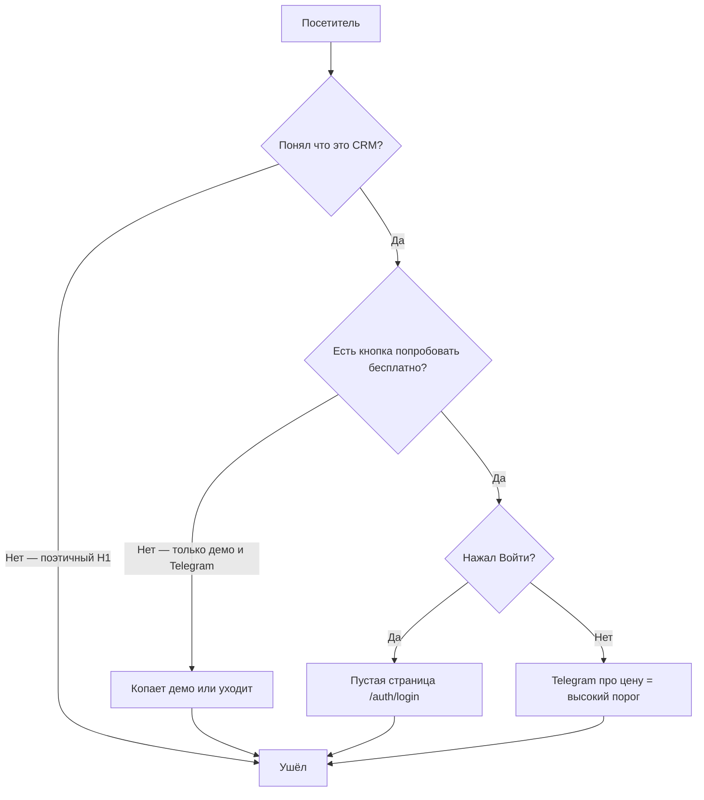
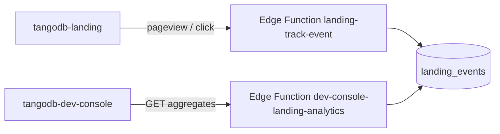

# Разбор отзыва маркетолога о лендинге TangoDB (v3.5)

### Профессиональный маркетинговый аудит текущей версии `tangodb-landing`, на основе кода

*Дата: 3 июля 2026 · Обновлено после полной сверки кода лендинга, Dev Console и промтов реализации*  

*Основа: `tangodb-landing/src`, `tangodb/src` (продукт), `tangodb-dev-console/`, `tangodb/supabase/functions/dev-console-metrics`, `tangodb_saas_platform_TZ.md`*


---


## 0. Контекст: это уже третий проход


- `tangodb_landing_audit.md` (v2) — прошлый аудит, много рекомендаций из него уже реализовано в коде: появились `TrustSection`, `ModularitySection`, `PricingSection`, `FaqSection`, живое демо стало заголовком-приглашением, hero-картинку заменили на `new_girl.png`.

- Проблема в том, что **реализация v2 решила старые проблемы ценой новой** — страница стала ещё длиннее и ещё более «музейной». Именно это сейчас поймал маркетолог свежим взглядом человека, не читавшего ни один аудит.

- Дополнительный коммерческий контекст после запуска: за полнедели после размещения лендинга было **0 регистраций и 0 вопросов разработчику**. Даже при небольшом трафике это сильный сигнал: лендинг не создаёт импульса попробовать продукт.

- **Уточнение после проверки кода (сессия 3 июля):** на лендинге **нет кнопки «Зарегистрироваться»** — только «Попробовать живое демо», «Войти» и «Написать в Telegram». Метрика «0 кликов по регистрации» отражает не слабый оффер, а **отсутствие пути к регистрации** на странице. Регистрация (`/register`, «Создать аккаунт») существует только внутри CRM.

- Новый оффер владельца продукта: **скидка 70% на пожизненный доступ к CRM для ранних пользователей до 31 августа 2026 года**. Сильный коммерческий повод, но сейчас не встроен в структуру лендинга и требует аккуратной упаковки условий.

- **OG-картинка (`public/og-image.jpg`):** **заменена** на статичную **десктопную визуализацию CRM** в том же духе, что `CrmDesktopPreview` в секции «Компьютер и смартфон» (рендер интерфейса, не lifestyle-фото и не сырой скриншот). Путь в коде: `OG_IMAGE_PATH` → `/og-image.jpg`, теги в `index.html` и `syncPageMeta`. Старый мобильный PNG-скриншот `crm-mobile-overview.png` **удалён** — больше не используется. После деплоя дождаться сброса кэша OG в мессенджерах (несколько дней).

- **Аналитика:** на лендинге нет счётчиков и событий. Решение — **метрики посещаемости и кликов в Dev Console** (см. раздел 8), а не публичный счётчик на лендинге и не только Cloudflare Dashboard.

- Этот документ разбирает отзыв маркетолога построчно, подтверждает или уточняет каждый пункт кодом и даёт готовый к реализации список изменений. Старый [`tangodb_landing_cursor_prompts.md`](tangodb_landing_cursor_prompts.md) полезен как справочник по формату, но его продуктовая логика устарела: он усиливает живое демо как главный CTA, тогда как текущая версия аудита требует вести холодного посетителя в `/register` на 30-дневный trial. Актуальные промты — в разделе 9.


---


## 1. Главный вывод


Отзыв маркетолога **точен и профессионально обоснован**, а не просто «вкусовщина». Он описывает классическую ошибку позиционирования лендинга: страница построена в логике «докажи скептику, что продукт настоящий» (много доказательств, живое демо, полная матрица модулей, детальный FAQ), а не в логике «помоги занятому владельцу студии принять решение за 30–60 секунд».


Это подтверждается структурой `App.tsx` — в `<main>` **9 секций** + footer, включая полноценное встроенное SPA-приложение (демо CRM с 12 пунктами сайдбара) прямо посреди страницы:


```1:34:tangodb-landing/src/App.tsx

import { CrmCapabilities } from "./components/CrmCapabilities";

import { DemoSection } from "./components/DemoSection";

import { Features } from "./components/Features";

import { Footer } from "./components/Footer";

import { Header } from "./components/Header";

import { Hero } from "./components/Hero";

import { ModularitySection } from "./components/ModularitySection";

import { PlatformSection } from "./components/PlatformSection";

import { FaqSection } from "./components/FaqSection";

import { PricingSection } from "./components/PricingSection";

import { TrustSection } from "./components/TrustSection";

import { useI18n } from "./hooks/useI18n";


export default function App() {

  const { locale, t, setLocale } = useI18n();


  return (

    <div className="min-h-screen flex flex-col">

      <Header locale={locale} onLocaleChange={setLocale} t={t} />

      <main className="flex-1">

        <Hero t={t} />

        <TrustSection t={t} />

        <Features t={t} />

        <ModularitySection t={t} />

        <DemoSection locale={locale} t={t} />

        <CrmCapabilities t={t} />

        <PlatformSection locale={locale} t={t} />

        <PricingSection t={t} />

        <FaqSection t={t} />

      </main>

      <Footer t={t} />

    </div>

  );

}

```


Самая серьёзная находка, которую маркетолог не мог знать из скриншотов: **в продукте уже реализован полноценный бесплатный 30-дневный доступ (self-service), но на лендинге о нём нет ни единого слова и нет CTA на `/register`** — см. пункт 2.5.


После появления акции для ранних пользователей главный оффер должен стать ещё конкретнее: **30 дней бесплатно → затем возможность купить пожизненный доступ со скидкой 70% до 31 августа 2026 года**. Это гораздо сильнее, чем текущая формула «напишите в Telegram, обсудим стоимость».


**Диагноз сессии 3 июля:** нулевая конверсия объясняется не «слабым текстом», а тем, что лендинг **не предлагает бесплатный trial**, **не показывает продукт на первом экране**, **ведёт в демо / Telegram / сломанный login**, и **не измеряет поведение** (до внедрения Dev Console analytics).


---


## 2. Разбор отзыва маркетолога по пунктам


### 2.1 «Сильно длинный, нацеленный на изучение, а не на продажу»


**Согласен, подтверждено кодом.**


10 секций + встроенный `CrmDemoApp` (это не скриншот, а рабочее React-приложение с сайдбаром на 12 пунктов: обзор, расписание, посещения, абонементы, персональные уроки, финансы, тарифы, команда, настройки и т.д. — `tangodb-landing/src/crm/CrmDemoApp.tsx`, `src/crm/panels/*.tsx`). Посетитель, который просто хочет понять «что это и стоит ли писать разработчику», физически проходит через:


1. Hero

2. Блок доверия (3 колонки текста)

3. 4 карточки «выгод»

4. Тёмный блок модульности с таблицей 3×6 чекбоксов

5. Полноценное демо-приложение (можно залипнуть на 10 минут, изучая разделы)

6. Справочник из 9 карточек «Всё внутри CRM»

7. Блок «Компьютер и смартфон»

8. Блок «Стоимость» (без цифр, только приглашение написать)

9. FAQ-аккордеон на 5 вопросов

10. Футер с ещё одной навигацией


Для холодного трафика (реклама, сарафан, случайная ссылка) это радикально длиннее нормы для B2B-лендинга ниши «CRM для малого бизнеса», где решение принимается быстро, а не как для энтерпрайз-закупки с комитетом.


**Причина по факту:** прошлый аудит (v2) сознательно сделал ставку на «живое демо — герой страницы» и добавил ещё детальности (модульность, справочник функций, FAQ), чтобы закрыть возражения технически подкованного или уже почти убеждённого посетителя. Это верно для второй половины воронки, но не для первого касания — а сейчас это единственная версия страницы, которую видят все.


---


### 2.2 «Много текста»


**Согласен.** `tangodb-landing/src/i18n/ru.ts` содержит **136 i18n-ключей** (файл ~140 строк), из них:

- 9 пунктов + блок «Настройте CRM…» в `CrmCapabilities` (компактный список, не сетка карточек);

- полная матрица модулей 3 тарифа × 6 модулей в `ModularitySection`;

- 5 вопросов-ответов в FAQ;

- отдельные развёрнутые абзацы в `PlatformSection`, `PricingSection`, футере.


Ни один блок не является «одним взглядом» — везде заголовок + подзаголовок + список/сетка с описаниями на каждый пункт.


---


### 2.3 «Лендинг не продаёт на каждом шаге. Нет кнопки получить подробную информацию»


**Согласен, и это системная недоработка.** На странице **10+ разных CTA-точек** с разными формулировками и разными целями, но при этом целые секции вообще без действия:


| Секция | Есть ли CTA | Куда ведёт |

|---|---|---|

| Hero | Да, 2 кнопки | `#demo` (якорь) и Telegram |

| TrustSection | Ссылки в заголовках колонок | `#demo` и Telegram |

| **Features** | **Нет** | — |

| ModularitySection | 2 кнопки | Deep-link в демо (не «узнать больше») |

| DemoSection | Нет отдельного CTA (сам виджет — действие) | — |

| **CrmCapabilities** | **Нет** | — |

| PlatformSection | 1 кнопка в конце | Telegram |

| PricingSection | 1 кнопка | Telegram |

| FaqSection | **Нет** | — |

| Footer | 3 разных ссылки | `#demo`, Telegram, email |


**Критично:** ни в одной строке таблицы нет CTA на **`/register`**. Primary-путь для нового посетителя фактически отсутствует.


Получается двойная проблема: **где-то CTA нет вообще**, а там, где есть — **их слишком много и они разного вида** (якорь, Telegram, login) — классический paradox of choice.


---


### 2.4 «Должна быть возможность связаться с разработчиком и получить подробную инструкцию к использованию»


**Частично уже есть технически, но не оформлено как оффер.** Контакты реальны и рабочие:


```21:25:tangodb-landing/src/config.ts

export const CONTACTS = {

  email: "omowdance@gmail.com",

  telegramUrl: "https://t.me/omow_second",

  telegramHandle: "@omow_second",

} as const;

```


Но везде, где Telegram упоминается, это подано как **поддержка при сбоях** (`platform.supportDesc`) или **канал для расчёта цены** (`pricing.subtitle`). Нигде нет формулировки «Расскажем, как подключить и настроить студию» / «Получить инструкцию по началу работы» — предложения **до** покупки, а не после проблемы или при обсуждении денег.


---


### 2.5 «Нет информации о том, что пользователь может бесплатно пользоваться CRM в течение 30 дней»


**Самая важная продуктовая находка аудита.** Бесплатный 30-дневный доступ уже реализован:


```81:86:tangodb/src/lib/i18n/ru.ts

"auth.register.demoHint": "После подтверждения email вы получите демо-CRM на 30 дней — ключ не нужен.",

...

"auth.register.checkEmailDemo":

  "Проверьте почту и подтвердите email — после этого откроется демо-версия CRM на 30 дней.",

```


На лендинге этой фразы **нет нигде**. Регистрация не упоминается — только «Войти» (`nav.login`), что годится для уже существующих клиентов.


**Трение регистрации (честно указывать на лендинге):** путь в продукте — email + пароль + **Turnstile captcha** + **подтверждение email** → затем демо-CRM. Формулировка «без звонка» верна, но лучше: «30 дней бесплатно. Подтвердите email — займёт ~2 минуты. Карта не нужна».


---


### 2.6 «Одна кнопка должна быть ведущая на вход в CRM (она сейчас есть в лендинге)»


**Кнопка «Войти» есть, но primary CTA для новых посетителей — нет. Плюс вероятный баг URL.**


```19:19:tangodb-landing/src/config.ts

export const CRM_LOGIN_URL = "https://tangodb.vercel.app/auth/login";

```


В приложении маршруты — `/login` и `/register`, не `/auth/login`. Vercel отдаёт HTTP 200 на любой URL (SPA rewrite), но React Router **не находит маршрут** → пустой экран. README лендинга тоже ссылается на неверный URL.


**P0:** исправить на `/login` и `/register`; primary CTA → **`/register`** («Начать бесплатно»), «Войти» — вторичная ссылка в шапке.


---


### 2.7 Дополнительные находки (ревью сессии 3 июля)


Пункты, которых не было в исходном отзыве маркетолога, но которые усиливают диагноз:


| # | Проблема | Где в коде | Влияние |

|---|---|---|---|

| 1 | **Hero не показывает продукт** — lifestyle-фото (`new_girl.png`), интерфейс CRM почти не виден | `Hero.tsx`, `HERO_IMAGE` | За 3 секунды непонятно, *что* покупаешь |

| 2 | **H1 не называет категорию** — «Меньше таблиц… Больше учеников…», слово «CRM» только в `<title>` | `ru.ts` `hero.titleLine*` | Холодный трафик не узнаёт продукт |

| 3 | ~~**OG-картинка с минусом в прибыли**~~ | **Исправлено:** `og-image.jpg` — десктопная визуализация CRM; `crm-mobile-overview.png` удалён | Задеплоить и дождаться сброса кэша |

| 4 | **Демо read-only** — нельзя «продать абонемент своему ученику» | `CrmDemoApp`, disabled-кнопки в panels | Слабый aha moment; trial важнее демо |

| 5 | **Нет social proof** — ни одной студии, отзыва, цифры | — | Компенсировать founder story (видео/фото/имя) |

| 6 | **Мёртвая ссылка «Политика конфиденциальности»** | `Footer.tsx` `href="#"` | Красный флаг перед регистрации SaaS |

| 7 | **`og:locale` статичен, SSR lang="en"** | `index.html` `lang="en"`, `og:locale` = `en_US`; runtime — `useI18n` меняет `<html lang>`, `syncPageMeta` — title/description/og:image, но **не** `og:locale` | Для RU-шеринга донастроить |

| 8 | **Нет аналитики** | лендинг целиком | Невозможно диагностировать воронку → раздел 8 |

| 9 | **FAQ уводит от регистрации** | `faq.q4` — «попробовать без регистрации» → только демо на лендинге | Прямой конфликт с trial-оффером; нужен отдельный вопрос про 30 дней |

| 10 | **TrustSection продаёт демо, не trial** | `trust.demo.title` = «Живое демо вместо скриншотов» | Верх страницы закрепляет старую стратегию v2 |

| 11 | **PricingSection = «напишите в Telegram про цену»** | `pricing.subtitle`, единственный CTA → Telegram | Высокий порог до trial; early birds не упомянуты |


### 2.8 Snapshot кода лендинга (верификация 3 июля 2026)

Сверка с репозиторием: **рекомендации аудита v2 частично в коде**, **OG обновлён**; **P0 v3 (register/trial) — ещё нет**.

#### Уже реализовано (v2, подтверждено кодом)

| Элемент | Факт в коде |
|---|---|
| `TrustSection`, `ModularitySection`, `PricingSection`, `FaqSection` | Есть в `App.tsx` |
| Hero lifestyle + оптимизация | `HERO_IMAGE` → avif/webp/`new_girl-800.jpg`, `<picture>`, preload в `index.html` |
| Живое демо + deep-link | `DemoSection`, `demoDeepLink.ts`, кнопки модульности → `#demo?panel=…` |
| Features | 4 карточки, разные цвета иконок |
| CrmCapabilities | 9 пунктов компактным списком + блок настройки |
| PlatformSection | `CrmDesktopPreview` + `CrmMobilePreview` (React) |
| OG image | `og-image.jpg` — десктопная визуализация CRM (как `CrmDesktopPreview`); `crm-mobile-overview.png` удалён |
| Primary CTA цвет | `btn-cta` — тёплый amber (`index.css`), hero использует его |
| SEO базовый | `index.html`: OG, Twitter, canonical, robots; `public/robots.txt`, `sitemap.xml`; runtime — `useI18n` + `syncPageMeta` |
| FAQ | 5 вопросов (без v2-вопроса про Google Таблицы) |

#### Ещё не сделано (P0/P1 v3)

| Элемент | Факт в коде сейчас | Целевое состояние |
|---|---|---|
| `CRM_LOGIN_URL` | `https://tangodb.vercel.app/auth/login` (`config.ts:19`) | `/login` |
| `CRM_REGISTER_URL` | **отсутствует** | `/register` |
| Header primary CTA | «Войти» → `CRM_LOGIN_URL` | «Начать бесплатно» → register |
| Hero primary CTA | «Попробовать живое демо» → `#demo` | «Начать бесплатно» → register |
| Hero визуал | lifestyle (`HERO_IMAGE` / `new_girl`) | продуктовый скрин CRM |
| H1 | 4 строки без слова «CRM» | «CRM для танцевальной студии…» |
| Trial / early birds в текстах | **нет** ни в hero, ни в pricing | бейдж + оффер-блок |
| Privacy | `href="#"` + TODO в `Footer.tsx:101` | `/privacy` |
| `og:locale` | статичный `en_US` в `index.html` | синхронизировать с locale |
| README лендинга | ссылка на `/auth/login` (стр. 72) | `/login` и `/register` |
| Структура `App.tsx` | 9 секций в `<main>` + footer; демо на 5-й позиции | короткий продающий верх (раздел 4) |
| `landingAnalytics.ts` / `landing_events` | **не существуют в репо** | раздел 8 |


---


## 3. Синтез: почему лендинг ощущается как «реклама для айтишников»





**Причины по убыванию влияния на нулевую конверсию:**


1. **Нет CTA на бесплатную регистрацию** — кнопки «Зарегистрироваться» на лендинге literally нет.

2. Primary CTA ведёт в **демо** или **Telegram**, а не в trial.

3. Возможно **сломанный «Войти»** (`/auth/login`).

4. Длина страницы и «музейность» — маркетолог прав.

5. «Напишите, обсудим стоимость» **до** trial убивает холодный интерес.

6. **Нет измерений** — непонятно, проблема в трафике или в лендинге (до Dev Console analytics).


### 3.1 Коммерческие и UX-правки (сессия 3 июля)


1. **Конверсия = регистрация, не просмотр демо.** Главный CTA → `/register` («Начать бесплатно на 30 дней»). Демо — secondary.

2. **Первый экран — прямой.** H1: «CRM для танцевальной студии…» + подзаголовок с trial + **статичный скрин интерфейса** (не lifestyle-фото, не виджет).

3. **Early birds — после trial, не вместо.** «30 дней бесплатно → до 31 августа 2026 −70% на пожизненный доступ».

4. **Раскрыть «пожизненный доступ»** — что входит, лимиты, модули; иначе выглядит как scam.

5. **Убрать «фиксированного прайса нет»** с верха воронки.

6. **Блок «Для кого»** — соло / студия / сеть до демо.

7. **Честно про шаги регистрации** — email + captcha, без карты.

8. **Страница Privacy Policy** — минимум `/privacy`, убрать `href="#"`.

9. **Founder story** — усилить одну строку `hero.proof` до блока с фото/видео.

10. **Аналитика в Dev Console** — не на публичном лендинге (раздел 8).


---


## 4. Рекомендуемая новая структура


```

Header:

   Лого

   + ссылка «Как работает» / «Демо»

   + вторичная «Войти» → /login

   + primary «Начать бесплатно» → /register

→ Hero:

   H1: «CRM для танцевальной студии без таблиц»

   + подзаголовок: расписание, абонементы, посещаемость, деньги

   + оффер «30 дней бесплатно, без карты» (+ «подтвердите email, ~2 мин»)

   + early birds: «−70% на пожизненный доступ до 31 августа 2026»

   + статичный скрин CRM (десктоп или мобильный — как в PlatformSection)

   + 2 кнопки: «Начать бесплатно» (→ /register) и «Получить инструкцию» (→ Telegram)

→ Компактный блок выгод (3–4 строки)

→ «Для кого TangoDB»

→ Оффер-блок: trial + early birds + что после 30 дней

→ Живое демо (опционально, с подписью «хотите подробнее»)

→ (ниже по желанию) модульность, справочник, FAQ, платформа

→ Footer: primary CTA + контакты + рабочая privacy

```


**Не удалять** живое дemo, модульность, FAQ — **переставить приоритеты**: короткий продающий путь наверху, референс ниже.


---


## 5. Чеклист изменений для реализации


### 🔴 P0 — критично, прямое влияние на конверсию


1. **Исправить `CRM_LOGIN_URL` и добавить `CRM_REGISTER_URL`** — `/login` и `/register`; обновить `README.md` лендинга. Проверить на проде форму входа и регистрации.

2. **Primary CTA «Начать бесплатно на 30 дней» → `/register`** в Header, Hero, Footer — вместо «Попробовать живое демо» и вместо «Войти» как главной кнопки.

3. **Оффер «30 дней бесплатно»** в hero (бейдж) + акцентный блок ниже; формулировка из `auth.register.demoHint`, с уточнением про email/captcha.

4. **Early birds в hero и оффер-блоке** — после обещания trial, не как единственный CTA.

5. **Единые CTA:** primary «Начать бесплатно» + secondary «Получить инструкцию в Telegram» (`?text=…` prefilled) — не более 2 формулировок на всю страницу.

6. **Hero: H1 с «CRM для танцевальной студии»** + **статичная визуализация продукта** (рендер как `CrmDesktopPreview`, не lifestyle-фото), lifestyle-фото убрать или сделать вторичным.

7. **Сократить путь до оффера** — hero → 3–4 выгоды → «для кого» → trial/early birds → скрин; остальное ниже.

8. **Живое демо опустить и пометить как опциональное**; в верхней части — статика, не `CrmDemoApp`.

9. **Переиспользуемый CTA-блок** после Features, CrmCapabilities, FaqSection.

10. ~~**OG-картинка**~~ — ✅ **сделано:** `og-image.jpg` — десктопная визуализация CRM (как `CrmDesktopPreview`); `crm-mobile-overview.png` удалён. **Задеплоить** и дождаться сброса кэша мессенджеров.


### 🟡 P1 — доверие, ясность, измерения


11. **Объяснить, что после 30 дней** — без автосписания, demo_retention, purge (из `tangodb_saas_platform_TZ.md`).

12. **Раскрыть условия «пожизненного доступа»** и скидки 70%.

13. **Пересобрать PricingSection** → «Как это работает» / «Trial и early birds».

14. **Не ставить «фиксированного прайса нет»** в верх воронки.

15. **Слить Features + CrmCapabilities** в 4–6 пунктов; полный список — ниже демо.

16. **Единые формулировки CTA**; синхронно `ru.ts` и `en.ts`.

17. **Privacy Policy** — реальная страница `/privacy`, убрать `href="#"` в футере.

18. **SEO locale** — `<html lang>` уже меняется в `useI18n`; дополнительно синхронизировать `og:locale` / `og:locale:alternate` при смене RU/EN.

19. **Аналитика лендинга в Dev Console** — раздел 8 (P1, параллельно с CTA-правками).


### 🟢 P2 — полировка


20. Полный лендинг на `/product` или `#подробнее`.

21. FAQ про trial, early birds, карту, «пожизненный» — развести «демо на лендинге» и «CRM на 30 дней после регистрации».

22. `footer.ctaDemo` → «Начать бесплатно» → `/register`.

23. Founder story (видео/кейс) вместо одной строки proof.

24. Опционально: Cloudflare Web Analytics как sanity-check (не заменяет Dev Console по кликам).


---


## 6. Открытые вопросы — решение владельца продукта


1. Публично писать «30 дней бесплатно, без карты» — подтвердить по `demo_active` flow.

2. «Получить подробную информацию» — Telegram с шаблоном, форма email или онбординг в CRM?

3. Формат инструкции: Notion/PDF/видео или `/onboarding` в продукте?

4. Сохранять «полный» лендинг отдельной страницей?

5. Юридическое определение «пожизненного доступа».

6. Что входит в скидку 70%.

7. Ограничить early birds по количеству мест?

8. ~~Достаточно ли трафика для выводов?~~ → закрывается **Dev Console analytics** (раздел 8): pageviews, unique, клики по CTA, referrers за 7/30/365 дней.


---


## 7. Итог одной фразой


> Маркетолог прав: лендинг доказывает, что продукт существует, вместо того чтобы продавать результат. Решение — наверх короткий оффер «30 дней бесплатно» + «−70% early birds» + одна кнопка «Начать бесплатно» → `/register`; демо и детали — ниже; **метрики и клики — в Dev Console**, чтобы видеть воронку рядом с `demo_active` и регистрациями.


---


## 8. Аналитика лендинга в Dev Console


**Решение (сессия 3 июля):** посещаемость и клики **не выводить на публичный лендинг** — только в **`tangodb-dev-console`** рядом с существующими Platform metrics (`dev-console-metrics`). Cloudflare Dashboard можно оставить как дополнительную проверку трафика, но **клики по CTA** там не видны без своих событий.


### 8.1 Архитектура





| Компонент | Назначение |

|---|---|

| `landing_events` (таблица Supabase) | `id`, `created_at`, `event`, `visitor_id`, `referrer`, `path`, `locale` |

| `landing-track-event` | Публичная запись: CORS (`tangodb-landing.pages.dev`, localhost, будущий домен), rate limit по IP, whitelist событий, **без PII** (IP в БД не хранить) |

| `dev-console-landing-analytics` | Чтение только для `isDeveloper` — тот же паттерн, что `dev-console-metrics` |

| `trackLandingEvent()` на лендинге | `fetch` на Edge Function; `visitor_id` в `localStorage` (UUID) для unique за период |

| `LandingAnalyticsPage` в Dev Console | Новый пункт меню **Landing** |


**RLS:** anon не пишет в таблицу напрямую — только через Edge Function с `service_role`.


### 8.2 События (минимальный набор)


| `event` | Когда |

|---|---|

| `pageview` | первый заход за сессию |

| `cta_register` | «Начать бесплатно» (после появления CTA) |

| `cta_demo` | «Попробовать живое демо» / `#demo` |

| `cta_telegram` | любая ссылка в Telegram |

| `cta_login` | «Войти» в шапке |

| `scroll_pricing` | (опционально) дошёл до `#pricing` |

| `scroll_faq` | (опционально) дошёл до `#faq` |


После правок CTA имена событий зафиксировать в одном месте (`tangodb-landing/src/lib/landingAnalytics.ts`).


### 8.3 UI в Dev Console


Страница **Landing** (или секция на Dashboard):


```

┌─────────────────────────────────────────┐

│ Landing analytics                       │

├──────────────┬──────────┬───────────────┤

│ 7 days       │ 30 days  │ 365 days      │

│ N pageviews  │ …        │ …*            │

│ M unique     │ …        │ …*            │

├──────────────┴──────────┴───────────────┤

│ Clicks (выбранный период)               │

│  cta_register  ░ 0                      │

│  cta_demo      ██ …                     │

│  cta_telegram  █ …                      │

│  cta_login     …                        │

├─────────────────────────────────────────┤

│ Top referrers · таблица по дням         │

└─────────────────────────────────────────┘

* — только с даты подключения трекера

```


**Связка с продуктом:** рядом с `demo_active_count` видна воронка «визиты → клик register → новые demo org».


### 8.4 Env и деплой


| Где | Что добавить |

|---|---|

| Лендинг (Vite env) | `VITE_SUPABASE_URL`, `VITE_SUPABASE_ANON_KEY` — только для вызова `landing-track-event` |

| Supabase Secrets | `ALLOWED_ORIGINS` += `https://tangodb-landing.pages.dev`, `http://localhost:5173` |

| Миграция | `landing_events` + индекс по `created_at`, `event` |

| Edge Functions | `landing-track-event`, `dev-console-landing-analytics` |

| Dev Console | `LandingAnalyticsPage.tsx`, маршрут `/landing`, пункт в `Layout.tsx` |


### 8.5 Ограничения


- **История только с момента деплоя** — прошлую неделю не восстановить.

- **Боты** (Telegram/VK preview) дают лишние `pageview` — на малых цифрах заметно; фильтрация — позже.

- **Не дублировать** Cloudflare Pages Analytics — Dev Console = источник правды по **кликам и воронке**.

- Публичный счётчик «N посетителей» на лендинге **не делать** — снижает доверие в B2B.


### 8.6 Оценка трудозатрат (MVP)


| Часть | ~время |

|---|---|

| миграция + `landing-track-event` | 2–3 ч |

| `trackLandingEvent` + хуки на CTA | 1–2 ч |

| `dev-console-landing-analytics` + страница | 2–3 ч |

| env, деплой, ALLOWED_ORIGINS | 30 мин |

| **Итого** | **~1 рабочий день** |


### 8.7 Чеклист (аналитика)


- [ ] Миграция `landing_events`

- [ ] Edge Function `landing-track-event`

- [ ] Edge Function `dev-console-landing-analytics` (агрегаты 7 / 30 / 365 дней + all time)

- [ ] `landingAnalytics.ts` на лендинге + `pageview` при загрузке

- [ ] События на все CTA (в т.ч. после рефактора primary → register)

- [ ] `LandingAnalyticsPage` + nav в Dev Console

- [ ] Env на Cloudflare Pages и Vercel (dev-console)

- [ ] Задеплоить **до** или **сразу после** CTA-правок, чтобы мерить эффект


---


### 8.8 Отдельный анализ текущих метрик в Dev Console


**Статус реализации (3 июля 2026).** Лендинговая аналитика из разделов 8.1–8.7 **ещё не реализована**: в репозитории нет миграции `landing_events`, Edge Functions `landing-track-event` / `dev-console-landing-analytics`, файла `tangodb-landing/src/lib/landingAnalytics.ts` и страницы `LandingAnalyticsPage`. Единственный источник метрик сегодня — **`DashboardPage` → `dev-console-metrics`** и ручной просмотр разделов Tenants / Users / Errors.


#### 8.8.1 Что показывает Platform metrics сегодня


`DashboardPage` (`tangodb-dev-console/src/pages/DashboardPage.tsx`) один раз при загрузке вызывает `invokeDevFunction("dev-console-metrics")` и рисует 7 карточек без периода, без трендов и без кнопки обновления.


Edge Function `dev-console-metrics` (`tangodb/supabase/functions/dev-console-metrics/index.ts`) считает **снимок на момент запроса**:


| UI-лейбл | Поле API | Запрос (service_role) | Что означает для воронки |
|---|---|---|---|
| Organizations | `org_count` | `COUNT(*)` из `organizations` | Все организации за всё время — нижняя часть воронки |
| Licensed | `licensed_count` | `status = 'licensed'` | Платящие клиенты; не KPI холодного лендинга |
| **Demo active** | `demo_active_count` | `status = 'demo_active'` | **Ключевая метрика trial** — активные 30-дневные demo org |
| Demo retention | `demo_retention_count` | `status = 'demo_retention'` | Org после истечения demo, до purge/лицензии |
| Pending keys | `pending_keys_count` | `access_keys.status = 'pending'` | Ручная продажа по ключам, параллельный канал |
| Active members | `active_members_count` | `organization_members.is_active = true` | Участники в org, не уникальные посетители лендинга |
| DB size (est.) | `db_size_bytes_estimate` | RPC `pg_database_size_bytes` или эвристика | Инфраструктура, не конверсия |


**Security pattern (уже правильный для расширения):** Bearer session → `isDeveloper` → rate limit 30 req / 15 min / IP → `service_role` только на сервере. Новую функцию `dev-console-landing-analytics` нужно строить по этому же шаблону.


#### 8.8.2 Чего Platform metrics не умеет — и почему «0 регистраций» не диагностируется


| Проблема | Последствие |
|---|---|
| Нет временного окна | Нельзя ответить «сколько demo org за неделю после запуска лендинга» |
| Нет delta / графика | Не видно, росло ли что-то или всегда было 0 |
| Нет связи с лендингом | `demo_active_count = 0` не доказывает «нет трафика» vs «нет кликов register» |
| Нет верхней воронки | pageviews, referrers, клики CTA отсутствуют |
| Snapshot при открытии | Закрыли вкладку — новые регистрации не видны без перезагрузки |


**Интерпретация «0 регистраций за полнедели» при текущем Dev Console:**


1. **`demo_active_count = 0`** — подтверждает пустую нижнюю воронку self-service trial (если не было ручных org через ключи).
2. **Это не опровергает и не подтверждает трафик** — для визитов нужен Cloudflare Pages Analytics (только просмотры) или будущий `landing_events`.
3. **Это не объясняет, куда ушли посетители** — без трекера кликов неизвестно: demo, Telegram, сломанный login или bounce на hero.
4. **Альтернативный путь через ключи** — `pending_keys_count` / Inbox не заменяют register CTA, но могут маскировать «тишину» в demo, если клиенты шли через Telegram.


#### 8.8.3 Другие разделы Dev Console для ручной диагностики (до Landing analytics)


| Раздел | Edge Function | Что смотреть для лендинга |
|---|---|---|
| **Tenants** (`/orgs`) | `dev-console-list-tenants`, `dev-console-search-orgs` | Фильтр `status = demo_active`, сортировка по `created_at` — были ли новые org после деплоя лендинга |
| **Users** (`/users`) | `dev-console-list-users` | `created_at`, `email_confirmed`, `is_orphan` — регистрация auth без создания org (обрыв воронки после `/register`) |
| **Errors** (`/errors`) | `dev-console-list-errors` | Сбои `verify-self-service-registration`, `create-self-service-demo-org`, Turnstile |
| **Inbox** (`/inbox`) | `dev-console-purchase-inbox` | Заявки на покупку / lifetime — intent через Telegram вместо self-service |
| **Keys** (`/keys`) | `dev-console-generate-key` | Ручная выдача demo/licensed минуя лендинг |


**Практический чеклист владельца продукта (сейчас, без landing tracker):**


1. Dev Console → **Metrics** → записать `org_count`, `demo_active_count`, `demo_retention_count`.
2. **Tenants** → фильтр demo → есть ли org с `created_at` после даты публикации лендинга?
3. **Users** → есть ли пользователи с `email_confirmed = true` и `is_orphan = true`? (зарегистрировались, demo org не создалась)
4. **Errors** → ошибки регистрации за тот же период.
5. Cloudflare Pages → **Analytics** (если включено) → sanity-check по pageviews (без кликов по CTA).
6. Зафиксировать baseline **до** деплоя промтов 6–8, иначе эффект CTA-правок не измерить.


#### 8.8.4 Целевая модель: Platform metrics + Landing funnel


**Главный вывод:** существующий `Platform metrics` оставить как **операционную панель продукта** (состояние org после онбординга). Лендинговую аналитику добавить **отдельной страницей `/landing`** — не смешивать в одну сетку карточек.


| Уровень | Источник | Вопрос |
|---|---|---|
| Верх воронки | `landing_events` (будущее) | Пришли ли люди? Куда кликнули? |
| Середина | `cta_register` → переход на `/register` | Понятен ли оффер? |
| Низ | `demo_active_count`, Users, Tenants | Дошли ли до demo org? |


**Минимальная воронка после внедрения трекера:**


| Шаг | Источник | Что показывает |
|---|---|---|
| `pageviews` | `landing_events` | Есть ли вообще трафик |
| `unique_visitors` | `visitor_id` | Сколько реальных посетителей без повторов |
| `cta_register` | клик на `/register` | Сработал ли главный оффер |
| `cta_demo` | клик/переход к `#demo` | Не отвлекает ли демо от trial |
| `cta_telegram` | Telegram-ссылки | Нужен ли посетителю контакт вместо self-service |
| `cta_login` | login-ссылка | Не путают ли новые пользователи вход и регистрацию |
| `new_demo_orgs` | delta `organizations.created_at` / `demo_active` | Доходит ли клик register до созданной demo CRM |


**Производные метрики для UI Landing analytics:**


| Метрика | Формула | Интерпретация |
|---|---|---|
| Register CTR | `cta_register / unique_visitors` | Понятен ли оффер «30 дней бесплатно» |
| Demo distraction ratio | `cta_demo / cta_register` (если register > 0) | Не уводит ли живое демо внимание от регистрации |
| Telegram intent rate | `cta_telegram / unique_visitors` | Нужна ли инструкция/ручной контакт до trial |
| Trial start conversion | `new_demo_orgs / cta_register` | Не ломается ли путь `/register` → demo org |
| Login confusion rate | `cta_login / unique_visitors` | Не выглядит ли «Войти» как путь для новых пользователей |
| Referrer quality | `cta_register` по `referrer` | Какие источники дают intent, а не только визиты |


#### 8.8.5 Рекомендуемый UI Dev Console (MVP)


На странице **Landing** (`LandingAnalyticsPage.tsx`, маршрут `/landing`, пункт в `Layout.tsx` рядом с Metrics):


```
┌─────────────────────────────────────────┐
│ Landing analytics          [7d|30d|365d]│
├──────────────┬──────────┬───────────────┤
│ Traffic      │ Intent   │ Funnel        │
│ pageviews    │ register │ register CTR  │
│ unique       │ demo     │ trial conv.   │
│ top referrers│ telegram │ new demo orgs │
│              │ login    │               │
├──────────────┴──────────┴───────────────┤
│ Daily: pageviews + cta_register (table) │
└─────────────────────────────────────────┘
Attribution is aggregate, not per-user
```


На **Dashboard (Metrics)** — только ссылка «See landing funnel →» и текущая карточка **Demo active** без перегрузки.


#### 8.8.6 Ограничение анализа до внедрения трекера


Исторические визиты за прошлую неделю **восстановить нельзя**. Cloudflare Pages Analytics может дать sanity-check по просмотрам, но не даст клики по CTA и не свяжет визиты с `demo_active_count`. Вывод «0 регистраций» — **диагноз по нижней воронке и UX лендинга** (нет register CTA, сломанный login URL), а не полноценная маркетинговая аналитика.


---


## 9. Готовые промты для Cursor по этому аудиту


Использовать последовательно, по одному промту за раз. **Краткий индекс для ссылок в заданиях ИИ — файл `steps` в корне репозитория.** Полные тексты промтов дублируются там и ниже. Каждый промт должен начинаться с чтения `.cursor/docs/ai/AI_CONTEXT.md`, затем relevant files; для кода лендинга и Dev Console сначала использовать CodeGraph. Не трогать RLS-политики без отдельного явного решения.


### Промт 1 — Исправить путь входа и добавить путь регистрации


```text
В `tangodb-landing` исправь CTA-маршруты под текущую CRM.

Контекст:
- в `tangodb-landing/src/config.ts` сейчас `CRM_LOGIN_URL` ведёт на `https://tangodb.vercel.app/auth/login`;
- в основном приложении реальные маршруты входа и регистрации: `/login` и `/register`;
- главный путь для нового посетителя должен быть регистрация на 30-дневный trial, а не login, demo или Telegram.

Сделай:
1. Исправь `CRM_LOGIN_URL` на `https://tangodb.vercel.app/login`.
2. Добавь `CRM_REGISTER_URL = "https://tangodb.vercel.app/register"`.
3. В Header оставь «Войти» как вторичную ссылку, но добавь primary CTA «Начать бесплатно» → `CRM_REGISTER_URL`.
4. На мобильном меню повтори ту же иерархию: primary register, secondary login/demo.
5. Обнови RU/EN i18n-ключи, не хардкодь тексты в компонентах.
6. Обнови README лендинга, если там есть старый `/auth/login`.
7. Проверь `npm run build`.
```


### Промт 2 — Пересобрать hero под trial и early birds


```text
Перепиши первый экран лендинга TangoDB под холодного владельца танцевальной студии.

Цель:
за 5 секунд должно быть понятно: это CRM для танцевальной студии, её можно начать бесплатно на 30 дней, карта не нужна, а до 31 августа 2026 есть −70% на пожизненный доступ для ранних пользователей.

Сделай:
1. H1 RU: «CRM для танцевальной студии без таблиц и хаоса».
2. H1 EN: «CRM for dance studios without spreadsheet chaos».
3. Подзаголовок RU: «Расписание, абонементы, посещаемость, финансы и команда — в одной CRM. Начните бесплатно на 30 дней: подтвердите email, карта не нужна.»
4. Подзаголовок EN: «Schedule, passes, attendance, finance and team roles in one CRM. Start free for 30 days: confirm your email, no card required.»
5. Primary CTA: «Начать бесплатно на 30 дней» / «Start free for 30 days» → `CRM_REGISTER_URL`.
6. Secondary CTA: «Получить инструкцию в Telegram» / «Get setup help on Telegram» → Telegram URL с prefilled text, если это удобно без лишней зависимости.
7. Живое демо оставить как tertiary text-link: «Сначала посмотреть демо» → `#demo`.
8. Early birds бейдж: «−70% на пожизненный доступ до 31 августа 2026» / «70% off lifetime access until Aug 31, 2026».
9. Hero-визуал заменить с lifestyle-акцента на продуктовую визуализацию CRM. Используй подход `CrmDesktopPreview` (рендер интерфейса), не сырой скриншот и не `crm-mobile-overview.png`.
10. Проверь адаптивность hero на mobile.
```


### Промт 3 — Сократить верх страницы до продающей воронки


```text
Перестрой порядок секций в `tangodb-landing/src/App.tsx` так, чтобы верх страницы продавал trial, а подробное демо стало вторым уровнем.

Рекомендуемый порядок:
1. Header
2. Hero с register CTA
3. TrustSection, но переписанная под «30 дней бесплатно / сделано преподавателем / помощь с настройкой»
4. Features как 4 результата первой недели
5. Новый компактный блок «Для кого TangoDB»
6. Offer/Pricing block: trial + early birds + что после 30 дней
7. DemoSection как «посмотреть подробнее»
8. CrmCapabilities / Modularity ниже как справочник
9. PlatformSection
10. FAQ
11. Footer с register CTA

Требования:
- не удаляй рабочее `CrmDemoApp`;
- не делай demo primary CTA в верхней части;
- CTA-формулировки должны быть едиными: primary `Начать бесплатно`, secondary `Получить инструкцию`;
- обнови RU и EN переводы синхронно;
- проверь build.
```


### Промт 4 — Слить и сократить Features / CrmCapabilities


```text
Убери ощущение длинного каталога функций на лендинге.

Проблема:
`Features` и `CrmCapabilities` сейчас идут как две похожие сетки карточек. Для холодного посетителя это много чтения до понимания оффера.

Сделай:
1. `Features` оставь выше демо и перепиши как 4 результата:
   - видно, кто пришёл и у кого долг;
   - абонементы списываются при отметке;
   - финансы студии на одном экране;
   - личные уроки не смешиваются с групповыми.
2. `CrmCapabilities` перенеси ниже демо и сделай компактным справочником «Что внутри CRM».
3. Если нужно, сократи описания `crmCaps.*Desc` до одной строки.
4. Добавь CTA-блок после Features: «Начать бесплатно на 30 дней» + «Получить инструкцию».
5. Не создавай дублирующие компоненты, переиспользуй существующие секции или вынеси маленький общий CTA-компонент только если это реально уменьшает повтор.
```


### Промт 5 — Переписать PricingSection в trial + early birds


```text
Пересобери `PricingSection` в блок «30 дней бесплатно + early birds».

Контекст:
- фиксированный публичный прайс сейчас не готов;
- но есть сильный оффер: 30 дней бесплатно и −70% на пожизненный доступ до 31 августа 2026;
- формулировка «напишите, обсудим стоимость» не должна быть главным сообщением.

Сделай:
1. H2 RU: «Начните бесплатно, решите после 30 дней».
2. H2 EN: «Start free, decide after 30 days».
3. Объясни шаги: регистрация → подтверждение email → demo CRM на 30 дней → выбор лицензии/пожизненного доступа.
4. Отдельно объясни early birds: что это скидка для ранних пользователей, не замена trial.
5. Убери ощущение скрытой цены: напиши, что условия пожизненного доступа уточняются в Telegram до оплаты.
6. Primary CTA → `CRM_REGISTER_URL`.
7. Secondary CTA → Telegram.
8. FAQ обнови вопросами про карту, trial, что будет после 30 дней и что значит «пожизненный доступ».
```


### Промт 6 — Добавить лендинговую аналитику: миграция и tracking Edge Function


```text
Добавь MVP аналитики лендинга через Supabase Edge Function, без прямой записи anon-клиентом в таблицу.

Сделай:
1. Создай миграцию `landing_events`:
   - `id uuid primary key default gen_random_uuid()`;
   - `created_at timestamptz default now()`;
   - `event text not null`;
   - `visitor_id text not null`;
   - `session_id text null`;
   - `path text not null`;
   - `locale text null`;
   - `referrer text null`;
   - `utm_source`, `utm_medium`, `utm_campaign` nullable;
   - `user_agent_hash text null` или не храни user-agent вовсе;
   - не хранить IP в таблице.
2. Добавь индексы по `created_at`, `event`, `(event, created_at)`, `visitor_id`.
3. Создай Edge Function `landing-track-event`.
4. Function принимает только whitelist событий: `pageview`, `cta_register`, `cta_demo`, `cta_telegram`, `cta_login`, `scroll_pricing`, `scroll_faq`.
5. CORS разрешить только `https://tangodb-landing.pages.dev`, будущий custom domain и localhost для dev.
6. Rate limit по IP, но IP не сохранять в БД.
7. Запись делать через service role на сервере.
8. Вернуть `{ ok: true }`, чтобы лендинг не зависел от аналитики.
9. Не менять существующие RLS-политики без отдельного подтверждения.
```


### Промт 7 — Добавить `trackLandingEvent()` на лендинг и повесить события


```text
Подключи клиентский трекер событий в `tangodb-landing`.

Сделай:
1. Создай `src/lib/landingAnalytics.ts`.
2. `visitor_id` храни в `localStorage`, генерируй через `crypto.randomUUID()`.
3. `session_id` храни в `sessionStorage`.
4. `trackLandingEvent(event, payload?)` вызывает Supabase Edge Function `landing-track-event` через `fetch`.
5. Ошибки трекинга не должны ломать UI и не должны спамить console в production.
6. На загрузке страницы отправляй `pageview`.
7. На CTA повесь:
   - register → `cta_register`;
   - demo/hash → `cta_demo`;
   - Telegram → `cta_telegram`;
   - login → `cta_login`.
8. Опционально через IntersectionObserver отправляй `scroll_pricing` и `scroll_faq` один раз за session.
9. Все имена событий вынеси в const/union type, чтобы не размазывать строки по компонентам.
10. Проверь build.
```


### Промт 8 — Dev Console: страница Landing analytics


```text
Добавь в `tangodb-dev-console` отдельную страницу Landing analytics.

Контекст:
- текущая главная страница Dev Console показывает Platform metrics через `dev-console-metrics`;
- лендинговые метрики должны жить отдельно, чтобы не смешивать трафик до регистрации и состояние организаций после регистрации.

Сделай:
1. Создай Edge Function `dev-console-landing-analytics`.
2. Повтори security pattern из `dev-console-metrics`: Authorization Bearer, `isDeveloper`, service client, rate limit, CORS через общий http helper.
3. Function принимает период: `7d`, `30d`, `365d`; default `30d`.
4. Возвращает:
   - pageviews;
   - unique_visitors;
   - counts by event;
   - top referrers;
   - daily pageviews/register clicks;
   - derived rates: register CTR, demo distraction ratio, telegram intent rate, login confusion rate.
5. В Dev Console добавь `LandingAnalyticsPage.tsx`.
6. В `main.tsx` добавь route `/landing`.
7. В `Layout.tsx` добавь nav item `Landing`.
8. UI сделать в текущем стиле Dev Console: slate background, карточки, простая таблица, без chart-библиотеки на MVP.
9. Ошибки отображать так же, как в `DashboardPage`, включая подсказку про `ALLOWED_ORIGINS`.
10. Проверь build.
```


### Промт 9 — Dev Console: связать landing funnel с demo orgs


```text
Расширь Landing analytics так, чтобы она показывала связь лендинга с регистрациями/demo organizations.

Сделай:
1. В `dev-console-landing-analytics` посчитай `new_demo_orgs` за период по `organizations.created_at` и `status in ('demo_active', 'demo_retention', 'licensed')`, если схема позволяет.
2. Отдельно покажи `demo_active_delta` или количество новых организаций за выбранный период.
3. В UI добавь блок Funnel:
   - Unique visitors;
   - Register clicks;
   - New demo orgs;
   - Register CTR;
   - Trial start conversion = `new_demo_orgs / cta_register`.
4. Если точной связи visitor → org нет, явно подпиши в UI: «Attribution is aggregate, not per-user».
5. Не добавляй PII и не связывай посетителя лендинга с email пользователя без отдельного решения по privacy.
```


### Промт 10 — Privacy, SEO и юридический минимум перед запуском trial CTA


```text
Перед тем как вести трафик на регистрацию, закрой юридические и SEO-дыры лендинга.

Контекст: базовый SEO уже есть — `index.html` (OG, Twitter, canonical), `robots.txt`, `sitemap.xml`, runtime `syncPageMeta` в `useI18n`. `og-image.jpg` уже заменён на десктопную визуализацию CRM. Остаётся privacy — заглушка.

Сделай:
1. Добавь реальную страницу/маршрут privacy или статический `privacy.html` для лендинга.
2. В Footer замени `href="#"` у Privacy Policy на рабочую ссылку.
3. Синхронизируй `og:locale` с переключателем RU/EN (сейчас статичный `en_US` в `index.html`).
4. В hero/FAQ честно укажи: 30 дней бесплатно, подтверждение email, карта не нужна.
5. Если добавлена аналитика, кратко отрази это в privacy: какие события собираются, без IP в БД, без PII.
6. Проверь production build и вручную открой основные CTA.
```


### Промт 11 — Переиспользуемый CTA-блок и единые формулировки


```text
В `tangodb-landing` вынеси повторяющиеся CTA в один компонент и проставь его во все «мёртвые» секции.

Контекст:
- primary путь: `CRM_REGISTER_URL` («Начать бесплатно на 30 дней»);
- secondary: Telegram с текстом «Получить инструкцию по настройке» (prefilled `?text=` на RU/EN);
- сейчас CTA есть в Hero/Header/Footer/Pricing, но нет в Features, CrmCapabilities, FaqSection.

Сделай:
1. Создай `src/components/CtaBlock.tsx` (или аналог по стилю секций): два button/link, опциональный compact variant.
2. i18n-ключи: `cta.startFree`, `cta.getInstructions`, `cta.startFreeHint` (про email ~2 мин, без карты).
3. Вставь `<CtaBlock />` после Features, после CrmCapabilities, в конец FaqSection.
4. Замени разрозненные формулировки в Footer (`footer.ctaDemo`), PricingSection, PlatformSection на те же ключи где уместно.
5. Не дублируй логику URL — только `CRM_REGISTER_URL` и `CONTACTS.telegramUrl` из `config.ts`.
6. Если уже есть `landingAnalytics.ts`, повесь `cta_register` / `cta_telegram` на оба action.
7. Проверь build и визуально — блок не должен ломать ритм секций на mobile.
```


### Промт 12 — TrustSection и FAQ под trial (не под демо)


```text
Перепиши TrustSection и FAQ так, чтобы они поддерживали оффер «30 дней бесплатно», а не конкурировали с ним.

Сделай:
1. TrustSection — три колонки:
   - «30 дней бесплатно» (self-service, подтверждение email, без карты);
   - «Сделано преподавателем» (founder story, можно ссылку на Telegram);
   - «Помощь с настройкой» (инструкция в Telegram до/после регистрации).
2. Убери или переформулируй «Живое демо вместо скриншотов» — демо не должно быть главным аргументом доверия.
3. FAQ: добавь вопросы про trial, early birds (−70% до 31.08.2026), карту, что после 30 дней.
4. FAQ q4: раздели «демо на лендинге (read-only)» и «полная CRM на 30 дней после регистрации».
5. Синхронно `ru.ts` и `en.ts`.
```


### Рекомендуемый порядок выполнения промтов


| Очередь | Промт | Почему |
|---|---|---|
| P0 | 1 → 2 → 5 | Сначала исправить путь к регистрации и оффер |
| P0 | 3 → 4 → 11 → 12 | Сократить страницу, CTA на каждом шаге, trust/FAQ под trial |
| P1 | 6 → 7 → 8 | Подключить измерение до или сразу после CTA-правок |
| P1 | 9 | Связать верх воронки с demo orgs |
| P1 | 10 | Закрыть privacy/SEO перед активным трафиком |


---


*Версия документа: v3.5 · сверка 3 июля 2026: OG — десктопная визуализация (`og-image.jpg`), `crm-mobile-overview.png` удалён; P0 v3 (register/trial) — в работе; промты 1–12 — в `steps`*


