# TangoDB — Техническое задание: multi-tenant CRM, лицензирование, роли и настройки

**Версия:** 1.5  
**Дата:** 2026-06-17  
**Ревизия 1.5:** аудит v1.4 — модель `pair`/`pair_month`, lifecycle ключей, DDL вспомогательных таблиц, route guards, нумерация фаз invite, import ID mapping, `/settings/license`.  
**Ревизия 1.4:** сверка с текущим проектом v1 — уточнены фактический стек/состояние миграций, UUID-стратегия, free-tier лимиты Supabase/Vercel, обязательная server-side активация ключей, seed версии CRM и добавлен SaaS-промт.  
**Проект:** TangoDB — CRM для танцевальных школ, преподавателей, спортивных секций и кружков  
**Стек (целевой):** React 19 · TypeScript 5.8 · Vite 6 · Supabase (PostgreSQL 17 + Auth + RLS + Edge Functions) · TanStack Query · Zustand · Vercel  
**Scope:** `tangodb/src/`, `tangodb/supabase/`  
**Связанные документы:** [tangodb_migration_TZ.md](./tangodb_migration_TZ.md), [tangodb_arch_improvements_TZ.md](./tangodb_arch_improvements_TZ.md), [CODE_REVIEW.md](./CODE_REVIEW.md)

---

## 0. Контекст и отправная точка

### 0.1. Что меняется принципиально

| Было (текущая v1) | Станет (v2) |
|---|---|
| Одна «школа», один преподаватель | Много организаций (tenants), изолированные данные |
| Вход только через Telegram | Telegram **+** email/пароль в браузере (ПК / планшет / смартфон) |
| Список `allowed_users` по `telegram_id` | Членство в организации + роли (RBAC) |
| RLS: «любой allowed teacher видит всё» | RLS: tenant + роль + scope (дисциплина/локация) |
| Настройки зашиты в код (`VND`, `ru-RU`, freeze=8 уроков) | Настройки организации в БД |
| Дисциплины и CSV-экспорт на Dashboard / в панелях (v1: `exportCsv`, `exportDashboardCsv`) | Раздел «Настройки CRM» → `/settings/data` |
| Нет монетизации | **Демо-ключ 30 дней** → **лицензия пожизненного доступа** к версии CRM |
| — | Dev Console (отдельное приложение) для ключей, мониторинга, версий |
| — | Перспектива: **SaaS-подписка** при росте нагрузки (см. §3.12) |

### 0.2. База данных — greenfield

**Перед реализацией v2 текущая Supabase-база будет удалена.** Существующие миграции в `tangodb/supabase/migrations/` служат справочником по бизнес-логике, но **не накатываются поверх prod**.

- Новая схема создаётся **с нуля** одной (или серией согласованных) миграций v2.
- Production-данные пользователь импортирует позже из **резервной копии другой CRM** (CSV/JSON — формат уточняется на этапе импорта).
- В ТЗ закладывается **Import Pipeline** (отдельная фаза), но не блокирует MVP multi-tenant.

### 0.3. Сохраняемая бизнес-логика (из v1)

Переносится без упрощения:

- Типы абонементов: `solo`, `pair`, `pair_hm` (CHECK на `subscriptions.type`); цикл парных — поле `pair_month` (`m1`/`m2`/`m3` при `type='pair'`, пусто при `pair_hm`); тарифы в `prices.type` — `pair_m1`/`pair_m2`/`pair_m3`, `pair_hm`, `solo`, …
- Персональные уроки (`solo` / `pair` / `trio`), оплата, конфликты расписания.
- Soft delete клиентов, CSV-экспорт, offline-баннер.
- UI-паттерны: slate/indigo, `AppSelect`, panel-card-stack, React Router.

### 0.4. Фактическое состояние текущего проекта v1

Сверка с текущим репозиторием `tangodb/` на 2026-06-17:

| Область | Текущее состояние | Следствие для v2 |
|---------|-------------------|------------------|
| Frontend | React 19, TypeScript 5.8, Vite 6, React Router 7, TanStack Query 5, Zustand 5 | Целевой стек в ТЗ соответствует проекту; новые providers/hooks лучше добавлять без смены фреймворка. |
| Auth | Только Telegram Mini App / Login Widget через `telegram-auth` Edge Function | Email/password, recovery, org picker и invite-flow действительно новые фазы. |
| Доступ | `allowed_users` + JWT claim `telegram_id`; любой активный teacher видит общую CRM | Multi-tenant v2 обязан удалить зависимость от `allowed_users` и перейти на `organization_members` + RLS. |
| БД | Одна общая v1-схема без `organization_id`; `clients/subscriptions/personal_lessons` используют `TEXT` PK, часть ID уже генерируется через `crypto.randomUUID()` в клиенте | В greenfield v2 PK должны стать `UUID DEFAULT gen_random_uuid()` на стороне БД; клиентская генерация не должна быть источником инварианта. |
| Настройки | Валюта `VND`, locale `ru-RU`, freeze=1 раз для 8 уроков захардкожены в коде/RPC | Настройки `organization_settings` нужны до переноса бизнес-логики. |
| Экспорт | `exportAllDashboardCsv` вызывается из Dashboard; есть private Storage bucket `exports` для CSV/download | Перенос экспорта в `/settings/data` должен сохранить fallback signed URLs для Telegram/mobile. |
| Операции | Есть ErrorBoundary, offline banner, audit/performance миграции v1 | Эти наработки переносить как паттерн, но audit в v2 должен хранить `organization_id` и `changed_by auth.uid()` UUID. |

---

## 1. Цели

1. **Multi-tenant CRM:** несколько школ/организаций в одном инстансе приложения без пересечения данных.
2. **Лицензирование:** демо 30 дней по ключу → покупка пожизненной лицензии на конкретную версию CRM; обновления внутри версии бесплатны.
3. **Командная работа:** несколько пользователей в одной организации с разными ролями и областями видимости.
4. **Универсальность:** настройки адаптируют CRM под танго, балет, спорт, гимнастику, кружки.
5. **Доступность:** Telegram Mini App + браузер (ПК, планшет, смартфон); email/пароль + восстановление через email.
6. **Безопасность:** изоляция на уровне PostgreSQL RLS, не только UI.
7. **Dev Console:** отдельное приложение для генерации ключей, контроля версий, мониторинга и поддержки.
8. **Операционная готовность:** backup, наблюдаемость, runbook инцидентов (см. §19).

---

## 2. Архитектура высокого уровня

### 2.1. Диаграмма системы

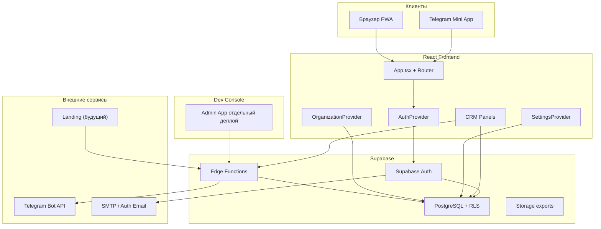

> Dev Console и лендинг обращаются к данным **только через Edge Functions** (service role на сервере), не через прямой Postgres client в браузере.

### 2.2. Слои ответственности

| Слой | Ответственность |
|------|-----------------|
| **UI** | Маршруты, формы, скрытие недоступных действий по роли |
| **Client state** | TanStack Query (server cache), Zustand (UI), контексты auth/org/settings |
| **API boundary** | Supabase client + RPC; Edge Functions для Telegram и invite-flow |
| **Auth** | Supabase Auth (JWT), custom access token hook (claims) |
| **Data** | PostgreSQL, RLS policies, CHECK constraints |
| **Isolation** | `organization_id` на всех tenant-таблицах + membership |

### 2.3. Ключевой принцип изоляции

> **Каждая бизнес-строка принадлежит ровно одной организации.**  
> JWT содержит `organization_id` (активный tenant) и `role`. RLS проверяет оба.

Cross-tenant запрос **невозможен** при корректных policies, даже если UI подставит чужой UUID.

---

## 3. Multi-tenancy (организации)

### 3.1. Модель tenant

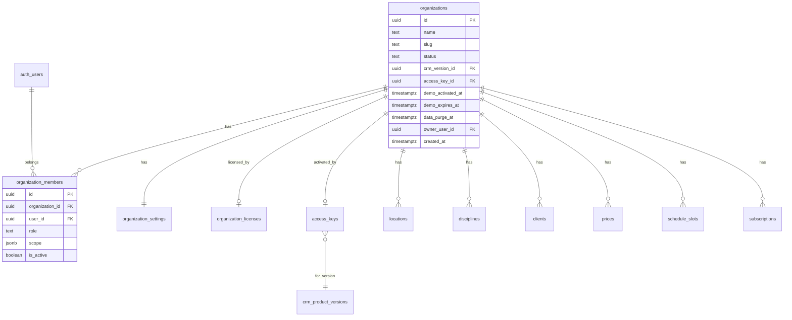

### 3.2. Таблица `organizations`

| Поле | Тип | Описание |
|------|-----|----------|
| `id` | UUID PK | Tenant ID |
| `name` | TEXT | «Школа танго N», «Studio X» |
| `slug` | TEXT UNIQUE | Для URL приглашений `/join/studio-x` (опционально v2.1) |
| `status` | TEXT | `demo_active` / `demo_retention` / `licensed` / `suspended` / `purged` |
| `crm_version_id` | UUID FK → `crm_product_versions` | Версия CRM, к которой привязана org |
| `access_key_id` | UUID FK → `access_keys` NULL | Ключ, активировавший org |
| `demo_activated_at` | TIMESTAMPTZ NULL | Момент активации демо-ключа |
| `demo_expires_at` | TIMESTAMPTZ NULL | Конец активного демо (+30 дней от активации) |
| `data_purge_at` | TIMESTAMPTZ NULL | Плановое удаление данных (+60 дней от активации демо; NULL для licensed) |
| `schema_version_locked` | BOOLEAN DEFAULT false | true на время миграции между major-версиями |
| `owner_user_id` | UUID FK → auth.users | Создатель; передаётся при смене владельца |
| `created_at` | TIMESTAMPTZ | |

### 3.3. Членство `organization_members`

Связь **пользователь ↔ организация ↔ роль**.

| Поле | Тип | Описание |
|------|-----|----------|
| `id` | UUID PK | |
| `organization_id` | UUID FK | |
| `user_id` | UUID FK → auth.users | |
| `role` | TEXT | См. раздел 5 |
| `scope` | JSONB | Область видимости для teacher (см. 5.3) |
| `display_name` | TEXT | Имя в UI организации |
| `is_active` | BOOLEAN | Деактивация без удаления истории |
| `invited_at` | TIMESTAMPTZ | |
| `joined_at` | TIMESTAMPTZ | |

**UNIQUE** (`organization_id`, `user_id`).

### 3.4. Выбор активной организации

Пользователь может состоять в нескольких организациях (преподаватель в двух школах, бухгалтер на аутсорсе).

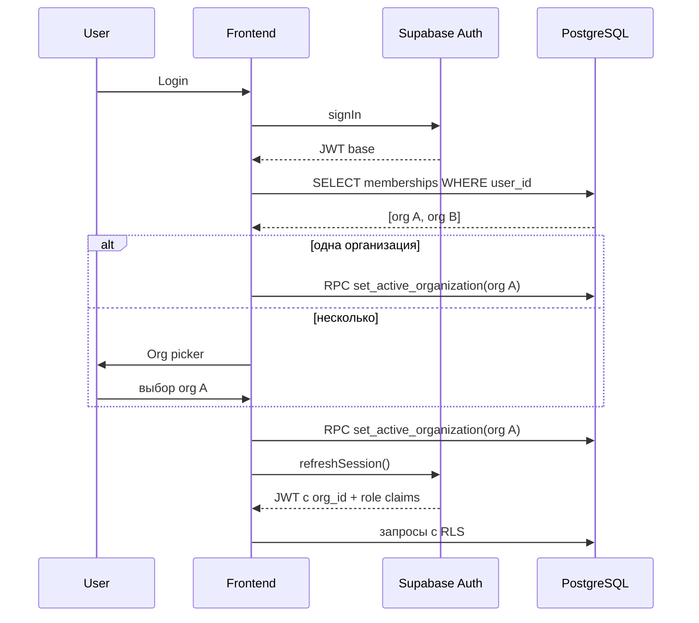

**Хранение active org:**

- Таблица `user_active_organizations(user_id PK, organization_id, member_id, updated_at)` — единственный серверный источник active tenant.
- RPC `set_active_organization(p_organization_id)` с `SECURITY DEFINER` проверяет активное membership и обновляет `user_active_organizations`.
- Custom Access Token Hook читает active tenant из `user_active_organizations`; клиент после RPC вызывает `supabase.auth.refreshSession()`.
- `localStorage` хранит только последний выбранный org для быстрого старта UI, но не является источником прав.
- **Запрещено** менять active org через клиентский `updateUser()`/`user_metadata`: эти данные пользователь может подменить, а `app_metadata` не должен обновляться с клиента.

### 3.5. Онбординг новой организации

**Сценарий A — демо-ключ (с лендинга):**

1. Пользователь на лендинге нажимает «Получить пробный доступ на 30 дней», вводит email.
2. Edge Function `request-demo-key` проверяет: на этот email ещё не выдавался демо-ключ (UNIQUE constraint).
3. Генерируется одноразовый демо-ключ; в БД сохраняется только **hash** ключа (`access_keys`).
4. Ключ отправляется на email (или показывается один раз на экране — TBD при реализации лендинга).
5. Пользователь регистрируется / входит в CRM (Telegram или email) **с тем же email**, что указан при запросе демо-ключа.
6. На `/activate-key` вводит демо-ключ → Edge Function `activate-access-key` (HMAC hash + pepper server-side) → private RPC `activate_access_key()`.
7. RPC проверяет: email сессии = `access_keys.email` (demo); `access_keys.crm_version_id` = `crm_product_versions` с `is_current=true` для текущего деплоя (см. §3.10).
8. Создаются `organizations`, `organization_settings`, `organization_members` (role=`owner`). Строка `organization_licenses` **не** создаётся до апгрейда на lifetime.
9. Org получает `status=demo_active`, `demo_activated_at=now()`, `demo_expires_at=now()+30d`, `data_purge_at=now()+60d`; demo-ключ → `access_keys.status='active'`.
10. Wizard: название → тип организации (пресет) → язык/валюта → модули.

**Сценарий B — лицензионный ключ (без демо):**

1. Разработчик генерирует lifetime-ключ в Dev Console для конкретной версии CRM (`crm_version_id`).
2. Пользователь регистрируется / входит, активирует ключ на `/activate-key` через `activate-access-key`.
3. Создаётся org с `status=licensed`, `data_purge_at=NULL`; создаётся `organization_licenses` (`license_type=lifetime`); ключ → `status='consumed'`.
4. Wizard онбординга — как в сценарии A.

**Сценарий C — апгрейд демо → lifetime:**

1. Пользователь с org в статусе `demo_active` или `demo_retention` активирует lifetime-ключ.
2. **Org не пересоздаётся:** меняется только `status=licensed`, `data_purge_at=NULL`, привязка к `access_key_id` lifetime-ключа; upsert `organization_licenses`; lifetime-ключ → `status='consumed'`.
3. Все CRM-данные сохраняются; триггер/джоб удаления отменяется.

**Сценарий D — прямой онбординг без ключа (только dev/staging):**

1. Регистрация владельца (email или Telegram) на staging / для внутренних тестов.
2. Wizard создаёт org со `status=licensed` без ключа — **запрещено в production**, только через Dev Console override.

### 3.6. Изоляция данных tenant (рекомендация)

> **Не создавать отдельную Supabase-базу на каждого пользователя.**  
> Изоляция — через `organization_id` + RLS в **одном** PostgreSQL-инстансе.

| Подход | Плюсы | Минусы | Решение |
|--------|-------|--------|---------|
| Отдельный Supabase project на org | Максимальная изоляция | Дорого, медленный provisioning, сложный мониторинг | ❌ не использовать |
| Отдельная PostgreSQL schema на org | Сильная изоляция | Сложные миграции, лимиты connection pool | ❌ не использовать |
| **`organization_id` + RLS** | Быстро, масштабируемо, единые миграции | Требует строгих RLS-тестов | ✅ **MVP и prod** |

**Гарантии от cross-tenant ошибок:**

- JWT claim `organization_id` + RLS на каждой tenant-таблице.
- Все query keys на фронте содержат `orgId`; при смене org — `queryClient.clear()`.
- RPC с `SECURITY DEFINER` обязаны проверять `auth_organization_id()`.
- Индексы с префиксом `organization_id` на всех hot paths.
- SQL-тесты: две org, попытки SELECT/INSERT/UPDATE чужих UUID → 0 rows / error.

Concurrent access разных пользователей **не конфликтует**: PostgreSQL row-level locking + tenant-scoped queries; каждый запрос фильтруется по своему `organization_id`.

### 3.7. Модель монетизации

**Текущая модель (MVP → рост):**

| Этап | Модель | Описание |
|------|--------|----------|
| **MVP** | License-first | Демо 30 дней → покупка **пожизненной лицензии** на версию CRM |
| **Будущее** | SaaS subscription | При исчерпании free tier Supabase/Vercel/GitHub — ежемесячная подписка (см. §3.12) |

**Не SaaS-подписка на старте:** пользователь покупает ключ доступа к **конкретной major-версии** CRM (v1, v2, …). Все обновления **внутри этой версии** — бесплатны и автоматические (деплой frontend/backend без доп. оплаты).

**Другая major-версия CRM** — отдельное приложение (отдельный деплой). После запуска v2 переходы между major-версиями (например v2↔v3) идут через **миграцию данных org** (см. §3.10), не через параллельное использование двух версий в одном UI.

### 3.8. Ключи доступа (`access_keys`)

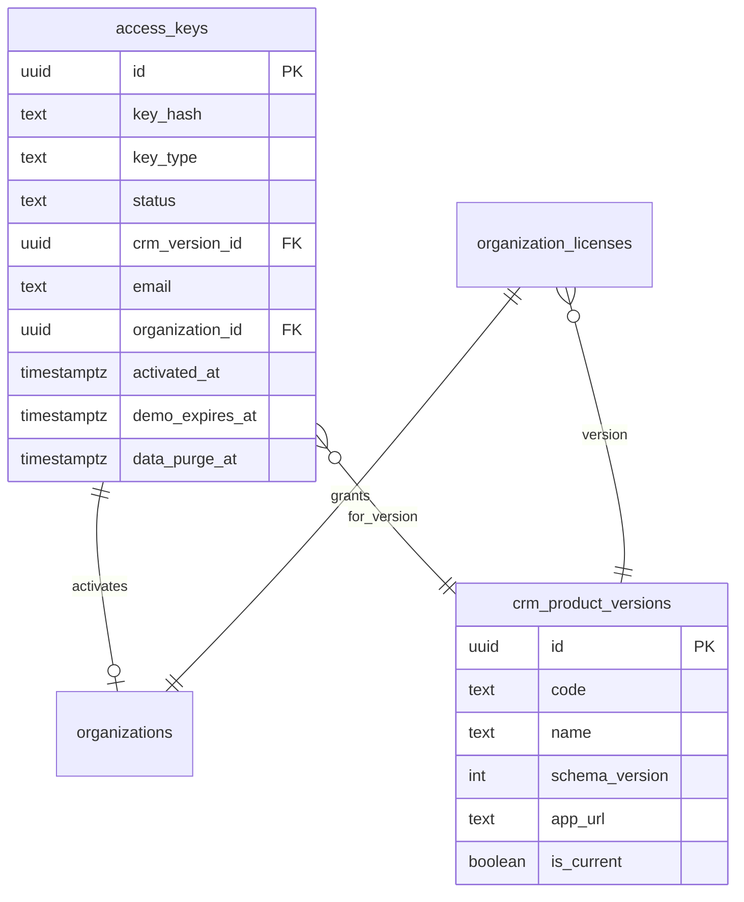

#### Таблица `access_keys`

| Поле | Тип | Описание |
|------|-----|----------|
| `id` | UUID PK | |
| `key_hash` | TEXT UNIQUE | HMAC-SHA256 ключа с server-side pepper (`ACCESS_KEY_PEPPER`); plaintext **не хранить** |
| `key_type` | TEXT | `demo` / `lifetime` |
| `status` | TEXT | `pending` / `active` / `consumed` / `revoked` |
| `crm_version_id` | UUID FK | Версия CRM, к которой относится ключ |
| `email` | TEXT NULL | Email заявки с лендинга (обязателен для demo) |
| `organization_id` | UUID FK NULL | Заполняется при активации |
| `activated_at` | TIMESTAMPTZ NULL | |
| `demo_expires_at` | TIMESTAMPTZ NULL | Только demo: +30 дней от активации |
| `data_purge_at` | TIMESTAMPTZ NULL | Только demo: +60 дней от активации |
| `created_by` | UUID NULL | Dev Console operator (для lifetime) |
| `created_at` | TIMESTAMPTZ | |
| `revoked_at` | TIMESTAMPTZ NULL | |

**Ограничения:**

```sql
-- Один demo-запрос навсегда на email (включая после purge: повторный demo на тот же email запрещён)
CREATE UNIQUE INDEX idx_access_keys_demo_email
  ON access_keys (lower(email))
  WHERE key_type = 'demo';

-- CHECK
key_type IN ('demo', 'lifetime')
status IN ('pending', 'active', 'consumed', 'revoked')
```

**Жизненный цикл `status`:**

| Тип | Переходы |
|-----|----------|
| **demo** | `pending` → `active` (org создана, demo не purged) → `consumed` (org purged после retention) |
| **lifetime** | `pending` → `consumed` сразу при успешной активации (org создана или demo→lifetime upgrade); состояние `active` для lifetime **не используется** |

`revoked` — ручная отмена в Dev Console на любом этапе до `consumed`.

**Генерация ключа:** cryptographically secure random string (например `TDB-DEMO-XXXX-XXXX-XXXX`), показывается пользователю **один раз**; в БД — только `key_hash = HMAC-SHA256(pepper, plaintext)`. Активация ключа должна идти через Edge Function `activate-access-key` (или DB Vault/Secrets, если выбран DB-side вариант), потому что `ACCESS_KEY_PEPPER` не должен быть доступен frontend и не должен храниться plaintext в таблицах. SQL RPC получает уже проверенный контекст или hash, а не клиентский источник прав. Rate limit на Edge/RPC: например 5 попыток / 15 мин / IP+email, generic error message, constant-time сравнение hash.

#### Таблица `organization_licenses`

| Поле | Тип | Описание |
|------|-----|----------|
| `id` | UUID PK | |
| `organization_id` | UUID FK UNIQUE | Одна лицензия на org |
| `crm_version_id` | UUID FK | Версия CRM |
| `license_type` | TEXT | `lifetime` (MVP); позже `subscription` |
| `access_key_id` | UUID FK | Ключ, давший лицензию |
| `activated_at` | TIMESTAMPTZ | |
| `expires_at` | TIMESTAMPTZ NULL | NULL = бессрочно (lifetime) |

Строка создаётся при активации **lifetime**-ключа (сценарии B и C); demo-org (`demo_active` / `demo_retention`) **без** строки в `organization_licenses` до апгрейда.

#### Таблица `crm_product_versions`

| Поле | Тип | Описание |
|------|-----|----------|
| `id` | UUID PK | |
| `code` | TEXT UNIQUE | `v1`, `v2` |
| `name` | TEXT | «TangoDB CRM v1» |
| `schema_version` | INT | Номер схемы БД для миграций |
| `app_url` | TEXT | URL деплоя этой версии |
| `min_client_version` | TEXT NULL | Semver frontend |
| `is_current` | BOOLEAN | Актуальная версия для новых ключей |
| `released_at` | TIMESTAMPTZ | |
| `deprecated_at` | TIMESTAMPTZ NULL | |

### 3.9. Жизненный цикл demo-организации

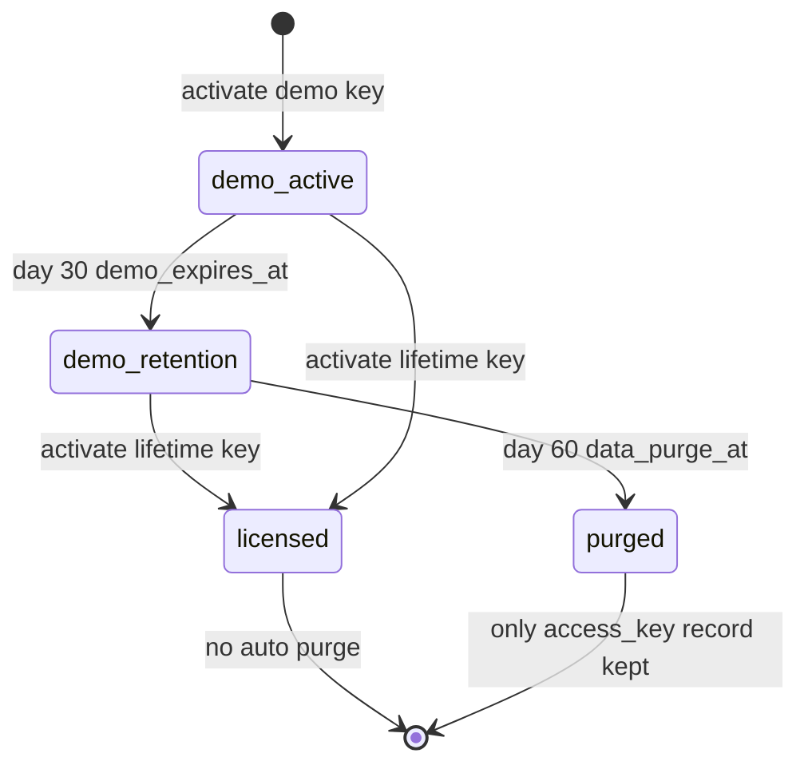

| Фаза | Период | `organizations.status` | Доступ к CRM |
|------|--------|------------------------|--------------|
| **Активное демо** | 0–30 дней от активации | `demo_active` | Полный доступ (все платформы: Telegram, браузер ПК/планшет/смартфон) |
| **Retention** | 31–60 дней от активации | `demo_retention` | Read-only + экран «Купить лицензию»; запись/редактирование заблокированы (RLS + UI) |
| **Purged** | после 60 дней | — | Tenant-данные **удалены**; в `access_keys` остаётся запись со `status=consumed`; опциональная tombstone-строка в `organizations` (`status=purged`, без PII) — только для audit |
| **Licensed** | после покупки ключа | `licensed` | Полный доступ без ограничения по времени; `data_purge_at=NULL` |

**Cron / scheduled jobs** (`demo-lifecycle` + `purge-expired-demo-orgs` Edge Functions или pg_cron):

1. **Ежедневно (переход в retention):** `UPDATE organizations SET status='demo_retention' WHERE status='demo_active' AND demo_expires_at < now()`.
2. **Ежедневно (purge):** `SELECT organizations WHERE status='demo_retention' AND data_purge_at < now()`.
3. Для каждой org на purge: DELETE cascade всех tenant-данных (clients, subscriptions, …), затем org shell (или tombstone без PII).
4. UPDATE `access_keys SET status='consumed'` для связанного demo-ключа.
5. Audit event в `platform_audit_log`.

**Переход demo → lifetime:** тот же cron **не удаляет** org, если `status` уже `licensed`.

**Уведомления (рекомендация):**

- За 7 и 1 день до `demo_expires_at` — email «демо заканчивается».
- В день перехода в `demo_retention` — email «данные сохранятся ещё 30 дней».
- За 7 дней до `data_purge_at` — email «купите лицензию или данные будут удалены».

### 3.10. Версии CRM и миграция данных

**Принцип:** каждая major-версия CRM — **отдельное приложение** (отдельный Vercel-деплой, свой frontend bundle). Общая Supabase-база; org привязана к `crm_version_id`.

**Валидация при активации ключа:** `access_keys.crm_version_id` должен совпадать с `crm_product_versions.id`, где `code` = версия текущего деплоя (env `CRM_VERSION_CODE`, по умолчанию `v2`) и `is_current=true`. Иначе — отказ с сообщением «ключ для другой версии CRM» и ссылкой на `app_url` целевой версии.

**Обновления внутри версии:** patch/minor деплои (v1.0 → v1.1) — автоматические, бесплатные, без смены лицензии.

**Переход на другую major-версию (после запуска v2, например v2 → v3):**

1. Пользователь покупает/получает ключ для целевой версии (или Dev Console выдаёт migration grant).
2. RPC `migrate_organization_version(p_target_version_id)`:
   - блокирует org (`status=suspended` на время миграции);
   - проверяет совместимость `schema_version`;
   - запускает **version-specific migration script** (up или down);
   - обновляет `organizations.crm_version_id`, `organization_licenses.crm_version_id`;
   - снимает блокировку → `licensed`.
3. Frontend редиректит на `crm_product_versions.app_url` целевой версии.

**Исключение конфликтов версий:**

- Поле `organizations.schema_version_locked` — true на время миграции.
- RLS: при `schema_version_locked=true` все writes denied кроме migration RPC.
- Одна org — **одна активная major-версия**; нельзя одновременно работать в v1 и v2 UI с одними данными.
- Migration scripts — идемпотентные, с dry-run и rollback plan; хранятся в `tangodb/supabase/migrations/version_migrations/`.
- Таблица `organization_version_migrations` — audit: from_version, to_version, started_at, completed_at, status, error.

**Важно для текущего v1:** так как v2 планируется как greenfield со сбросом текущей Supabase-базы, автоматическая миграция данных из текущей single-tenant v1 **не входит в MVP**. Если понадобится сохранить текущие v1-данные, это отдельный import/mapping pipeline (§12/§6), а не `migrate_organization_version()`.

**Downgrade (например v3 → v2):** поддерживается только если migration script `down` существует и данные целевой версии совместимы; иначе — экспорт CSV + ручной импорт (fallback).

### 3.11. Dev Console (отдельное приложение)

**Отдельный деплой** (`tangodb-dev-console/` или monorepo package) — доступ **только разработчику** (allowlist email / IP / service account).

| Функция | Описание |
|---------|----------|
| **Генерация ключей** | Lifetime-ключи для версии CRM; просмотр demo-ключей (hash, email, status) |
| **Управление версиями** | CRUD `crm_product_versions`, флаг `is_current`, URL деплоев |
| **Тарифы / цены** | Справочник цен на ключи (MVP: справочно; оплата вне системы) |
| **Организации** | Поиск org, статус, demo/licensed, ручной апгрейд, revoke |
| **Данные пользователей** | Read-only просмотр org data для поддержки (с audit log) |
| **Ошибки** | Aggregated errors: Edge Function logs, Supabase logs, Sentry (если подключён) |
| **Нагрузка** | DB size, row counts per org, API request metrics, connection pool |
| **Ручное подтверждение оплаты** | MVP: отметить invoice paid → сгенерировать/активировать lifetime key |

**Auth Dev Console:** отдельный Supabase Auth или shared Auth с claim `platform_role=developer`; RLS policy `platform_*` tables — только для developer claim. **Прямой доступ к PostgreSQL с клиента Dev Console запрещён** — только Edge Functions с `service_role` на сервере.

**Не в MVP Dev Console:** автоматический эквайринг (платёжные webhooks) — фаза после MVP.

### 3.12. Перспектива SaaS-подписки и расчёт нагрузки

При росте числа org **free tier** инфраструктуры исчерпывается. Тогда вводится **ежемесячная подписка** (новые клиенты; существующие lifetime-лицензии сохраняются).

#### Ориентировочные лимиты free tier (2026, проверять актуальные тарифы)

| Сервис | Free tier (ориентир) | Что упирается первым |
|--------|----------------------|----------------------|
| **Supabase** | 500 MB DB, 5 GB egress/mo, 50k MAU auth, 500k Edge invocations, 1 GB Storage | **DB size** и egress при ~50–100 активных org с историей attendance |
| **Vercel** | 100 GB Fast Data Transfer/mo (Hobby, non-commercial) | Для коммерческого запуска нужен Pro уже с первых paying customers; по нагрузке static assets обычно не первый bottleneck |
| **GitHub** | 2000 CI min/mo (Free) | Deploy pipeline, не runtime |
| **Telegram Bot** | ~30 msg/sec | Уведомления при массовых рассылках |

#### Эвристика «когда упираемся в потолок»

**Консервативная оценка для TangoDB CRM (1 org ≈ 200 clients, 12 мес history):**

| Метрика | ~на org | Потолок free (500 MB DB) |
|---------|---------|--------------------------|
| DB storage | 2–5 MB | **~100–200 org** |
| Monthly egress | 50–200 MB | **~25–100 org** при активном использовании |
| Auth MAU | 1–5 users/org | 50k MAU → **~10k org** (auth не bottleneck) |

**Практический вывод:** первым техническим лимитом станет **Supabase DB size (~100–200 org)** или **egress (~25–100 активных org)**. Для коммерческого использования Vercel Hobby нельзя считать production-тарифом: при появлении платящих клиентов планировать Vercel Pro сразу, даже если bandwidth ещё мал. Мониторинг в Dev Console: `total_db_size`, `egress_month`, `storage_size`, `edge_invocations_month`, `org_count`, `active_org_count`.

**Триггер перехода на SaaS (рекомендация):**

- DB > 400 MB **или** egress > 4 GB/mo **или** Edge invocations > 400k/mo **или** > 80 active licensed org → включить SaaS-тариф для новых клиентов.
- Lifetime-клиенты: grandfathering — доступ сохраняется; optional «hosting fee» обсуждается отдельно.

**Подготовка архитектуры:** поле `organization_licenses.license_type` уже допускает `subscription`; таблица `organization_subscriptions` (plan, billing_period, provider_id) — заглушка, UI «Тарифный план» disabled до фазы SaaS.

---

## 4. Аутентификация

### 4.1. Способы входа

| Способ | Сценарий | Реализация |
|--------|----------|------------|
| **Email + пароль** | Браузер, бухгалтер, админ без Telegram | Supabase Auth `signInWithPassword` |
| **Регистрация email** | Новый владелец организации | `signUp` + подтверждение email |
| **Восстановление пароля** | Забыли пароль | `resetPasswordForEmail` → ссылка на `/auth/reset-password` |
| **Telegram Mini App** | Преподаватель в Telegram | Edge Function `telegram-auth` (доработать) |
| **Telegram Login Widget** | Браузер с Telegram | Widget + Edge Function |
| **Invite link** | Приглашение в организацию | Magic link / одноразовый token (Фаза 4) |

### 4.2. Поток email/пароль

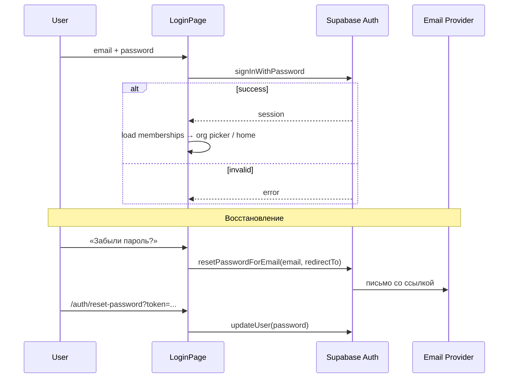

### 4.3. Страницы auth (новые маршруты)

| Маршрут | Назначение |
|---------|------------|
| `/login` | Telegram + вкладка «Email» |
| `/register` | Регистрация пользователя; org создаётся **только** после активации ключа на `/activate-key` |
| `/auth/forgot-password` | Запрос ссылки |
| `/auth/reset-password` | Новый пароль (Supabase recovery flow) |
| `/auth/verify-email` | Подтверждение email |
| `/select-organization` | Выбор org при N > 1 membership |
| `/activate-key` | Активация demo / lifetime ключа |
| `/license-required` | Экран покупки при `demo_retention` / истёкшем demo |

### 4.4. Связка Telegram ↔ email аккаунта

Один `auth.users` может иметь:

- `email` (реальный, для входа и recovery),
- `app_metadata.telegram_id` (опционально),
- несколько `organization_members`.

**Правило:** при первом Telegram-login, если email уже привязан админом — merge через invite, не дубликат user.

**Demo-ключ и Telegram без email:** активация demo требует совпадения `auth.users.email` с `access_keys.email`. Пользователь Telegram-only без email → сначала привязать email в профиле (`/settings/account` или Supabase `updateUser({ email })` + confirm), либо использовать lifetime-ключ (без привязки к email заявки).

Edge Function `telegram-auth` v2:

1. Verify Telegram payload.
2. Найти user по `telegram_id` **или** по membership (не глобальный `allowed_users`).
3. Проверить `organization_members.is_active` хотя бы для одной org.
4. Выдать session; если org > 1 — redirect на picker.

### 4.5. Custom Access Token Hook (JWT claims)

Расширить существующий `custom_access_token_hook` (v1 добавляет только `telegram_id` из `app_metadata`):

```json
{
  "sub": "user-uuid",
  "email": "user@example.com",
  "telegram_id": "123456789",
  "organization_id": "org-uuid",
  "role": "teacher",
  "member_id": "membership-uuid"
}
```

SQL-хелперы:

```sql
auth_user_id()          -- auth.uid()
auth_organization_id()  -- из JWT
auth_member_id()        -- из JWT
auth_member_role()      -- из JWT как быстрый claim; для критичных write-проверок сверять с organization_members
auth_is_member_of(org)  -- EXISTS в organization_members
```

**RLS больше не использует `allowed_users`.** Таблица удаляется в v2. Hook **не читает** `organization_id`/`role` из `user_metadata` — только из `user_active_organizations` + `organization_members`.

### 4.6. Безопасность auth

- Минимальная длина пароля: 8 символов (Supabase settings); рекомендация: 10+ для owner/admin.
- Rate limit на Edge Functions: в v1 `telegram-auth` — best-effort in-memory (см. CODE_REVIEW SEC-2); для production — shared store (Upstash Redis / таблица `rate_limit_buckets`) на всех auth/key endpoints.
- CORS по `ALLOWED_ORIGINS` (без `*` в production).
- Recovery link — одноразовый, TTL Supabase (по умолчанию 1h).
- Email templates: брендинг TangoDB, ссылки только на prod/staging origin.
- Active organization выбирается только серверным RPC; JWT claims не должны строиться на клиентском `user_metadata`.
- `service_role` key — только Edge Functions / CI / import scripts; **никогда** в frontend bundle.

---

## 5. Роли и права (RBAC)

### 5.1. Роли

| Роль | Код | Описание |
|------|-----|----------|
| **Владелец** | `owner` | Полный доступ, лицензия/ключи org, удаление org, смена owner |
| **Руководитель** | `director` | Почти как owner, без управления лицензией/delete org |
| **Администратор** | `admin` | Клиенты, абонементы, расписание, настройки (кроме лицензии) |
| **Преподаватель** | `teacher` | Свои дисциплины/классы/расписание/локации; журнал; ограниченная аналитика |
| **Бухгалтер** | `accountant` | Read-only CRM + экспорт CSV + финансовая статистика |

Иерархия для write-проверок:  
`owner > director > admin`.  
`teacher` и `accountant` — отдельные ветки: teacher получает scoped write только на разрешённые CRM-сущности, accountant всегда read-only. Не использовать простое числовое сравнение ролей для всех действий.

### 5.2. Матрица прав (операции)

| Операция | owner | director | admin | teacher | accountant |
|----------|:-----:|:--------:|:-----:|:-------:|:----------:|
| Настройки org (язык, валюта, freeze) | ✓ | ✓ | ✓ | — | — |
| Управление командой | ✓ | ✓ | ✓* | — | — |
| Клиенты CRUD | ✓ | ✓ | ✓ | ✓** | R |
| Абонементы продажа/редакт | ✓ | ✓ | ✓ | ✓** | R |
| Журнал посещаемости | ✓ | ✓ | ✓ | ✓** | R |
| Расписание групп | ✓ | ✓ | ✓ | ✓** | R |
| Персональные уроки | ✓ | ✓ | ✓ | ✓** | R |
| Тарифы | ✓ | ✓ | ✓ | — | R |
| Локации / дисциплины | ✓ | ✓ | ✓ | ✓*** | R |
| Dashboard статистика (вся org) | ✓ | ✓ | ✓ | scoped | ✓ |
| Экспорт CSV | ✓ | ✓ | ✓ | ✓** | ✓ |
| Audit log | ✓ | ✓ | R | — | — |

\* admin может приглашать teacher/accountant, но не owner/director.  
\** teacher — только в рамках `scope` (см. 5.3).  
\*** teacher — CRUD только своих дисциплин, если разрешено настройкой `teachers_can_manage_disciplines`.

### 5.3. Scope преподавателя (`organization_members.scope`)

```typescript
interface TeacherScope {
  discipline_ids: string[];       // UUID disciplines; пусто = нет доступа
  location_ids: string[];         // UUID locations; пусто = нет доступа
  all_disciplines: boolean;       // явное "все", только если выдал admin+
  all_locations: boolean;         // явное "все", только если выдал admin+
  can_view_all_clients: boolean;  // иначе только клиенты своих абонементов/уроков
}
```

**Безопасный default:** `discipline_ids=[]`, `location_ids=[]`, `all_disciplines=false`, `all_locations=false`, `can_view_all_clients=false`. Пустой scope не должен означать полный доступ, иначе ошибка заполнения `scope` превращается в privilege escalation.

**Фильтрация данных для teacher:**

- `schedule_slots` WHERE `(discipline_id IN scope OR all_disciplines)` AND `(location_id IN scope OR all_locations)` OR `teacher_member_id = self`.
- `subscriptions` / `personal_lessons` WHERE `discipline_id IN scope OR all_disciplines`.
- `attendance` — через subscription scope.
- Dashboard — агрегаты только по scoped data.

RLS реализует scope через специализированные функции, а не через универсальный `row_passes_teacher_scope(table_row)`:

```sql
teacher_has_discipline_access(discipline_id) RETURNS boolean
teacher_has_location_access(location_id) RETURNS boolean
teacher_can_access_subscription(subscription_id) RETURNS boolean
teacher_can_access_lesson(personal_lesson_id) RETURNS boolean
```

### 5.4. Несколько преподавателей — модель «классов»

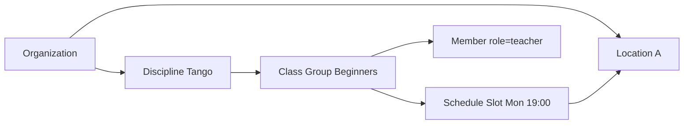

**Новые сущности v2:**

| Сущность | Назначение |
|----------|------------|
| `locations` | Залы, филиалы, адреса проведения |
| `disciplines` | Направления (Tango, Salsa, Gymnastics…) + `organization_id` |
| `classes` | Группа/класс: название, дисциплина, основной преподаватель, локация по умолчанию |
| `class_teachers` | M2M class ↔ teacher (несколько преподавателей на класс) |
| `schedule_slots` | День, время, `class_id`, `location_id`, `discipline_id`, `teacher_member_id` |

**Связь с абонементами:** `subscriptions.discipline_id`, опционально `subscriptions.class_id` (v2.1).

### 5.5. Логика конфликтов расписания (расширение v1)

Конфликт проверяется **внутри organization_id**:

1. Персональный урок vs групповой слот — тот же `location_id` + пересечение времени + дата.
2. Два персональных — тот же преподаватель (`teacher_member_id`) или та же локация.
3. Teacher видит конфликты только в своём scope.

---

## 6. Настройки CRM (`organization_settings`)

### 6.1. Раздел в UI

Новая секция навигации **«Настройки»** (`/settings/*`), подразделы:

| Подраздел | URL | Кто редактирует |
|-----------|-----|-----------------|
| Общие | `/settings/general` | owner, director, admin |
| Организация | `/settings/organization` | owner, director, admin |
| Абонементы | `/settings/subscriptions` | owner, director, admin |
| Направления | `/settings/disciplines` | owner, director, admin (+ teacher*) |
| Локации | `/settings/locations` | owner, director, admin |
| Данные | `/settings/data` | owner, director, admin, accountant |
| Команда | `/settings/team` | owner, director, admin |
| Лицензия | `/settings/license` | owner (read-only статус; активация ключа) |

\* по флагу `teachers_can_manage_disciplines`.

**Перенос из Dashboard:**

- `DisciplinesPanel` → `/settings/disciplines`.
- Кнопка «Экспорт CSV» (`exportAllDashboardCsv`) → `/settings/data`.

### 6.2. Схема `organization_settings`

| Поле | Тип | Default | Описание |
|------|-----|---------|----------|
| `organization_id` | UUID PK/FK | | |
| `locale` | TEXT | `ru-RU` | BCP 47: `ru-RU`, `en-US`, `vi-VN`, … |
| `currency_code` | TEXT | `RUB` | ISO 4217 |
| `currency_display` | TEXT | `symbol` | `symbol` / `code` |
| `timezone` | TEXT | `Europe/Moscow` | IANA |
| `week_starts_on` | INT | 1 | 1=пн, 7=вс |
| `org_preset` | TEXT | `dance_school` | Пресет ниши |
| `terminology` | JSONB | `{}` | Переопределение терминов UI |
| `modules` | JSONB | см. ниже | Вкл/выкл модулей |
| `freeze_max_count` | INT | 1 | Заморозок на абонемент |
| `freeze_min_lessons` | INT | 8 | Мин. размер абонемента для freeze |
| `freeze_deducts_lesson` | BOOLEAN | true | Списывает занятие |
| `low_balance_threshold` | INT | 2 | Порог «мало занятий» |
| `teachers_can_manage_disciplines` | BOOLEAN | false | |
| `pair_cycle_enabled` | BOOLEAN | true | pair_m1/m2/m3 |
| `branding_name` | TEXT | | Вместо «TangoDB» в header |
| `branding_logo_url` | TEXT | | Storage URL |
| `updated_at` | TIMESTAMPTZ | | |

Обязательные DB-ограничения:

- `currency_code` — `CHECK (currency_code ~ '^[A-Z]{3}$')`.
- `week_starts_on` — `CHECK (week_starts_on BETWEEN 1 AND 7)`.
- `freeze_max_count`, `freeze_min_lessons`, `low_balance_threshold` — `CHECK (value >= 0)`.
- `modules` и `terminology` — `jsonb_typeof(...) = 'object'`.

**`modules` (JSONB):**

```json
{
  "group_subscriptions": true,
  "personal_lessons": true,
  "pair_subscriptions": true,
  "trio_lessons": true,
  "multi_discipline": true,
  "locations": true
}
```

### 6.3. Пресеты организации (`org_preset`)

| Пресет | Модули по умолчанию | Термины |
|--------|---------------------|---------|
| `dance_school` | все group + pair | ученик, занятие, абонемент |
| `solo_teacher` | personal, group optional | клиент, урок |
| `sport_section` | group, без pair cycle | спортсмен, тренировка |
| `gymnastics_club` | group + locations | участник, занятие |
| `custom` | пользователь выбирает | свой словарь |

Пресет применяется **один раз** при онбординге; далее всё редактируется.

### 6.4. SettingsProvider (frontend)

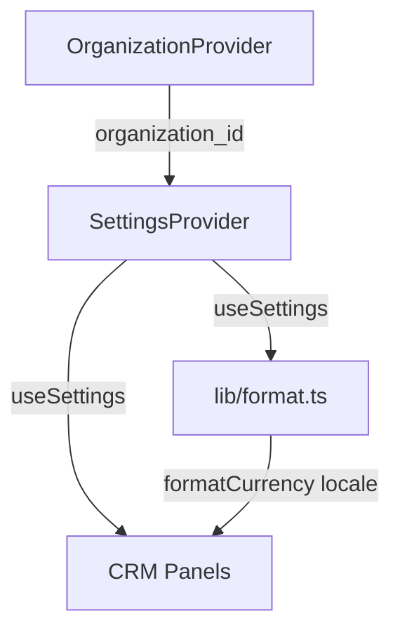

- `useSettings()` — TanStack Query `['organization-settings', orgId]`.
- `formatCurrency(amount)` читает `currency_code` + `locale` из settings.
- Freeze policy — единый модуль `lib/freezePolicy.ts`, используется в `useAttendance` и RPC `mark_attendance`.

### 6.5. Экспорт CSV в настройках

Страница `/settings/data`:

- Выбор наборов: клиенты, архив, абонементы, посещаемость (месяц), персональные (месяц), тарифы.
- Кнопка «Экспорт всего» — текущий `exportAllDashboardCsv`, refactored.
- Язык заголовков = `settings.locale`.
- Доступ: accountant+ (read-only достаточно).

---

## 7. Модель данных v2 (PostgreSQL)

### 7.1. Tenant-ключ и типы ID

**Все таблицы ниже содержат `organization_id UUID NOT NULL REFERENCES organizations(id)`**, кроме системных (`organizations`, auth, platform tables).

**Greenfield v2:** первичные ключи бизнес-сущностей (`clients`, `subscriptions`, `personal_lessons`, …) — **UUID** (`gen_random_uuid()` на стороне БД), не `TEXT` PK как в v1. В текущем frontend v1 часть ID уже создаётся через `crypto.randomUUID()`, но greenfield-инвариант должен жить в PostgreSQL: это устраняет зависимость от клиента и упрощает cross-org FK validation.

### 7.2. Полный список таблиц

| Таблица | Назначение | От v1 |
|---------|------------|-------|
| `organizations` | Tenants | NEW |
| `organization_members` | User ↔ Org ↔ Role | NEW |
| `organization_settings` | Настройки CRM | NEW |
| `user_active_organizations` | Активный tenant для JWT hook | NEW |
| `access_keys` | Demo / lifetime ключи | NEW |
| `organization_licenses` | Лицензия org на версию CRM | NEW |
| `crm_product_versions` | Справочник версий CRM (v1, v2) | NEW |
| `organization_version_migrations` | Audit миграций между major-версиями | NEW |
| `platform_audit_log` | Audit действий Dev Console | NEW |
| `organization_subscriptions` | SaaS-подписка (заглушка, фаза SaaS) | NEW |
| `organization_invites` | Приглашения email | NEW (Фаза 4) |
| `locations` | Места проведения | NEW |
| `classes` | Группы/классы | NEW |
| `class_teachers` | M2M | NEW |
| `disciplines` | + organization_id | MOD |
| `clients` | + organization_id | MOD |
| `schedule` → `schedule_slots` | + class, location, teacher | MOD |
| `prices` | + organization_id | MOD |
| `subscriptions` | + organization_id, class_id? | MOD |
| `attendance` | + organization_id | MOD |
| `personal_lessons` | + organization_id, location_id, teacher_member_id | MOD |
| `audit_log` | + organization_id; `changed_by` → `auth.uid()` (UUID) | MOD |
| ~~`allowed_users`~~ | — | **DELETE** |

### 7.2.1. Вспомогательные и delta-поля (DDL)

#### `user_active_organizations`

| Поле | Тип | Описание |
|------|-----|----------|
| `user_id` | UUID PK FK → auth.users | |
| `organization_id` | UUID FK → organizations | Активный tenant |
| `member_id` | UUID FK → organization_members | Membership для JWT `role` |
| `updated_at` | TIMESTAMPTZ | |

#### `platform_audit_log`

| Поле | Тип | Описание |
|------|-----|----------|
| `id` | UUID PK | |
| `actor_user_id` | UUID FK → auth.users NULL | Dev Console operator |
| `action` | TEXT | `key.generate`, `org.revoke`, … |
| `target_type` | TEXT | `organization`, `access_key`, … |
| `target_id` | UUID NULL | |
| `metadata` | JSONB | Без PII/secrets |
| `created_at` | TIMESTAMPTZ | |

RLS: SELECT/INSERT только `auth_platform_role() = 'developer'`.

#### `organization_invites` (Фаза 4)

| Поле | Тип | Описание |
|------|-----|----------|
| `id` | UUID PK | |
| `organization_id` | UUID FK | |
| `email` | TEXT | |
| `role` | TEXT | Не `owner`/`director` для admin-inviter |
| `scope` | JSONB | Для teacher |
| `token_hash` | TEXT UNIQUE | HMAC; plaintext не хранить |
| `invited_by` | UUID FK → organization_members | |
| `expires_at` | TIMESTAMPTZ | |
| `accepted_at` | TIMESTAMPTZ NULL | |
| `revoked_at` | TIMESTAMPTZ NULL | |
| `created_at` | TIMESTAMPTZ | |

#### `organization_subscriptions` (Фаза 7, заглушка)

| Поле | Тип | Описание |
|------|-----|----------|
| `id` | UUID PK | |
| `organization_id` | UUID FK UNIQUE | |
| `plan` | TEXT | |
| `billing_period` | TEXT | `monthly` / `yearly` |
| `status` | TEXT | `active` / `past_due` / `canceled` |
| `provider` | TEXT | Stripe / … |
| `provider_customer_id` | TEXT | |
| `provider_subscription_id` | TEXT | |
| `current_period_start` | TIMESTAMPTZ | |
| `current_period_end` | TIMESTAMPTZ | |
| `created_at` | TIMESTAMPTZ | |

#### Delta business-таблиц (от v1)

**`clients`** — сохранить soft delete v1:

| Поле | Тип | Описание |
|------|-----|----------|
| `archived_at` | TIMESTAMPTZ NULL | NULL = активный; иначе архив |

**`subscriptions`** — модель v1:

| Поле | Тип | Описание |
|------|-----|----------|
| `type` | TEXT | `solo` / `pair` / `pair_hm` |
| `pair_month` | TEXT | `m1`/`m2`/`m3` при `type='pair'`; пусто при `pair_hm` |
| `discipline_id` | UUID FK → disciplines | |
| `class_id` | UUID FK → classes NULL | v2.1 |

**`prices.type`** — отдельно от `subscriptions.type`: `solo`, `pair_m1`/`pair_m2`/`pair_m3`, `pair_hm`, `personal_solo`, …

### 7.3. Изменения constraints

```sql
-- freeze: настраиваемый лимит
freeze_used INTEGER NOT NULL DEFAULT 0 CHECK (freeze_used >= 0)
-- проверка freeze_used <= settings.freeze_max_count — в RPC/trigger; прямой UPDATE freeze_used запрещён RLS

-- subscriptions.type + pair_month (v1-совместимая модель)
-- type CHECK (type IN ('solo','pair','pair_hm'))
-- pair_month CHECK (pair_month IN ('','m1','m2','m3'))
-- pair: pair_month IN ('m1','m2','m3'); pair_hm: pair_month = ''
-- personal_lessons.type: CHECK (type IN ('solo','pair','trio')) до появления настраиваемого справочника
-- organization_members.role: CHECK (role IN ('owner','director','admin','teacher','accountant'))
-- organizations.status: CHECK (status IN ('demo_active','demo_retention','licensed','suspended','purged'))
-- access_keys.key_type: CHECK (key_type IN ('demo','lifetime'))
-- access_keys.status: CHECK (status IN ('pending','active','consumed','revoked'))
-- organization_licenses.license_type: CHECK (license_type IN ('lifetime','subscription'))
```

Не полагаться только на app-layer validation: прямой SQL/RPC при ошибочной policy не должен позволять записать несуществующий тип абонемента, отрицательные лимиты или недопустимую роль.

**Cross-org FK:** при ссылках между tenant-таблицами (например `subscriptions.client_id1` → `clients`) — composite FK `(organization_id, client_id)` или trigger, чтобы нельзя было привязать клиента другой org.

### 7.4. Индексы (обязательные)

```sql
CREATE INDEX idx_clients_org ON clients (organization_id) WHERE archived_at IS NULL;
CREATE INDEX idx_subscriptions_org_status ON subscriptions (organization_id, status);
CREATE INDEX idx_attendance_org_date ON attendance (organization_id, date);
CREATE INDEX idx_personal_lessons_org_date ON personal_lessons (organization_id, date);
CREATE INDEX idx_schedule_org_dow ON schedule_slots (organization_id, day_of_week);
CREATE INDEX idx_members_user ON organization_members (user_id) WHERE is_active;
CREATE INDEX idx_members_org_role ON organization_members (organization_id, role) WHERE is_active;
CREATE INDEX idx_active_org_user ON user_active_organizations (user_id);
CREATE INDEX idx_access_keys_org ON access_keys (organization_id) WHERE organization_id IS NOT NULL;
CREATE INDEX idx_access_keys_purge ON access_keys (data_purge_at) WHERE key_type = 'demo' AND status = 'active';
CREATE INDEX idx_organizations_purge ON organizations (data_purge_at) WHERE status = 'demo_retention';
CREATE INDEX idx_organizations_status ON organizations (status);
CREATE INDEX idx_org_licenses_org ON organization_licenses (organization_id);
CREATE INDEX idx_schedule_org_teacher ON schedule_slots (organization_id, teacher_member_id);
CREATE INDEX idx_subscriptions_org_discipline ON subscriptions (organization_id, discipline_id);
```

---

## 8. Row Level Security (RLS)

### 8.1. Базовая policy-шаблон

Для каждой tenant-таблицы `T`:

```sql
-- SELECT
USING (
  organization_id = auth_organization_id()
  AND is_active_member(auth.uid(), organization_id)
  AND (
    auth_member_role() IN ('owner','director','admin','accountant')
    OR (
      auth_member_role() = 'teacher'
      AND (
        teacher_has_discipline_access(discipline_id)
        OR teacher_can_access_subscription(id)
      )
    )
  )
);

-- INSERT/UPDATE/DELETE
-- accountant: denied
-- teacher: только scoped rows + запрет на settings/prices/team
```

Для таблиц без `discipline_id` или без прямой связи с subscription использовать соответствующую специализированную функцию: location-based, lesson-based или deny для teacher. SQL выше — шаблон логики, не универсальный copy-paste для каждой таблицы.

### 8.2. Функции безопасности

| Функция | Назначение |
|---------|------------|
| `is_active_member(user_id, org_id)` | Членство активно |
| `member_role(user_id, org_id)` | Роль |
| `member_scope(user_id, org_id)` | JSONB scope |
| `auth_organization_id()` | Из JWT |
| `auth_member_id()` | Из JWT |
| `teacher_has_discipline_access(discipline_id)` | Scope по discipline |
| `teacher_has_location_access(location_id)` | Scope по location |
| `teacher_can_access_subscription(subscription_id)` | Scope через subscription |
| `can_manage_settings()` | role IN (owner, director, admin) |
| `can_export_data()` | owner/director/admin/accountant + scoped teacher export |
| `organization_allows_writes(org_id)` | `status IN ('demo_active','licensed')` и не `schema_version_locked` |
| `organization_allows_reads(org_id)` | `status IN ('demo_active','demo_retention','licensed')` |
| `auth_platform_role()` | `developer` для Dev Console (platform tables) |

Функции, используемые в RLS, должны быть `STABLE`, `SECURITY DEFINER`, с фиксированным `search_path = public, auth` и без динамического SQL. Для write-policy роль желательно сверять по `organization_members`, а не только доверять JWT claim, чтобы деактивация member применялась сразу после refresh/следующего запроса.

### 8.3. Ограничения по статусу лицензии org

**SELECT (read):** разрешён при `organization_allows_reads()` — включая `demo_retention` (read-only просмотр + экспорт CSV).

**INSERT/UPDATE/DELETE (write):** только при `organization_allows_writes()`:

| `organizations.status` | Read | Write |
|------------------------|:----:|:-----:|
| `demo_active` | ✓ | ✓ |
| `demo_retention` | ✓ | ✗ |
| `licensed` | ✓ | ✓ |
| `suspended` | ✓* | ✗ |
| `purged` | ✗ | ✗ |

\* `suspended` — только owner видит экран миграции/ожидания.

В INSERT/UPDATE/DELETE policy каждой business-таблицы добавить:

```sql
AND organization_allows_writes(organization_id)
```

При `demo_retention` UI редиректит на `/license-required`; RPC `activate_access_key(lifetime)` доступен owner'у.

### 8.4. Особые случаи

| Таблица | Особенность |
|---------|-------------|
| `organizations` | SELECT только где user — member |
| `organization_members` | INSERT/DELETE только owner/director/admin; admin не может назначать owner/director и менять свою роль |
| `organization_settings` | UPDATE только can_manage_settings |
| `audit_log` | INSERT via trigger; SELECT owner/director |
| `access_keys` | SELECT только hash metadata для owner org; INSERT только Edge Functions / Dev Console |
| `organization_licenses` | SELECT member org; INSERT только RPC activate |
| `crm_product_versions` | SELECT authenticated; WRITE только platform developer |
| `platform_audit_log` | SELECT/INSERT только platform developer |

Отдельно протестировать policy для первичного выбора организации: пользователь без active org в JWT должен иметь возможность прочитать только список своих active memberships для `/select-organization`, но не tenant business tables.

### 8.5. RPC `mark_attendance`

Параметры без изменения; внутри:

1. `SELECT subscription WHERE id = p_sub_id AND organization_id = auth_organization_id()`.
2. Freeze checks через `organization_settings` (не hardcode 8).
3. Teacher scope check на `discipline_id` subscription.

---

## 9. Frontend-архитектура

### 9.1. Новые модули

```
tangodb/src/
  auth/
    AuthProvider.tsx          -- + signInWithEmail, signUp, resetPassword
    LoginPage.tsx             -- tabs: Telegram | Email
    RegisterPage.tsx
    ForgotPasswordPage.tsx
    ResetPasswordPage.tsx
    SelectOrganizationPage.tsx
  organization/
    OrganizationProvider.tsx
    useOrganization.ts
    useMembership.ts
  settings/
    SettingsProvider.tsx
    useSettings.ts
    pages/
      GeneralSettingsPage.tsx
      OrganizationSettingsPage.tsx
      SubscriptionSettingsPage.tsx
      DisciplinesSettingsPage.tsx
      LocationsSettingsPage.tsx
      DataExportPage.tsx
      TeamSettingsPage.tsx
      LicenseSettingsPage.tsx
  lib/
    freezePolicy.ts
    permissions.ts            -- can(user, action, resource)
    i18n/                     -- словари ru/en/vi
```

### 9.2. Маршруты (дополнение)

```tsx
/settings/general
/settings/organization
/settings/subscriptions
/settings/disciplines
/settings/locations
/settings/data
/settings/team
/settings/license
/select-organization
/activate-key
/license-required
/register
/auth/forgot-password
/auth/reset-password
/auth/verify-email
/login
```

### 9.6. Route guards (membership и active org)

| Состояние пользователя | Доступные маршруты |
|------------------------|-------------------|
| Не authenticated | `/login`, `/register`, `/auth/*` |
| Authenticated, **0** memberships | `/activate-key`, `/register`, auth pages; CRM panels **запрещены** |
| Authenticated, memberships есть, **нет** active org в JWT | `/select-organization`, `/activate-key`, auth pages |
| Authenticated, active org + `organization_allows_reads()` | CRM panels, `/settings/*` (write — по роли и `organization_allows_writes()`) |
| Org в `demo_retention` | Read + `/license-required`, `/settings/license`, `/activate-key`; мутации CRM — blocked |

`ProtectedRoute` / layout guard: перед business routes проверять session → memberships → `organization_id` в JWT (после `set_active_organization` + `refreshSession`). Не полагаться на `localStorage` для прав.

### 9.3. Навигация

```typescript
const NAV_SECTIONS = [
  { label: "Аналитика", items: [...] },
  // ... существующие ...
  { label: "Настройки", items: [
    { icon: Settings, label: "Настройки CRM", path: "/settings/general" },
  ]},
];
```

Мобильный tab bar — без Settings (только drawer).

### 9.4. Permission gates

```typescript
// permissions.ts
export function canAccessPanel(role: Role, panel: PanelId, scope?: TeacherScope): boolean
```

Компонент `<RequirePermission action="clients.write">` оборачивает кнопки; RLS — финальный барьер.

### 9.5. Query keys (TanStack Query)

```typescript
['organizations']
['organization-members', orgId]
['organization-settings', orgId]
['clients', orgId]
['subscriptions', orgId]
// все business keys включают orgId
```

При смене org — `queryClient.clear()` или invalidate по prefix.

---

## 10. Edge Functions и интеграции

### 10.0. Сводка Edge Functions

| Function | Назначение | Auth |
|----------|------------|------|
| `telegram-auth` | Telegram Mini App / Widget login | Public + HMAC verify |
| `request-demo-key` | Выдача demo-ключа с лендинга | Public + rate limit |
| `activate-access-key` | Активация demo/lifetime: HMAC hash, pepper, вызов RPC | Authenticated |
| `invite-member` | Приглашение в org (Фаза 4) | Authenticated + role check |
| `demo-lifecycle` | Cron: `demo_active` → `demo_retention` | Service / cron secret |
| `purge-expired-demo-orgs` | Cron: удаление данных после retention | Service / cron secret |
| `dev-console-*` | Ключи, метрики, support read | `platform_role=developer` |

### 10.1. `telegram-auth` (v2)

| Шаг | Действие |
|-----|----------|
| 1 | Verify initData / widget |
| 2 | Resolve/create auth user |
| 3 | Check `organization_members` (NOT `allowed_users`) |
| 4 | If 1 org → RPC `set_active_organization()` (не `user_metadata`) |
| 5 | Issue session; client вызывает `refreshSession()` для JWT claims |

### 10.2. `invite-member` (Фаза 4)

| Input | email, organization_id, role, scope |
| Action | Create invite row + send email via Supabase Auth admin invite |
| Accept | User registers → auto-link membership |

### 10.3. Email

- Supabase Auth SMTP (custom SMTP для prod).
- Templates: Confirm signup, Reset password, Invite member.
- `redirectTo`: `https://app.example.com/auth/reset-password`.

---

## 11. Сценарии использования

### 11.1. Школа танго (2 преподавателя, 1 admin, 1 бухгалтер)

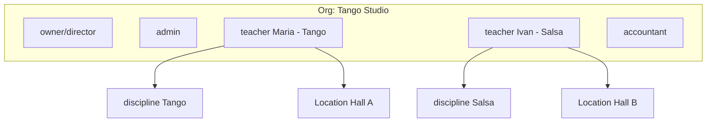

- Maria видит только Tango: расписание, абонементы, журнал.
- Ivan — только Salsa.
- Admin видит всё, редактирует тарифы и команду.
- Бухгалтер — экспорт и статистика, без мутаций.

### 11.2. Частный преподаватель (solo_teacher)

- Один member `owner`.
- Modules: personal_lessons=true, pair_subscriptions=false.
- Locations: опционально «Домашняя студия».

### 11.3. Пользователь в двух организациях

- Login → `/select-organization` → выбор → JWT с org_id → работа.
- Switcher в header sidebar → смена org без logout.

### 11.4. Преподаватель без Telegram

- Admin отправляет invite на email (Фаза 4) или owner создаёт user в Team settings.
- Teacher входит email/пароль в браузере.

---

## 12. Импорт данных (post-greenfield)

### 12.1. Источник

Резервная CRM пользователя → экспорт CSV/JSON (формат TBD).

### 12.2. Pipeline

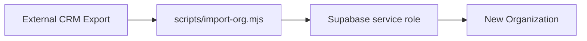

### 12.3. Порядок импорта

1. Create organization + settings.
2. locations, disciplines, classes.
3. clients.
4. prices.
5. schedule_slots.
6. subscriptions.
7. attendance (historical).
8. personal_lessons.

### 12.4. ID mapping

Import script хранит map `old_id → new_uuid` в JSON-файле на диске (например `.import-mappings/{org_slug}.json`) для режимов `--resume-from` и `--dry-run`; FK пересчитываются при каждом batch. In-memory map допустим только для unit-тестов.

**Не входит в MVP v2** — отдельный документ `tangodb_import_TZ.md` после стабилизации схемы.

---

## 13. План реализации по фазам

### Фаза 0 — Подготовка (1–2 дня)

| ID | Задача | Критерий |
|----|--------|----------|
| P0-1 | Backup текущей БД (если нужен справочно) | dump сохранён локально |
| P0-2 | Удаление prod DB / создание пустого Supabase project | чистый инстанс |
| P0-3 | Удалить/архивировать старые migrations → `migrations_v1_archive/` | v2 migrations отдельно |
| P0-4 | Env: SMTP, ALLOWED_ORIGINS, SITE_URL, ACCESS_KEY_PEPPER, CRON_SECRET, `CRM_VERSION_CODE` | email recovery работает на staging |

### Фаза 1 — Core tenant + auth + licensing (2–3 недели)

| ID | Задача | Зависимости |
|----|--------|-------------|
| A-1 | Schema: organizations (+ license fields), members, settings, `crm_product_versions` seed v2 (`is_current=true`) | P0 |
| A-2 | Schema: `access_keys`, `organization_licenses`, `platform_audit_log` | A-1 |
| A-3 | user_active_organizations + JWT hook: organization_id, role, member_id | A-1 |
| A-4 | RLS базовый (org isolation) + `organization_allows_reads/writes` | A-2, A-3 |
| A-5 | Edge Function `request-demo-key` (landing API, one demo per email) | A-2 |
| A-6 | Edge Function `activate-access-key` + RPC `activate_access_key` (demo + lifetime + upgrade demo→lifetime) | A-2, A-4 |
| A-7 | Email login/register/forgot/reset UI + `/activate-key`, `/license-required` | A-1 |
| A-8 | OrganizationProvider + org picker | A-3, A-7 |
| A-9 | Onboarding wizard (create org via key activation) | A-6, A-8 |
| A-10 | Telegram-auth v2 (membership check) | A-1 |
| A-11 | Cron `demo-lifecycle` + `purge-expired-demo-orgs` | A-2, A-6 |

**Критерий фазы:** demo-ключ → 30 дней write → retention read-only → lifetime upgrade сохраняет данные; purge через 60 дней удаляет tenant data.

### Фаза 2 — Business tables + RBAC (2–3 недели)

| ID | Задача |
|----|--------|
| B-1 | Миграция clients, disciplines, prices, subscriptions, attendance, personal_lessons + organization_id |
| B-2 | locations, classes, class_teachers, schedule_slots |
| B-3 | RLS с ролями и teacher scope |
| B-4 | Обновить все hooks (orgId в query keys) |
| B-5 | permissions.ts + UI gates |
| B-6 | RPC mark_attendance v2 (settings-aware freeze) |

**Критерий:** два преподавателя в одной org видят разные дисциплины; admin видит всё; accountant read-only.

### Фаза 3 — Settings CRM (1 неделя)

| ID | Задача |
|----|--------|
| C-1 | Settings pages (general, subscriptions, organization, **license**) |
| C-2 | Перенос Disciplines → settings/disciplines |
| C-3 | Перенос CSV export → settings/data |
| C-4 | SettingsProvider + formatCurrency/i18n v1 |
| C-5 | locations UI, team UI (list members) |

### Фаза 4 — Team invites + Dev Console MVP (1–2 недели)

| ID | Задача |
|----|--------|
| D-1 | organization_invites + invite-member Edge Function |
| D-2 | Team settings: invite, deactivate, change role |
| D-3 | Audit log scoped by org |
| D-4 | i18n: en/vi базовые строки |
| D-5 | **Dev Console app:** auth developer, generate lifetime keys, org search, platform metrics |
| D-6 | Dev Console: manual payment → issue lifetime key |

### Фаза 5 — Version migration tooling (по готовности v2 app)

| ID | Задача |
|----|--------|
| F-1 | RPC `migrate_organization_version` + `organization_version_migrations` |
| F-2 | Migration scripts между major-версиями, например v2→v3 и v3→v2 (dry-run) |
| F-3 | Dev Console: trigger migration, monitor status |

### Фаза 6 — Import tooling (по готовности экспорта)

| ID | Задача |
|----|--------|
| E-1 | `scripts/import-org.mjs` с dry-run и persistent ID mapping |
| E-2 | Документ mapping полей |
| E-3 | Dry-run import на staging |

### Фаза 7 — SaaS subscription (при достижении лимитов, см. §3.12)

| ID | Задача |
|----|--------|
| S-1 | `organization_subscriptions` + payment provider integration |
| S-2 | UI «Тарифный план» в settings |
| S-3 | Grandfathering для lifetime licenses |

---

## 14. Диаграмма зависимостей фаз

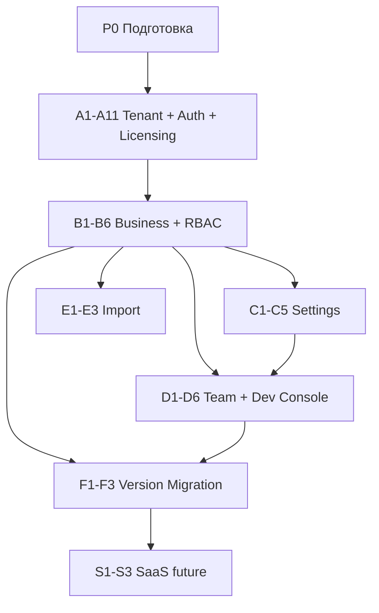

---

## 15. Риски и решения

| Риск | Митигация |
|------|-----------|
| JWT hook не успевает при смене org | `set_active_organization()` + `refreshSession()` + clear query cache |
| RLS сложнее отлаживать | SQL tests + policy naming convention |
| Teacher scope bypass через прямой UUID | RLS на каждой таблице, не только UI |
| Telegram-only users без email | Recovery через admin reset / invite |
| Большой import ломает FK | Ordered import + transaction batches |
| i18n scope creep | v1: ru + en для settings labels; UI постепенно |
| Stale JWT после смены роли/deactivate | write-policy сверяет `organization_members`; UI делает refresh после team changes |
| Пустой teacher scope случайно даёт полный доступ | deny-by-default; полный доступ только через `all_disciplines/all_locations=true` |
| App-layer validation обходится прямым SQL/RPC | CHECK constraints, FK, RPC-only для критичных операций |
| Cross-tenant cache leak на фронтенде | все query keys содержат orgId; при смене org `queryClient.clear()` |
| Invite token утечёт в логах/почте | хранить только hash токена, TTL, one-time accept, audit event |
| Повторный demo на тот же email | UNIQUE index на `access_keys(email)` WHERE `key_type='demo'` |
| Утечка plaintext ключей | хранить только `key_hash`; показывать ключ один раз |
| Demo org не удаляется после 60 дней | cron `purge-expired-demo-orgs` + мониторинг в Dev Console |
| Demo не переходит в retention на день 31 | cron `demo-lifecycle` + alert при org в `demo_active` с `demo_expires_at < now()` |
| Lifetime upgrade теряет данные | upgrade in-place: тот же `organization_id`, `data_purge_at=NULL` |
| Cross-tenant при concurrent access | RLS + org_id в каждом запросе; SQL stress tests |
| Конфликт версий v1/v2 | `schema_version_locked`, одна active major version на org |
| Brute-force активации ключей | rate limit на `activate_access_key`; HMAC hash + pepper; generic error message |
| Утечка service_role в frontend | CI secret scan; anon key only в Vite env; Dev Console через Edge |

### 15.1. Ревизия найденных багов, несостыковок и оптимизаций

| Область | Найдено | Что исправлено / рекомендация |
|---------|---------|-------------------------------|
| Active tenant | В v1.0 предлагалось менять active org через `supabase.auth.updateUser()` и `app_metadata`; клиент не должен управлять источником RLS-claim. | Добавлена таблица `user_active_organizations`, RPC `set_active_organization()`, refresh session. |
| JWT/RLS | Был риск доверять только claim `role` в JWT: роль может устареть после deactivate/change role. | Для write-policy требуется сверка с `organization_members`; JWT используется как быстрый context. |
| Teacher scope | `discipline_ids: [] = все` делал ошибку заполнения scope критичной уязвимостью. | Scope стал deny-by-default; полный доступ задаётся явными флагами `all_disciplines/all_locations`. |
| Типы ID | Scope был `number[]`, хотя новая greenfield-схема использует UUID для ключевых сущностей. | Scope переведён на `string[]` UUID. |
| Роли | Иерархия `owner > ... > accountant` могла привести к тому, что accountant наследует write-логику или teacher сравнивается как обычная роль. | Accountant и teacher вынесены в отдельные ветки permissions. |
| Валидация данных | `subscriptions.type` и `personal_lessons.type` валидировались только app layer. | Добавлена DB-валидация через CHECK/справочник; прямой SQL не должен ломать данные. |
| Freeze | Проверка `freeze_used <= settings.freeze_max_count` была только в RPC/UI. | Указано запретить прямой UPDATE критичных полей и проверять через RPC/trigger. |
| Settings | `locale=ru` конфликтовал с `formatCurrency`, которому нужен BCP 47 locale. | Default изменён на `ru-RU`, добавлены ограничения для currency/week/modules. |
| RLS helper | Универсальный `row_passes_teacher_scope(table_row)` не является практичным SQL-интерфейсом. | Разделён на специализированные функции по discipline/location/subscription/lesson. |
| Org picker | Пользователь без active org должен видеть memberships, но не business data. | Добавлено отдельное требование к policy для `/select-organization`. |
| Frontend cache | При смене org старые query данные могут мигнуть в UI. | Закреплено: все query keys с orgId + `queryClient.clear()` при переключении. |
| Invite flow | Одноразовый token был описан без требований к хранению. | Рекомендация: хранить hash, TTL, one-time accept, audit event. |
| Demo lifecycle cron | Описан только purge; переход `demo_active` → `demo_retention` не был автоматизирован. | Добавлен job `demo-lifecycle` (§3.9, A-11). |
| telegram-auth step 4 | «set active org in metadata» противоречил §3.4. | Заменено на RPC `set_active_organization()` + `refreshSession()`. |
| Rate limiting | Утверждение «уже есть» не соответствует production-grade требованию. | Уточнено: v1 best-effort; production — shared store (§4.6). |
| Key hashing | Plain SHA-256 без pepper уязвим к offline brute-force при утечке БД. | HMAC-SHA256 + `ACCESS_KEY_PEPPER` (§3.8). |
| ID типы v1→v2 | v1-схема использует `TEXT` PK; часть клиентской генерации уже переведена на `crypto.randomUUID()`, но инвариант не закреплён в БД. | Greenfield UUID для business tables на стороне PostgreSQL (§7.1). |
| Dev Console → PG | Диаграмма допускала прямой DB access из admin app. | Только Edge Functions с service role (§2.1, §3.11). |
| Промты фаз 1B/1C | Неверные ID задач (A-4…A-6 / A-7 вместо A-7…A-9 / A-10). | Исправлены в §17. |
| Операции / compliance | Отсутствовали SLO, DR, observability, GDPR, incident response. | Добавлен §19. |
| Модель абонементов | В §0.3 указан несуществующий тип `pair_month`; v1 использует `type='pair'` + поле `pair_month`. | Исправлено §0.3, §7.2.1, §7.3. |
| Invite-фаза | «фаза 2» в §4/§10 противоречила Фазе 4 в §13. | Унифицировано: «Фаза 4». |
| Import ID mapping | §12.4 — только in-memory; промт Фазы 6 — persist на диск. | §12.4 согласован с §17 Фаза 6. |
| Активация ключа | §3.5 — только RPC без Edge Function. | Edge Function `activate-access-key` + проверка `crm_version_id`. |
| Lifetime key status | Неясно: `active` или `consumed` после активации. | Lifetime → `consumed` сразу; `active` только для demo. |
| Demo email policy | Не зафиксирован запрет повторного demo после purge. | UNIQUE index сохраняет запись; повторный demo на email невозможен. |
| Telegram + demo | Telegram-only user не может активировать demo без email. | §4.4: привязать email или lifetime-ключ. |
| Route guards | Нет явного guard для user без membership. | Добавлен §9.6. |
| `/settings/license` | Есть в §6.1, отсутствовал в §9.2 и C-1. | Добавлен в §9.1–9.2, §13 C-1, промт Фазы 3. |

### 15.2. Рекомендации перед началом реализации

1. Начать с SQL-тестов RLS: две организации, по одному пользователю каждой роли, попытки SELECT/INSERT/UPDATE чужих UUID.
2. Сделать минимальный `permissions.ts` до переноса UI, чтобы фронтенд и RLS использовали одну матрицу действий.
3. Не переносить все business tables одним большим PR: сначала tenant core и auth, затем read-only org isolation, затем scoped writes.
4. Для Edge Functions сразу добавить structured logs без токенов/email reset links; rate limit через shared store (§4.6, §19.3).
5. Для импорта заранее определить canonical CSV/JSON schema; без этого не начинать `scripts/import-org.mjs`.
6. Для производительности агрегатов Dashboard предусмотреть RPC/view с фильтрами по `organization_id`, `discipline_id`, `location_id`, а не собирать статистику на клиенте.

---

## 16. Критерии приёмки v2 (общие)

1. Две тестовые организации — **нулевое пересечение** данных при любых запросах.
2. Email login + password reset работает в Chrome/Safari mobile.
3. Telegram Mini App login работает для member org.
4. Teacher с scope discipline=A **не видит** абонементы discipline=B.
5. Accountant может экспорт CSV, **не может** создать клиента (403 / disabled UI).
6. Настройки freeze меняют поведение журнала без деплоя кода.
7. CSV экспорт доступен в `/settings/data`, **отсутствует** на Dashboard.
8. Старые migrations/allowed_users **не используются** в prod v2.
9. **Demo-ключ:** один на email; активация создаёт org; 30 дней full access; день 31 → read-only (`demo-lifecycle`); день 61 → data purged, key `consumed`.
10. **Lifetime-ключ:** апгрейд demo org сохраняет все данные; `data_purge_at` сбрасывается.
11. **Lifetime без demo:** новый ключ создаёт licensed org с нуля.
12. **Dev Console:** генерация lifetime key; просмотр org status и platform metrics.
13. **RLS demo_retention:** SELECT разрешён, INSERT/UPDATE/DELETE denied на business tables.

---

## 17. Промты для поэтапной реализации (копировать)

### Фаза 0 — Подготовка

```text
Выполни фазу 0 из tangodb_saas_platform_TZ.md.

Контекст: greenfield Supabase v2, старые prod-миграции не накатываются.

Задачи:
1. Проверь текущую структуру `tangodb/supabase/` и предложи безопасный план архивации v1 migrations в `migrations_v1_archive/`.
2. Подготовь список env vars для staging/prod: Supabase URL/anon key, SMTP, SITE_URL, ALLOWED_ORIGINS, ACCESS_KEY_PEPPER, CRON_SECRET, CRM_VERSION_CODE (default `v2`), Telegram bot secrets.
3. Зафиксируй команды backup/dump текущей БД, если она нужна как справочник.
4. Ничего не удаляй без явного подтверждения пользователя.

Результат: короткий план действий, список файлов/команд, риски. Код не менять, если не попросят.
```

### Фаза 1A — Tenant Core + Licensing + Active Org + RLS

```text
Реализуй фазу 1A (A-1, A-2, A-3, A-4) из tangodb_saas_platform_TZ.md.

Обязательные требования:
1. Создай v2 migrations для `organizations` (+ demo/license fields), `organization_members`, `organization_settings`, `user_active_organizations`, `access_keys`, `organization_licenses`, `crm_product_versions` (seed `v2` с `is_current=true`; `v1_legacy` только если нужен справочный redirect), `platform_audit_log`.
2. Добавь CHECK constraints для roles, organization status, access_keys, license_type, settings limits, currency_code, week_starts_on.
3. Реализуй RPC `set_active_organization(p_organization_id)` с `SECURITY DEFINER`: проверка active membership, обновление `user_active_organizations`.
4. Реализуй Custom Access Token Hook: `organization_id`, `role`, `member_id` брать из `user_active_organizations` + `organization_members`, не из клиентского `user_metadata`.
5. Реализуй SQL helpers: `auth_organization_id()`, `auth_member_id()`, `is_active_member()`, `member_role()`, `member_scope()`, `organization_allows_reads()`, `organization_allows_writes()`.
6. Включи RLS на tenant core tables + license write gating. Пользователь без active org может читать только свои active memberships для org picker.
7. НЕ трогай business tables в этой фазе.

Проверка:
- SQL tests: две организации, owner/admin/teacher/accountant, попытки чтения чужих memberships.
- SQL tests: demo_retention org — SELECT ok, INSERT denied.
- `npm run lint` и, если есть, Supabase test/migration check.
```

### Фаза 1A-L — Demo/Lifetime Key Activation

```text
Реализуй фазу 1A-L (A-5, A-6, A-11) из tangodb_saas_platform_TZ.md.

Задачи:
1. Edge Function `request-demo-key`: email input, UNIQUE one demo per email, generate key, store HMAC hash with `ACCESS_KEY_PEPPER`, send email/show once.
2. Edge Function `activate-access-key` + private RPC: validate HMAC hash server-side, verify email совпадает с `access_keys.email` для demo, validate `crm_version_id` vs `CRM_VERSION_CODE`/`is_current`, create org (demo/lifetime) OR upgrade demo→lifetime in-place. Plaintext key не хранить и не логировать.
3. Cron/scheduled `demo-lifecycle` + `purge-expired-demo-orgs`: transition retention + delete tenant data after data_purge_at, mark access_key consumed.
4. Email notifications: demo expiring, retention warning, purge warning (можно stub templates).

Проверка:
- Demo: 30d write, day 31 read-only, day 61 purged.
- Lifetime upgrade preserves org data and clears data_purge_at.
- Second demo request for same email rejected.
```

### Фаза 1B — Email Auth + Onboarding + Org Picker

```text
Реализуй фазу 1B (A-7, A-8, A-9) из tangodb_saas_platform_TZ.md.

Задачи:
1. Добавь маршруты `/login`, `/register`, `/auth/forgot-password`, `/auth/reset-password`, `/select-organization`, `/activate-key`, `/license-required`.
2. `LoginPage`: вкладки Telegram | Email, email использует `signInWithPassword`.
3. `RegisterPage`: регистрация владельца; после регистрации — `/activate-key` (demo или lifetime).
4. `OrganizationProvider`: загрузка memberships, выбор active org через RPC `set_active_organization()`, затем `refreshSession()`.
5. Onboarding wizard после успешной активации ключа (A-9): название org → пресет (`org_preset`) → язык/валюта → модули; создаёт/дополняет `organization_settings`, не дублирует org из RPC активации.
6. При `demo_retention`: redirect на `/license-required`, read-only banner в CRM.
7. Route guards по §9.6: user без membership → только `/activate-key`; без active org → `/select-organization`.
8. При смене org: `queryClient.clear()`, сброс scoped Zustand state, переход на безопасный route.
9. Все новые query keys должны содержать `orgId`, если данные tenant-scoped.

Ограничения:
- Не использовать `supabase.auth.updateUser()` для active organization.
- Не хранить права/role в localStorage как источник истины.

Проверка: ручной сценарий login/register/reset, выбор org для пользователя с 1 и 2 memberships, `npm run lint`.
```

### Фаза 1C — Telegram Auth v2

```text
Реализуй фазу 1C (A-10) из tangodb_saas_platform_TZ.md.

Задачи:
1. Обнови Edge Function `telegram-auth`: verify Telegram initData/widget, resolve user по `telegram_id`, проверка active `organization_members`.
2. Удали зависимость от `allowed_users`.
3. Если active memberships = 1, установи active org серверно; если >1, верни состояние для `/select-organization`.
4. Добавь rate limit, CORS по `ALLOWED_ORIGINS`, structured logs без секретов и auth tokens.
5. Опиши сценарий merge Telegram ↔ email через invite, не создавая duplicate user.

Проверка: успешный вход Telegram member, отказ inactive/non-member, пользователь в двух org попадает на picker, `npm run lint`.
```

### Фаза 2A — Business Schema

```text
Реализуй фазу 2A (B-1, B-2) из tangodb_saas_platform_TZ.md.

Задачи:
1. Создай/обнови greenfield business tables: `clients`, `disciplines`, `prices`, `subscriptions`, `attendance`, `personal_lessons`, `locations`, `classes`, `class_teachers`, `schedule_slots`, `audit_log`.
2. На всех tenant tables добавь `organization_id UUID NOT NULL REFERENCES organizations(id)`.
3. Для role/type/status/limits добавь DB CHECK constraints или справочники, не только app validation.
4. Добавь обязательные индексы из раздела 7.4 и индексы под teacher scope.
5. Для FK внутри tenant добавь защиту от cross-org связей: composite FK или trigger validation, где обычного FK недостаточно.

Проверка: миграции накатываются на пустую БД, seed двух организаций не позволяет создать cross-org FK, `npm run lint`.
```

### Фаза 2B — RBAC/RLS + RPC

```text
Реализуй фазу 2B (B-3, B-6) из tangodb_saas_platform_TZ.md.

Задачи:
1. Включи RLS для всех business tables.
2. Реализуй role policies: owner/director/admin write, accountant read-only, teacher scoped write/read.
3. Teacher scope deny-by-default: пустые `discipline_ids/location_ids` не дают полный доступ; полный доступ только через `all_disciplines/all_locations`.
4. Реализуй функции `teacher_has_discipline_access`, `teacher_has_location_access`, `teacher_can_access_subscription`, `teacher_can_access_lesson`.
5. Обнови RPC `mark_attendance`: tenant check, teacher scope, freeze policy из `organization_settings`.
6. Запрети прямой UPDATE критичных полей, которые должны меняться только через RPC.

Проверка: SQL tests на cross-tenant UUID, teacher scope, accountant write denied, freeze limits. Затем `npm run lint`.
```

### Фаза 2C — Frontend Permissions + Hooks

```text
Реализуй фазу 2C (B-4, B-5) из tangodb_saas_platform_TZ.md.

Задачи:
1. Обнови все data hooks: tenant-scoped query keys включают `orgId`.
2. Добавь `permissions.ts` с action-based проверками, где teacher/accountant не моделируются простым role rank.
3. Добавь `<RequirePermission>` для кнопок и панелей, но не считай UI-gates заменой RLS.
4. Dashboard и списки должны фильтровать данные через org-aware hooks/RPC.
5. При смене org не должно быть flash старых данных.

Проверка: ручной сценарий owner/admin/teacher/accountant, переключение org, `npm run lint`.
```

### Фаза 3 — Settings CRM

```text
Реализуй фазу 3 (C-1 ... C-5) из tangodb_saas_platform_TZ.md.

Задачи:
1. Добавь `/settings/*` pages: general, organization, subscriptions, disciplines, locations, data, team, **license** (`/settings/license` — статус demo/licensed, активация lifetime-ключа для owner).
2. Перенеси `DisciplinesPanel` в `/settings/disciplines`.
3. Перенеси CSV export с Dashboard в `/settings/data`.
4. Реализуй `SettingsProvider`, `useSettings`, `formatCurrency` на основе `locale` BCP 47 и `currency_code`.
5. Вынеси freeze logic в `lib/freezePolicy.ts`; frontend должен совпадать с RPC behavior.
6. UI редактирования settings должен уважать `can_manage_settings()`.

Проверка: изменение currency/locale/freeze без деплоя кода, accountant export read-only, Dashboard без CSV export, `npm run lint`.
```

### Фаза 4 — Team Invites + Dev Console

```text
Реализуй фазу 4 (D-1 ... D-6) из tangodb_saas_platform_TZ.md.

Задачи:
1. Создай `organization_invites`: email, organization_id, role, scope, token_hash, expires_at, accepted_at, revoked_at.
2. Edge Function `invite-member`: проверка роли приглашающего, запрет admin назначать owner/director, отправка email invite.
3. Accept invite: one-time token, TTL, auto-link membership, сценарий existing user и new user.
4. Team settings: invite, deactivate, change role/scope; нельзя деактивировать последнего owner.
5. Audit log scoped by org для invite/deactivate/change role/settings changes.
6. **Dev Console** (отдельный package/deployment): developer auth, generate lifetime keys, org search, platform metrics (DB size, org count), manual payment → issue key.
7. Базовые i18n строки en/vi только для новых settings/auth/team/license экранов.

Проверка: invite accepted once, expired/revoked token denied, inactive member loses access after refresh, Dev Console key generation works, `npm run lint`.
```

### Фаза 5 — Version Migration

```text
Реализуй фазу 5 (F-1 ... F-3) из tangodb_saas_platform_TZ.md.

Задачи:
1. RPC `migrate_organization_version(p_target_version_id)` с блокировкой org (`schema_version_locked`).
2. Таблица `organization_version_migrations` + audit.
3. Migration scripts между major-версиями (например v2→v3 и v3→v2) в `supabase/migrations/version_migrations/` с dry-run.
4. Dev Console UI: trigger migration, view status/errors.

Проверка: migration lock denies writes; successful migration updates crm_version_id; rollback on failure.
```

### Фаза 6 — Import Tooling

```text
Реализуй фазу 6 (E-1 ... E-3) из tangodb_saas_platform_TZ.md после утверждения формата экспорта.

Задачи:
1. Сначала создай `tangodb_import_TZ.md` с mapping внешних полей в v2 schema.
2. Реализуй `scripts/import-org.mjs` с режимами `--dry-run`, `--apply`, `--resume-from`.
3. ID mapping `old_id -> new_uuid` должен сохраняться на диск для resume, а не только в памяти.
4. Импортировать в порядке: organization/settings, locations, disciplines, classes, clients, prices, schedule_slots, subscriptions, attendance, personal_lessons.
5. Добавить validation report: missing FK, duplicate clients, invalid dates, unknown package types.
6. Не использовать service role в frontend; import script запускается только локально/CI с защищёнными env vars.

Проверка: dry-run на staging, apply на тестовой org, сравнение counts/checksums, rollback plan.
```

### Фаза 7 — SaaS Subscription

```text
Реализуй фазу 7 (S-1 ... S-3) из tangodb_saas_platform_TZ.md только после достижения триггеров нагрузки/монетизации из §3.12.

Задачи:
1. Спроектируй и добавь `organization_subscriptions`: organization_id, plan, billing_period, status, provider, provider_customer_id, provider_subscription_id, current_period_start/end.
2. Интегрируй выбранного payment provider через Edge Functions/webhooks; service role и webhook secrets только на сервере.
3. Добавь UI `/settings/license` или `/settings/billing`: текущий план, статус оплаты, grandfathering lifetime licenses.
4. RLS/write gating должен учитывать `organization_licenses.license_type='lifetime'` и активную subscription без регрессии demo/lifetime flow.
5. Добавь Dev Console: просмотр billing status, ручная коррекция, audit event.

Проверка: paid subscription activates org, failed/expired payment переводит в read-only/suspended по политике, lifetime org не ломается, webhook replay idempotent, `npm run lint`.
```

---

## 18. Глоссарий

| Термин | Определение |
|--------|-------------|
| **Tenant** | Организация (`organizations`) — изолированный клиент платформы |
| **Demo key** | Одноразовый ключ на 30 дней активного доступа + 30 дней retention |
| **Lifetime key** | Ключ пожизненной лицензии на major-версию CRM |
| **CRM version** | Major-линия продукта (v1, v2) — отдельный деплой приложения |
| **Dev Console** | Отдельное приложение разработчика для ключей, мониторинга, версий |
| **Retention** | Период 31–60 дней после активации demo: данные сохранены, write заблокирован |
| **Member** | Запись `organization_members` — пользователь в org с ролью |
| **Scope** | JSONB фильтр для teacher (disciplines, locations) |
| **Greenfield** | Новая БД без миграции старых prod-данных |
| **Freeze (заморозка)** | Статус посещаемости без списания (или с — по настройке) |
| **Class (класс/группа)** | Учебная группа внутри дисциплины с привязкой к преподавателю |

---

## 19. Операции, наблюдаемость и compliance

### 19.1. SLO и доступность (целевые ориентиры MVP)

| Метрика | Цель (MVP) | Измерение |
|---------|------------|-----------|
| **Availability** CRM UI | 99.5% / месяц (исключая плановые работы) | Vercel + synthetic check |
| **API latency** (p95) | < 800 ms для типичных SELECT | Supabase Dashboard / logs |
| **RTO** (восстановление после сбоя) | < 4 ч | Runbook + Supabase backup restore |
| **RPO** (потеря данных) | < 24 ч | Daily Supabase backup (Pro) или ручной dump |

Публичный **SLA** для paying customers — после фазы SaaS (§3.12); для lifetime/demo — best-effort с прозрачным status page (опционально).

### 19.2. Резервное копирование и DR

- **Supabase:** включить автоматические daily backups (план Pro) или документированный ручной `pg_dump` по расписанию.
- **Point-in-time recovery:** рекомендуется при > 50 org; иначе — weekly full dump + хранение 30 дней.
- **Restore drill:** раз в квартал на staging — восстановление из backup и smoke-test RLS.
- **Tenant export:** org owner может выгрузить данные через `/settings/data` (право на переносимость, GDPR Art. 20).
- **Demo purge:** автоматическое удаление по `data_purge_at` — задокументировать в Privacy Policy.

### 19.3. Наблюдаемость (observability)

| Слой | Инструмент | Что логировать |
|------|------------|----------------|
| Frontend | Sentry (опц.) | JS errors, route, `orgId` (без PII) |
| Edge Functions | Supabase Logs + structured JSON | request_id, duration, outcome; **без** ключей, токенов, паролей |
| PostgreSQL | `platform_audit_log`, `audit_log` | admin actions, membership changes |
| Dev Console | Dashboard | DB size, org count, cron last run, failed purges |

**Алерты (минимум):** cron purge failure, DB > 80% free tier, Edge 5xx spike, `demo_active` с просроченным `demo_expires_at` > 24h.

### 19.4. Инциденты и runbook

1. **Классификация:** P1 (data leak / total outage), P2 (auth broken), P3 (degraded).
2. **Ответственный:** владелец продукта (solo) — on-call по email/Telegram.
3. **Шаги P1:** revoke compromised keys → rotate secrets (`ACCESS_KEY_PEPPER`, `service_role`) → assess `platform_audit_log` → notify affected org owners при утечке tenant data.
4. **Post-mortem:** шаблон в `docs/incidents/` (опционально) — timeline, root cause, action items.

### 19.5. Безопасность и compliance (практический минимум)

| Область | Требование MVP |
|---------|----------------|
| **Tenant isolation** | RLS + SQL tests (§3.6, §8); pen-test перед prod multi-tenant |
| **GDPR / 152-ФЗ** | Privacy Policy + Terms; lawful basis (contract/legitimate interest); право на удаление — purge demo + owner request via support |
| **PII** | Имена, Telegram, email — минимизация; не логировать в Edge/frontend |
| **Secrets** | Supabase Vault / env secrets; rotation при увольнении доступа к Dev Console |
| **SOC 2** | Не в scope MVP; при B2B enterprise — рассмотреть после SaaS-фазы |
| **Support access** | Dev Console read-only org data — только с audit event и основанием (ticket) |

**DPA с Supabase/Vercel:** принять стандартные DPA провайдеров; для EU customers — проверить region (Supabase EU при необходимости).

### 19.6. Тестирование и качество

- **RLS:** автоматизированные SQL-тесты (pgTAP или CI script) — обязательны до prod v2.
- **E2E:** критические сценарии (login, org switch, demo lifecycle) — Playwright на staging.
- **Регрессия:** `npm run lint` + ручной чеклист из §16 после каждой фазы.

---

*Документ подлежит ревизии после утверждения формата импорта из внешней CRM и выбора платёжного провайдера для lifetime-ключей.*

**Changelog v1.5:** аудит v1.4 — `pair`/`pair_month`, lifecycle ключей, DDL §7.2.1, route guards §9.6, invite Фаза 4, import mapping на диск, `/settings/license`, `crm_version_id` при активации.  
**Changelog v1.4:** сверка с текущим проектом v1, поправки free-tier лимитов, server-side активация ключей, seed `v2`, добавлен SaaS-промт.  
**Changelog v1.3:** аудит архитектуры/безопасности/операций, active org, cron demo lifecycle, SLO/DR/compliance.  
**Changelog v1.2:** добавлена модель license-first (demo 30d + retention 30d + lifetime key), Dev Console, версионирование CRM, расчёт нагрузки free tier, перспектива SaaS-подписки.
